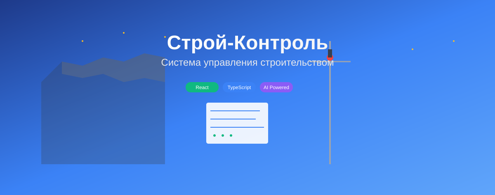

<div align="center">

</div>

# Строй-Контроль

Комплексная система управления строительством с интеграцией ИИ.

## О проекте

Строй-Контроль - это современная веб-платформа для управления строительными проектами, сметами, финансами и взаимоотношениями с клиентами. Система построена на модульной архитектуре с использованием передовых технологий и интеграцией искусственного интеллекта.

## Основные возможности

- **Управление проектами**: Создание и отслеживание строительных проектов
- **Сметы и расчеты**: Автоматизированное создание и анализ смет с помощью ИИ
- **Финансовый учет**: Полный контроль над бюджетом и транзакциями
- **CRM**: Управление клиентами, подрядчиками и поставщиками
- **Документооборот**: Хранение и управление проектной документацией
- **ИИ-ассистент**: Интеллектуальный анализ данных и рекомендации
- **Модульная архитектура**: Ленивая загрузка модулей для оптимальной производительности

## Архитектура

- **Frontend**: React 19 + TypeScript + Vite
- **Backend**: Go (в разработке) + Gin
- **База данных**: PostgreSQL + Redis для кэширования
- **ИИ**: Интеграция с Google Gemini, OpenAI GPT, Anthropic Claude, Groq
- **Хранение файлов**: MinIO/S3
- **Мониторинг**: Prometheus + Grafana + ELK Stack

## Установка и запуск

### Предварительные требования

- Node.js (версия 18+)
- npm или pnpm

### Установка зависимостей

```bash
npm install
# или
pnpm install
```

### Настройка переменных окружения

В проекте используются примеры конфигурационных файлов:

- `.env.local.example` - шаблон для локальной разработки
- `.env.production.example` - шаблон для продакшена (Vercel)

**Локальная разработка:**
1. Скопируйте `.env.local.example` в `.env.local`:
   ```bash
   cp .env.local.example .env.local
   ```
2. Заполните необходимые ключи (например, `VITE_GEMINI_API_KEY`).

**Деплой на Vercel:**
Проект настроен для автоматического деплоя на Vercel (см. `vercel.json`).
В настройках проекта на Vercel (Settings > Environment Variables) необходимо добавить переменные, указанные в `.env.production.example`:

- `VITE_API_URL` (URL бэкенда)
- `VITE_WS_URL` (URL вебсокетов бэкенда)
- `VITE_GEMINI_API_KEY` (API ключ Google Gemini)
- `VITE_APP_ENV` (значение: production)
- и другие необходимые переменные.

### Запуск в режиме разработки

```bash
npm run dev
# или
pnpm run dev
```

Приложение будет доступно по адресу: http://localhost:5173

### Сборка для продакшена

```bash
npm run build
npm run preview
```

## Документация

Подробная документация находится в папке `docs/`:

- [Архитектура системы](docs/ARCHITECTURE.md)
- [План разработки](docs/DEVELOPMENT_PLAN.md)
- [Интеграция ИИ](docs/AI_INTEGRATION_PLAN.md)
- [План тестирования](docs/TESTING_PLAN.md)
- [План развертывания](docs/DEPLOYMENT_PLAN.md)

## Структура проекта

```
строй-контроль/
├── components/          # Переиспользуемые компоненты
├── pages/              # Страницы приложения
├── services/           # Сервисы и API клиенты
├── docs/               # Документация
├── assets/             # Статические ресурсы
└── types.ts            # Типы TypeScript
```

## Лицензия

Этот проект является частным и предназначен для внутреннего использования.

---

*Версия: 0.0.1*
*Дата обновления: 2024*
