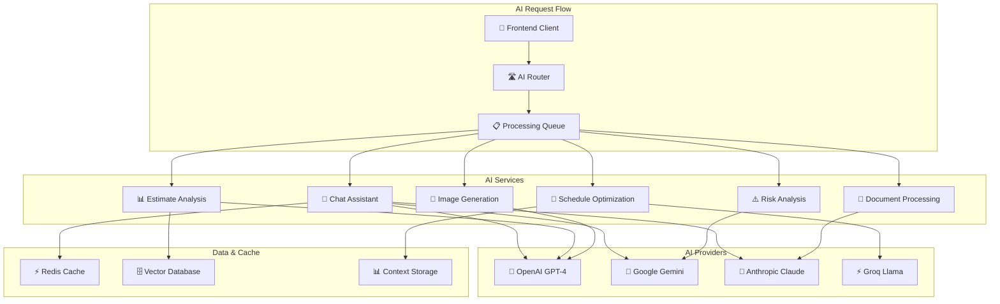

# План AI интеграции для системы "Строй-Контроль"

## Обзор AI интеграции

Данный документ описывает комплексную стратегию интеграции искусственного интеллекта в систему "Строй-Контроль", включающую множественные LLM провайдеры, специализированные AI функции для строительной отрасли и масштабируемую AI архитектуру.

### Цели AI интеграции
- 🤖 Автоматизация рутинных задач в управлении проектами
- 📊 AI анализ смет и оптимизация расходов
- 💬 Интеллектуальный чат-ассистент для пользователей
- 🔮 Прогнозирование рисков и планирование
- 🎨 Генерация изображений и документации
- 📝 Автоматическое создание и анализ документов

## Архитектура AI сервисов

### Многоуровневая AI архитектура



## AI Провайдеры и адаптеры

### Provider Interface

```go
// ai/providers.go
package ai

import (
    "context"
    "time"
)

type AIProvider interface {
    Name() string
    GenerateText(ctx context.Context, prompt string, options TextOptions) (*TextResponse, error)
    GenerateChat(ctx context.Context, messages []ChatMessage, options ChatOptions) (*ChatResponse, error)
    GenerateImage(ctx context.Context, prompt string, options ImageOptions) (*ImageResponse, error)
    EstimateCost(tokens int64) float64
    GetRateLimit() RateLimit
}

type TextOptions struct {
    MaxTokens        int               `json:"max_tokens,omitempty"`
    Temperature      float64           `json:"temperature,omitempty"`
    TopP             float64           `json:"top_p,omitempty"`
    FrequencyPenalty float64           `json:"frequency_penalty,omitempty"`
    PresencePenalty  float64           `json:"presence_penalty,omitempty"`
    Stop             []string          `json:"stop,omitempty"`
    Stream           bool              `json:"stream,omitempty"`
    Metadata         map[string]string `json:"metadata,omitempty"`
}

type ChatOptions struct {
    MaxTokens        int               `json:"max_tokens,omitempty"`
    Temperature      float64           `json:"temperature,omitempty"`
    TopP             float64           `json:"top_p,omitempty"`
    SystemPrompt     string            `json:"system_prompt,omitempty"`
    Stream           bool              `json:"stream,omitempty"`
    Metadata         map[string]string `json:"metadata,omitempty"`
}

type ImageOptions struct {
    Size       string            `json:"size,omitempty"`
    Quality    string            `json:"quality,omitempty"`
    Style      string            `json:"style,omitempty"`
    Count      int               `json:"count,omitempty"`
    Metadata   map[string]string `json:"metadata,omitempty"`
}

type RateLimit struct {
    RequestsPerMinute int
    TokensPerMinute   int
    ResetTime         time.Time
}

type TextResponse struct {
    Content   string                 `json:"content"`
    Tokens    int                    `json:"tokens"`
    Model     string                 `json:"model"`
    Provider  string                 `json:"provider"`
    Usage     TokenUsage             `json:"usage"`
    Metadata  map[string]interface{} `json:"metadata,omitempty"`
}

type ChatResponse struct {
    Messages  []ChatMessage          `json:"messages"`
    Tokens    int                    `json:"tokens"`
    Model     string                 `json:"model"`
    Provider  string                 `json:"provider"`
    Usage     TokenUsage             `json:"usage"`
    Metadata  map[string]interface{} `json:"metadata,omitempty"`
}

type ImageResponse struct {
    URLs      []string               `json:"urls"`
    Provider  string                 `json:"provider"`
    Model     string                 `json:"model"`
    Metadata  map[string]interface{} `json:"metadata,omitempty"`
}

type TokenUsage struct {
    PromptTokens     int `json:"prompt_tokens"`
    CompletionTokens int `json:"completion_tokens"`
    TotalTokens      int `json:"total_tokens"`
}
```

### OpenAI Provider

```go
// ai/providers/openai.go
package openai

import (
    "bytes"
    "context"
    "encoding/json"
    "fmt"
    "io"
    "net/http"
    "time"

    "github.com/google/uuid"
)

type OpenAIProvider struct {
    apiKey    string
    baseURL   string
    model     string
    client    *http.Client
    rateLimit RateLimit
}

func NewOpenAIProvider(apiKey, baseURL, model string) *OpenAIProvider {
    return &OpenAIProvider{
        apiKey:  apiKey,
        baseURL: baseURL,
        model:   model,
        client: &http.Client{
            Timeout: 30 * time.Second,
        },
        rateLimit: RateLimit{
            RequestsPerMinute: 60,
            TokensPerMinute:   150000,
        },
    }
}

func (p *OpenAIProvider) Name() string {
    return "openai"
}

func (p *OpenAIProvider) GenerateText(ctx context.Context, prompt string, options ai.TextOptions) (*ai.TextResponse, error) {
    request := TextRequest{
        Model: p.model,
        Messages: []Message{
            {
                Role:    "user",
                Content: prompt,
            },
        },
        MaxTokens:        options.MaxTokens,
        Temperature:      options.Temperature,
        TopP:             options.TopP,
        FrequencyPenalty: options.FrequencyPenalty,
        PresencePenalty:  options.PresencePenalty,
        Stop:             options.Stop,
    }

    response, err := p.makeRequest(ctx, "/chat/completions", request)
    if err != nil {
        return nil, err
    }

    if len(response.Choices) == 0 {
        return nil, fmt.Errorf("no choices returned from OpenAI")
    }

    return &ai.TextResponse{
        Content:   response.Choices[0].Message.Content,
        Tokens:    response.Usage.TotalTokens,
        Model:     response.Model,
        Provider:  p.Name(),
        Usage:     ai.TokenUsage(response.Usage),
        Metadata:  map[string]interface{}{
            "request_id": uuid.New().String(),
            "timestamp":  time.Now(),
        },
    }, nil
}

func (p *OpenAIProvider) GenerateChat(ctx context.Context, messages []ai.ChatMessage, options ai.ChatOptions) (*ai.ChatResponse, error) {
    openAIMessages := make([]Message, len(messages))
    for i, msg := range messages {
        openAIMessages[i] = Message{
            Role:    msg.Role,
            Content: msg.Content,
        }
    }

    request := ChatRequest{
        Model:       p.model,
        Messages:    openAIMessages,
        MaxTokens:   options.MaxTokens,
        Temperature: options.Temperature,
        TopP:        options.TopP,
        Stream:      options.Stream,
    }

    if options.SystemPrompt != "" {
        openAIMessages = append([]Message{{Role: "system", Content: options.SystemPrompt}}, openAIMessages...)
        request.Messages = openAIMessages
    }

    response, err := p.makeRequest(ctx, "/chat/completions", request)
    if err != nil {
        return nil, err
    }

    chatMessages := make([]ai.ChatMessage, len(response.Choices))
    for i, choice := range response.Choices {
        chatMessages[i] = ai.ChatMessage{
            Role:    choice.Message.Role,
            Content: choice.Message.Content,
        }
    }

    return &ai.ChatResponse{
        Messages:  chatMessages,
        Tokens:    response.Usage.TotalTokens,
        Model:     response.Model,
        Provider:  p.Name(),
        Usage:     ai.TokenUsage(response.Usage),
        Metadata:  map[string]interface{}{
            "request_id": uuid.New().String(),
            "timestamp":  time.Now(),
        },
    }, nil
}

func (p *OpenAIProvider) GenerateImage(ctx context.Context, prompt string, options ai.ImageOptions) (*ai.ImageResponse, error) {
    request := ImageRequest{
        Prompt:  prompt,
        Model:   "dall-e-3",
        Size:    options.Size,
        Quality: options.Quality,
        Count:   options.Count,
    }

    response, err := p.makeRequest(ctx, "/images/generations", request)
    if err != nil {
        return nil, err
    }

    urls := make([]string, len(response.Data))
    for i, data := range response.Data {
        urls[i] = data.URL
    }

    return &ai.ImageResponse{
        URLs:     urls,
        Provider: p.Name(),
        Model:    "dall-e-3",
        Metadata: map[string]interface{}{
            "request_id": uuid.New().String(),
            "timestamp":  time.Now(),
        },
    }, nil
}

func (p *OpenAIProvider) EstimateCost(tokens int64) float64 {
    // GPT-4 pricing (примерные цены)
    pricePer1M := 30.0 // $30 за 1M токенов
    return float64(tokens) * pricePer1M / 1000000
}

func (p *OpenAIProvider) GetRateLimit() ai.RateLimit {
    return p.rateLimit
}

func (p *OpenAIProvider) makeRequest(ctx context.Context, endpoint string, payload interface{}) (*ChatResponse, error) {
    url := p.baseURL + endpoint
    
    data, err := json.Marshal(payload)
    if err != nil {
        return nil, err
    }

    req, err := http.NewRequestWithContext(ctx, "POST", url, bytes.NewBuffer(data))
    if err != nil {
        return nil, err
    }

    req.Header.Set("Content-Type", "application/json")
    req.Header.Set("Authorization", "Bearer "+p.apiKey)

    resp, err := p.client.Do(req)
    if err != nil {
        return nil, err
    }
    defer resp.Body.Close()

    if resp.StatusCode != http.StatusOK {
        body, _ := io.ReadAll(resp.Body)
        return nil, fmt.Errorf("OpenAI API error: %s - %s", resp.Status, string(body))
    }

    var response ChatResponse
    if err := json.NewDecoder(resp.Body).Decode(&response); err != nil {
        return nil, err
    }

    return &response, nil
}

// Data structures for OpenAI API
type Message struct {
    Role    string `json:"role"`
    Content string `json:"content"`
}

type TextRequest struct {
    Model            string   `json:"model"`
    Messages         []Message `json:"messages"`
    MaxTokens        int      `json:"max_tokens,omitempty"`
    Temperature      float64  `json:"temperature,omitempty"`
    TopP             float64  `json:"top_p,omitempty"`
    FrequencyPenalty float64  `json:"frequency_penalty,omitempty"`
    PresencePenalty  float64  `json:"presence_penalty,omitempty"`
    Stop             []string `json:"stop,omitempty"`
}

type ChatRequest struct {
    Model       string    `json:"model"`
    Messages    []Message `json:"messages"`
    MaxTokens   int       `json:"max_tokens,omitempty"`
    Temperature float64   `json:"temperature,omitempty"`
    TopP        float64   `json:"top_p,omitempty"`
    Stream      bool      `json:"stream,omitempty"`
}

type ImageRequest struct {
    Prompt  string `json:"prompt"`
    Model   string `json:"model"`
    Size    string `json:"size"`
    Quality string `json:"quality"`
    Count   int    `json:"n"`
}

type ChatResponse struct {
    ID      string `json:"id"`
    Object  string `json:"object"`
    Created int    `json:"created"`
    Model   string `json:"model"`
    Choices []struct {
        Index   int     `json:"index"`
        Message Message `json:"message"`
        LogProb *struct {
            Content []struct {
                Token       string  `json:"token"`
                LogProb     float64 `json:"logprob"`
                Bytes       []int   `json:"bytes,omitempty"`
                TopLogProbs []struct {
                    Token  string  `json:"token"`
                    LogProb float64 `json:"logprob"`
                    Bytes  []int   `json:"bytes,omitempty"`
                } `json:"top_logprobs"`
            } `json:"content"`
        } `json:"logprobs,omitempty"`
        FinishReason string `json:"finish_reason"`
    } `json:"choices"`
    Usage struct {
        PromptTokens     int `json:"prompt_tokens"`
        CompletionTokens int `json:"completion_tokens"`
        TotalTokens      int `json:"total_tokens"`
    } `json:"usage"`
}
```

### Google Gemini Provider

```go
// ai/providers/gemini.go
package gemini

import (
    "bytes"
    "context"
    "encoding/json"
    "fmt"
    "io"
    "net/http"
    "time"

    "github.com/google/generative-ai-go/genai"
)

type GeminiProvider struct {
    apiKey    string
    client    *genai.Client
    model     string
    rateLimit ai.RateLimit
}

func NewGeminiProvider(apiKey, model string) (*GeminiProvider, error) {
    client, err := genai.NewClient(context.Background(), genai.WithAPIKey(apiKey))
    if err != nil {
        return nil, err
    }

    return &GeminiProvider{
        apiKey:  apiKey,
        client:  client,
        model:   model,
        rateLimit: ai.RateLimit{
            RequestsPerMinute: 60,
            TokensPerMinute:   32000,
        },
    }, nil
}

func (p *GeminiProvider) Name() string {
    return "gemini"
}

func (p *GeminiProvider) GenerateText(ctx context.Context, prompt string, options ai.TextOptions) (*ai.TextResponse, error) {
    model := p.client.GenerativeModel(p.model)
    
    model.SetTemperature(float32(options.Temperature))
    model.SetTopK(int32(options.TopP * 100)) // Gemini использует topK
    
    resp, err := model.GenerateContent(context.Background(), genai.Text(prompt))
    if err != nil {
        return nil, err
    }

    var content string
    if len(resp.Candidates) > 0 && len(resp.Candidates[0].Content.Parts) > 0 {
        content = fmt.Sprintf("%v", resp.Candidates[0].Content.Parts[0])
    }

    return &ai.TextResponse{
        Content:  content,
        Tokens:   calculateTokenCount(content), // Приблизительный подсчет
        Model:    p.model,
        Provider: p.Name(),
        Usage: ai.TokenUsage{
            PromptTokens:     calculateTokenCount(prompt),
            CompletionTokens: calculateTokenCount(content),
            TotalTokens:      calculateTokenCount(prompt + content),
        },
        Metadata: map[string]interface{}{
            "request_id": fmt.Sprintf("gemini_%d", time.Now().Unix()),
            "timestamp":  time.Now(),
        },
    }, nil
}

func (p *GeminiProvider) GenerateChat(ctx context.Context, messages []ai.ChatMessage, options ai.ChatOptions) (*ai.ChatResponse, error) {
    model := p.client.GenerativeModel(p.model)
    
    var chat []*genai.Part
    for _, msg := range messages {
        if msg.Role == "system" && options.SystemPrompt != "" {
            continue // System prompt обрабатывается отдельно
        }
        
        switch msg.Role {
        case "user":
            chat = append(chat, genai.Text(msg.Content))
        case "assistant":
            chat = append(chat, genai.Text("Assistant: "+msg.Content))
        case "system":
            chat = append(chat, genai.Text("System: "+msg.Content))
        }
    }

    resp, err := model.GenerateContent(context.Background(), chat...)
    if err != nil {
        return nil, err
    }

    var content string
    if len(resp.Candidates) > 0 && len(resp.Candidates[0].Content.Parts) > 0 {
        content = fmt.Sprintf("%v", resp.Candidates[0].Content.Parts[0])
    }

    // Обновление истории чата
    chatMessages := append(messages, ai.ChatMessage{
        Role:    "assistant",
        Content: content,
    })

    return &ai.ChatResponse{
        Messages:  chatMessages,
        Tokens:    calculateTokenCount(content),
        Model:     p.model,
        Provider:  p.Name(),
        Usage: ai.TokenUsage{
            TotalTokens: calculateTokenCount(content),
        },
        Metadata: map[string]interface{}{
            "request_id": fmt.Sprintf("gemini_%d", time.Now().Unix()),
            "timestamp":  time.Now(),
        },
    }, nil
}

func (p *GeminiProvider) GenerateImage(ctx context.Context, prompt string, options ai.ImageOptions) (*ai.ImageResponse, error) {
    // Gemini не поддерживает генерацию изображений напрямую
    // Можно использовать через vertex.ai или другие сервисы
    return nil, fmt.Errorf("image generation not supported by Gemini provider")
}

func (p *GeminiProvider) EstimateCost(tokens int64) float64 {
    // Gemini Pro pricing
    pricePer1M := 0.5 // $0.5 за 1M токенов
    return float64(tokens) * pricePer1M / 1000000
}

func (p *GeminiProvider) GetRateLimit() ai.RateLimit {
    return p.rateLimit
}

func calculateTokenCount(text string) int {
    // Приблизительный подсчет токенов (1 токен ≈ 4 символа для русского языка)
    return len(text) / 4
}
```

## AI Services

### Chat Assistant Service

```go
// ai/services/chat_service.go
package services

import (
    "context"
    "fmt"
    "strings"
    "time"

    "github.com/google/uuid"
)

type ChatSession struct {
    ID          string              `json:"id"`
    UserID      string              `json:"user_id"`
    Title       string              `json:"title"`
    Messages    []ChatMessage       `json:"messages"`
    Context     map[string]interface{} `json:"context"`
    CreatedAt   time.Time           `json:"created_at"`
    UpdatedAt   time.Time           `json:"updated_at"`
    Provider    string              `json:"provider"`
    Model       string              `json:"model"`
}

type ChatMessage struct {
    ID        string                 `json:"id"`
    Role      string                 `json:"role"` // user, assistant, system
    Content   string                 `json:"content"`
    Metadata  map[string]interface{} `json:"metadata,omitempty"`
    Timestamp time.Time              `json:"timestamp"`
}

type ChatService struct {
    providers map[string]ai.AIProvider
    cache     *cache.Cache
    db        *sql.DB
}

func NewChatService(providers map[string]ai.AIProvider, cache *cache.Cache, db *sql.DB) *ChatService {
    return &ChatService{
        providers: providers,
        cache:     cache,
        db:        db,
    }
}

func (s *ChatService) CreateSession(ctx context.Context, userID string, initialMessage string) (*ChatSession, error) {
    session := &ChatSession{
        ID:        uuid.New().String(),
        UserID:    userID,
        Title:     generateSessionTitle(initialMessage),
        Messages:  make([]ChatMessage, 0),
        Context:   make(map[string]interface{}),
        CreatedAt: time.Now(),
        UpdatedAt: time.Now(),
        Provider:  "openai",
        Model:     "gpt-4",
    }

    // Добавление системного промпта
    systemPrompt := s.getSystemPrompt()
    session.Messages = append(session.Messages, ChatMessage{
        ID:        uuid.New().String(),
        Role:      "system",
        Content:   systemPrompt,
        Timestamp: time.Now(),
    })

    // Добавление первого сообщения пользователя
    if initialMessage != "" {
        session.Messages = append(session.Messages, ChatMessage{
            ID:        uuid.New().String(),
            Role:      "user",
            Content:   initialMessage,
            Timestamp: time.Now(),
        })
    }

    // Сохранение в БД
    query := `
        INSERT INTO chat_sessions (id, user_id, title, context, provider, model, created_at, updated_at)
        VALUES (?, ?, ?, ?, ?, ?, ?, ?)
    `
    
    contextJSON, _ := json.Marshal(session.Context)
    _, err := s.db.ExecContext(ctx, query,
        session.ID, session.UserID, session.Title, contextJSON,
        session.Provider, session.Model, session.CreatedAt, session.UpdatedAt)
    
    if err != nil {
        return nil, err
    }

    return session, nil
}

func (s *ChatService) SendMessage(ctx context.Context, sessionID, content string) (*ChatMessage, error) {
    // Получение сессии
    session, err := s.getSession(ctx, sessionID)
    if err != nil {
        return nil, err
    }

    // Добавление сообщения пользователя
    userMessage := ChatMessage{
        ID:        uuid.New().String(),
        Role:      "user",
        Content:   content,
        Timestamp: time.Now(),
    }

    // Подготовка сообщений для AI
    aiMessages := make([]ai.ChatMessage, len(session.Messages)+1)
    for i, msg := range session.Messages {
        aiMessages[i] = ai.ChatMessage{
            Role:    msg.Role,
            Content: msg.Content,
        }
    }
    aiMessages[len(aiMessages)-1] = ai.ChatMessage{
        Role:    userMessage.Role,
        Content: userMessage.Content,
    }

    // Получение провайдера
    provider, exists := s.providers[session.Provider]
    if !exists {
        return nil, fmt.Errorf("AI provider %s not found", session.Provider)
    }

    // Отправка в AI
    chatOptions := ai.ChatOptions{
        MaxTokens:   2000,
        Temperature: 0.7,
        SystemPrompt: s.getSystemPrompt(),
    }

    aiResp, err := provider.GenerateChat(ctx, aiMessages, chatOptions)
    if err != nil {
        return nil, err
    }

    // Создание ответа ассистента
    assistantMessage := ChatMessage{
        ID:        uuid.New().String(),
        Role:      "assistant",
        Content:   aiResp.Messages[len(aiResp.Messages)-1].Content,
        Timestamp: time.Now(),
        Metadata: map[string]interface{}{
            "provider":    session.Provider,
            "model":       session.Model,
            "tokens":      aiResp.Usage.TotalTokens,
            "cost":        provider.EstimateCost(int64(aiResp.Usage.TotalTokens)),
            "request_id":  fmt.Sprintf("%s_%d", session.Provider, time.Now().Unix()),
        },
    }

    // Обновление сессии
    session.Messages = append(session.Messages, userMessage, assistantMessage)
    session.UpdatedAt = time.Now()

    // Кэширование ответа
    cacheKey := fmt.Sprintf("chat:response:%s", sessionID)
    s.cache.Set(ctx, cacheKey, &assistantMessage, 30*time.Minute)

    // Сохранение в БД
    s.saveMessage(ctx, sessionID, &userMessage)
    s.saveMessage(ctx, sessionID, &assistantMessage)

    return &assistantMessage, nil
}

func (s *ChatService) getSystemPrompt() string {
    return `Ты - AI ассистент системы "Строй-Контроль" - комплексной платформы для управления строительными проектами.

Твои возможности:
- Помощь в управлении строительными проектами
- Анализ и оптимизация смет
- Консультации по финансовому планированию
- Работа с CRM и клиентами
- Анализ рисков и планирование

Твоя задача - предоставлять полезные, точные и профессиональные ответы на вопросы пользователей, связанные со строительной отраслью и управлением проектами.

Всегда отвечай на русском языке. Если вопрос касается конкретных технических деталей системы, предоставляй практические советы.`
}

func (s *ChatService) getSession(ctx context.Context, sessionID string) (*ChatSession, error) {
    // Попытка получения из кэша
    cacheKey := fmt.Sprintf("chat:session:%s", sessionID)
    var session ChatSession
    if err := s.cache.Get(ctx, cacheKey, &session); err == nil {
        return &session, nil
    }

    // Получение из БД
    query := `
        SELECT id, user_id, title, context, provider, model, created_at, updated_at
        FROM chat_sessions WHERE id = ?
    `
    
    var contextJSON []byte
    err := s.db.QueryRowContext(ctx, query, sessionID).Scan(
        &session.ID, &session.UserID, &session.Title,
        &contextJSON, &session.Provider, &session.Model,
        &session.CreatedAt, &session.UpdatedAt)
    
    if err != nil {
        return nil, err
    }

    if len(contextJSON) > 0 {
        json.Unmarshal(contextJSON, &session.Context)
    }

    // Получение сообщений
    messagesQuery := `
        SELECT id, role, content, metadata, timestamp
        FROM chat_messages 
        WHERE session_id = ?
        ORDER BY timestamp ASC
    `
    
    rows, err := s.db.QueryContext(ctx, messagesQuery, sessionID)
    if err != nil {
        return nil, err
    }
    defer rows.Close()

    session.Messages = make([]ChatMessage, 0)
    for rows.Next() {
        var msg ChatMessage
        var metadataJSON []byte
        err := rows.Scan(&msg.ID, &msg.Role, &msg.Content, &metadataJSON, &msg.Timestamp)
        if err != nil {
            continue
        }

        if len(metadataJSON) > 0 {
            json.Unmarshal(metadataJSON, &msg.Metadata)
        }

        session.Messages = append(session.Messages, msg)
    }

    // Кэширование
    s.cache.Set(ctx, cacheKey, &session, 15*time.Minute)

    return &session, nil
}

func generateSessionTitle(firstMessage string) string {
    // Генерация заголовка на основе первого сообщения
    if len(firstMessage) <= 50 {
        return firstMessage
    }
    
    // Берем первые 50 символов и добавляем троеточие
    return strings.TrimSpace(firstMessage[:50]) + "..."
}
```

### Estimate Analysis Service

```go
// ai/services/estimate_service.go
package services

import (
    "context"
    "encoding/json"
    "fmt"
    "time"

    "github.com/google/uuid"
)

type EstimateAnalysis struct {
    ID          string              `json:"id"`
    EstimateID  string              `json:"estimate_id"`
    Analysis    EstimateAIAnalysis  `json:"analysis"`
    RiskScore   float64             `json:"risk_score"`
    Recommendations []string       `json:"recommendations"`
    Optimizations []CostOptimization `json:"optimizations"`
    AIProvider  string              `json:"ai_provider"`
    Model       string              `json:"model"`
    TokensUsed  int                 `json:"tokens_used"`
    Cost        float64             `json:"cost"`
    CreatedAt   time.Time           `json:"created_at"`
}

type EstimateAIAnalysis struct {
    TotalCost           float64             `json:"total_cost"`
    CostBreakdown       map[string]float64  `json:"cost_breakdown"`
    MaterialCosts       float64             `json:"material_costs"`
    LaborCosts          float64             `json:"labor_costs"`
    EquipmentCosts      float64             `json:"equipment_costs"`
    OverheadCosts       float64             `json:"overhead_costs"`
    MarketComparison    MarketComparison    `json:"market_comparison"`
    EfficiencyScore     float64             `json:"efficiency_score"`
    RiskFactors        []RiskFactor        `json:"risk_factors"`
    TimeEstimates      TimeEstimates       `json:"time_estimates"`
}

type MarketComparison struct {
    AverageMarketPrice float64  `json:"average_market_price"`
    YourPrice          float64  `json:"your_price"`
    PriceDifference    float64  `json:"price_difference"`
    CompetitorScore    float64  `json:"competitor_score"`
    MarketPosition     string   `json:"market_position"`
    Recommendations    []string `json:"recommendations"`
}

type CostOptimization struct {
    Category    string  `json:"category"`
    CurrentCost float64 `json:"current_cost"`
    OptimizedCost float64 `json:"optimized_cost"`
    Savings     float64 `json:"savings"`
    Method      string  `json:"method"`
    Description string  `json:"description"`
}

type RiskFactor struct {
    Type        string  `json:"type"`
    Description string  `json:"description"`
    Impact      float64 `json:"impact"`
    Probability float64 `json:"probability"`
    Mitigation  string  `json:"mitigation"`
}

type TimeEstimates struct {
    StartDate    time.Time `json:"start_date"`
    EndDate      time.Time `json:"end_date"`
    Duration     string    `json:"duration"`
    CriticalPath []string  `json:"critical_path"`
    Bottlenecks  []string  `json:"bottlenecks"`
}

type EstimateAnalysisService struct {
    providers map[string]ai.AIProvider
    cache     *cache.Cache
    db        *sql.DB
}

func NewEstimateAnalysisService(providers map[string]ai.AIProvider, cache *cache.Cache, db *sql.DB) *EstimateAnalysisService {
    return &EstimateAnalysisService{
        providers: providers,
        cache:     cache,
        db:        db,
    }
}

func (s *EstimateAnalysisService) AnalyzeEstimate(ctx context.Context, estimateID string) (*EstimateAnalysis, error) {
    // Проверка кэша
    cacheKey := fmt.Sprintf("estimate:analysis:%s", estimateID)
    var cachedAnalysis EstimateAnalysis
    if err := s.cache.Get(ctx, cacheKey, &cachedAnalysis); err == nil {
        return &cachedAnalysis, nil
    }

    // Получение данных сметы
    estimate, err := s.getEstimateData(ctx, estimateID)
    if err != nil {
        return nil, err
    }

    // Подготовка промпта для AI
    prompt := s.buildAnalysisPrompt(estimate)

    // Выбор AI провайдера (Gemini хорошо подходит для аналитических задач)
    provider := s.providers["gemini"]
    if provider == nil {
        provider = s.providers["openai"]
    }

    // Генерация анализа
    response, err := provider.GenerateText(ctx, prompt, ai.TextOptions{
        MaxTokens:   3000,
        Temperature: 0.3, // Низкая температура для аналитических задач
        Metadata: map[string]string{
            "task_type": "estimate_analysis",
            "estimate_id": estimateID,
        },
    })
    if err != nil {
        return nil, err
    }

    // Парсинг ответа AI
    analysis, err := s.parseAnalysisResponse(response.Content)
    if err != nil {
        return nil, fmt.Errorf("failed to parse AI response: %v", err)
    }

    // Создание объекта анализа
    result := &EstimateAnalysis{
        ID:          uuid.New().String(),
        EstimateID:  estimateID,
        Analysis:    analysis,
        RiskScore:   s.calculateRiskScore(analysis.RiskFactors),
        Recommendations: s.generateRecommendations(analysis, response.Content),
        Optimizations:   s.generateOptimizations(analysis),
        AIProvider:  provider.Name(),
        Model:       response.Model,
        TokensUsed:  response.Usage.TotalTokens,
        Cost:        provider.EstimateCost(int64(response.Usage.TotalTokens)),
        CreatedAt:   time.Now(),
    }

    // Сохранение в БД
    analysisJSON, _ := json.Marshal(result.Analysis)
    recommendationsJSON, _ := json.Marshal(result.Recommendations)
    optimizationsJSON, _ := json.Marshal(result.Optimizations)

    query := `
        INSERT INTO estimate_analyses 
        (id, estimate_id, analysis, risk_score, recommendations, optimizations, 
         ai_provider, model, tokens_used, cost, created_at)
        VALUES (?, ?, ?, ?, ?, ?, ?, ?, ?, ?, ?)
    `
    
    _, err = s.db.ExecContext(ctx, query,
        result.ID, result.EstimateID, analysisJSON, result.RiskScore,
        recommendationsJSON, optimizationsJSON, result.AIProvider, result.Model,
        result.TokensUsed, result.Cost, result.CreatedAt)
    
    if err != nil {
        return nil, err
    }

    // Кэширование результата
    s.cache.Set(ctx, cacheKey, result, 24*time.Hour)

    return result, nil
}

func (s *EstimateAnalysisService) buildAnalysisPrompt(estimate *Estimate) string {
    prompt := fmt.Sprintf(`
Проанализируй следующую строительную смету и предоставь детальный анализ:

ИНФОРМАЦИЯ О ПРОЕКТЕ:
Название: %s
Проект: %s
Статус: %s
НДС: %s
Версия: %d

ПОЗИЦИИ СМЕТЫ:
`, estimate.Name, estimate.ProjectName, estimate.Status, estimate.VatMode, estimate.Version)

    for _, item := range estimate.Items {
        prompt += fmt.Sprintf(`
- %s (%s): %.2f x %.2f = %.2f руб.
  Наценка: %.2f%%, Итоговая стоимость: %.2f руб.
`, item.Name, item.Unit, item.Quantity, item.CostPrice, 
           item.Quantity * item.CostPrice, item.Markup,
           item.Quantity * item.CostPrice * (1 + item.Markup/100))
    }

    prompt += `
ПРОВЕДИ АНАЛИЗ И ОПИШИ:
1. Общую стоимость и структуру расходов
2. Соотношение материалов, работ, оборудования
3. Анализ цен по сравнению с рыночными
4. Выявленные риски и их влияние
5. Рекомендации по оптимизации
6. Оценку эффективности использования ресурсов

Ответь в структурированном JSON формате со следующими полями:
{
  "total_cost": число,
  "material_costs": число,
  "labor_costs": число,
  "equipment_costs": число,
  "overhead_costs": число,
  "efficiency_score": число от 0 до 100,
  "risk_factors": [
    {
      "type": "текст",
      "description": "текст",
      "impact": число,
      "probability": число,
      "mitigation": "текст"
    }
  ],
  "recommendations": ["текст", "текст"],
  "market_comparison": {
    "average_market_price": число,
    "your_price": число,
    "price_difference": число,
    "competitor_score": число,
    "market_position": "текст"
  }
}`

    return prompt
}

func (s *EstimateAnalysisService) parseAnalysisResponse(content string) (EstimateAIAnalysis, error) {
    // Извлечение JSON из ответа AI
    jsonStart := strings.Index(content, "{")
    jsonEnd := strings.LastIndex(content, "}")
    
    if jsonStart == -1 || jsonEnd == -1 {
        return EstimateAIAnalysis{}, fmt.Errorf("JSON not found in response")
    }
    
    jsonContent := content[jsonStart : jsonEnd+1]
    
    var analysis EstimateAIAnalysis
    err := json.Unmarshal([]byte(jsonContent), &analysis)
    if err != nil {
        return EstimateAIAnalysis{}, err
    }
    
    return analysis, nil
}

func (s *EstimateAnalysisService) calculateRiskScore(riskFactors []RiskFactor) float64 {
    if len(riskFactors) == 0 {
        return 0
    }
    
    totalRisk := 0.0
    for _, risk := range riskFactors {
        // Взвешенный риск = Impact * Probability
        totalRisk += risk.Impact * risk.Probability
    }
    
    // Нормализация к шкале 0-100
    return totalRisk * 10 // Приблизительная нормализация
}

func (s *EstimateAnalysisService) generateRecommendations(analysis EstimateAIAnalysis, fullResponse string) []string {
    var recommendations []string
    
    // Извлечение рекомендаций из JSON
    if analysis.EfficiencyScore < 70 {
        recommendations = append(recommendations, "Рекомендуется пересмотреть эффективность использования ресурсов")
    }
    
    if analysis.OverheadCosts > analysis.TotalCost*0.15 {
        recommendations = append(recommendations, "Накладные расходы превышают рекомендуемый уровень (15%)")
    }
    
    // Дополнительные рекомендации можно извлечь из полного ответа AI
    
    return recommendations
}

func (s *EstimateAnalysisService) generateOptimizations(analysis EstimateAIAnalysis) []CostOptimization {
    var optimizations []CostOptimization
    
    // Анализ возможностей оптимизации
    if analysis.MaterialCosts > analysis.TotalCost*0.6 {
        optimizations = append(optimizations, CostOptimization{
            Category:      "Материалы",
            CurrentCost:   analysis.MaterialCosts,
            OptimizedCost: analysis.MaterialCosts * 0.9,
            Savings:       analysis.MaterialCosts * 0.1,
            Method:        "Поиск альтернативных поставщиков",
            Description:   "Снижение стоимости материалов на 10% за счет оптимизации закупок",
        })
    }
    
    return optimizations
}
```

## AI Router и Load Balancing

```go
// ai/router.go
package ai

import (
    "context"
    "fmt"
    "sync"
    "time"

    "github.com/go-redis/redis/v8"
)

type AIRouter struct {
    providers     map[string]AIProvider
    rateLimiters  map[string]*RateLimiter
    cache         *cache.Cache
    redis         *redis.Client
    config        RouterConfig
    mu            sync.RWMutex
}

type RouterConfig struct {
    DefaultProvider  string            `json:"default_provider"`
    FallbackOrder    []string          `json:"fallback_order"`
    ProviderWeights  map[string]int    `json:"provider_weights"`
    TaskTypeMapping  map[string]string `json:"task_type_mapping"` // task_type -> provider_name
    RateLimits       map[string]RateLimit `json:"rate_limits"`
}

func NewAIRouter(providers map[string]AIProvider, config RouterConfig, cache *cache.Cache, redis *redis.Client) *AIRouter {
    rateLimiters := make(map[string]*RateLimiter)
    for name, provider := range providers {
        rateLimiters[name] = NewRateLimiter(provider.GetRateLimit())
    }
    
    return &AIRouter{
        providers:    providers,
        rateLimiters: rateLimiters,
        cache:        cache,
        redis:        redis,
        config:       config,
    }
}

func (r *AIRouter) RouteTextRequest(ctx context.Context, taskType, prompt string, options TextOptions) (*TextResponse, error) {
    // Определение провайдера
    providerName := r.selectProvider(taskType)
    
    // Попытка с основным провайдером
    response, err := r.tryProvider(ctx, providerName, func(p AIProvider) (*TextResponse, error) {
        return p.GenerateText(ctx, prompt, options)
    })
    
    if err == nil {
        return response, nil
    }
    
    // Попытка с fallback провайдерами
    return r.tryFallbackProviders(ctx, taskType, prompt, options)
}

func (r *AIRouter) RouteChatRequest(ctx context.Context, taskType string, messages []ChatMessage, options ChatOptions) (*ChatResponse, error) {
    providerName := r.selectProvider(taskType)
    
    response, err := r.tryProvider(ctx, providerName, func(p AIProvider) (*ChatResponse, error) {
        return p.GenerateChat(ctx, messages, options)
    })
    
    if err == nil {
        return response, nil
    }
    
    return r.tryFallbackProviders(ctx, taskType, "", ChatOptions{
        MaxTokens:   options.MaxTokens,
        Temperature: options.Temperature,
        SystemPrompt: options.SystemPrompt,
        Stream:      options.Stream,
    })
}

func (r *AIRouter) selectProvider(taskType string) string {
    r.mu.RLock()
    defer r.mu.RUnlock()
    
    // Проверка маппинга по типу задачи
    if provider, exists := r.config.TaskTypeMapping[taskType]; exists {
        return provider
    }
    
    // Использование весов для выбора
    return r.selectProviderByWeight()
}

func (r *AIRouter) selectProviderByWeight() string {
    // Простейший weighted round-robin
    totalWeight := 0
    for _, weight := range r.config.ProviderWeights {
        totalWeight += weight
    }
    
    // Выбор случайного провайдера на основе весов
    // В реальном приложении можно использовать более сложную логику
    
    // Пока что используем дефолтного провайдера
    return r.config.DefaultProvider
}

func (r *AIRouter) tryProvider(ctx context.Context, providerName string, fn func(AIProvider) (interface{}, error)) (interface{}, error) {
    provider, exists := r.providers[providerName]
    if !exists {
        return nil, fmt.Errorf("provider %s not found", providerName)
    }
    
    // Проверка rate limit
    if err := r.checkRateLimit(providerName); err != nil {
        return nil, fmt.Errorf("rate limit exceeded for provider %s: %v", providerName, err)
    }
    
    // Кэширование результата
    cacheKey := r.getCacheKey(providerName, fn)
    if result := r.getCachedResult(ctx, cacheKey); result != nil {
        return result, nil
    }
    
    // Выполнение запроса
    result, err := fn(provider)
    if err != nil {
        return nil, err
    }
    
    // Кэширование успешного результата
    r.cacheResult(ctx, cacheKey, result)
    
    return result, nil
}

func (r *AIRouter) tryFallbackProviders(ctx context.Context, taskType, prompt string, options interface{}) (interface{}, error) {
    fallbackOrder := r.config.FallbackOrder
    
    for _, providerName := range fallbackOrder {
        if providerName == r.selectProvider(taskType) {
            continue // Уже пробовали этот провайдер
        }
        
        var result interface{}
        var err error
        
        switch v := options.(type) {
        case TextOptions:
            result, err = r.tryProvider(ctx, providerName, func(p AIProvider) (*TextResponse, error) {
                return p.GenerateText(ctx, prompt, v)
            })
        case ChatOptions:
            result, err = r.tryProvider(ctx, providerName, func(p AIProvider) (*ChatResponse, error) {
                return p.GenerateChat(ctx, []ChatMessage{}, v)
            })
        }
        
        if err == nil {
            return result, nil
        }
    }
    
    return nil, fmt.Errorf("all providers failed")
}

func (r *AIRouter) checkRateLimit(providerName string) error {
    limiter, exists := r.rateLimiters[providerName]
    if !exists {
        return nil
    }
    
    // Проверка rate limit в Redis для распределенной системы
    if r.redis != nil {
        return r.checkRedisRateLimit(providerName, limiter)
    }
    
    // Локальная проверка rate limit
    if !limiter.Allow() {
        return fmt.Errorf("rate limit exceeded")
    }
    
    return nil
}

func (r *AIRouter) checkRedisRateLimit(providerName string, limiter *RateLimiter) error {
    key := fmt.Sprintf("ai:rate_limit:%s", providerName)
    
    // Использование Redis для rate limiting
    // Интеграция с существующим rate limiter
    return limiter.AllowWithRedis(key, 60, time.Minute)
}

func (r *AIRouter) getCacheKey(providerName string, fn func(AIProvider) (interface{}, error)) string {
    // Создание простого ключа кэша на основе параметров
    return fmt.Sprintf("ai:response:%s:%d", providerName, time.Now().Unix()/300) // 5 минут
}

func (r *AIRouter) getCachedResult(ctx context.Context, key string) interface{} {
    // Получение результата из кэша
    var result interface{}
    if err := r.cache.Get(ctx, key, &result); err == nil {
        return result
    }
    return nil
}

func (r *AIRouter) cacheResult(ctx context.Context, key string, result interface{}) {
    // Кэширование результата на короткий период
    r.cache.Set(ctx, key, result, 5*time.Minute)
}
```

## План выполнения

### Этап 1 (Недели 1-3): Базовые AI сервисы
- [ ] Настройка AI провайдеров (OpenAI, Gemini)
- [ ] Реализация базового чат-ассистента
- [ ] Создание AI роутера
- [ ] Базовые тесты AI интеграции

### Этап 2 (Недели 4-6): Специализированные AI функции
- [ ] AI анализ смет
- [ ] Оптимизация расписаний
- [ ] Генерация изображений
- [ ] Обработка документов

### Этап 3 (Недели 7-9): Продвинутые возможности
- [ ] Мультимодальный AI (текст + изображения)
- [ ] Голосовое управление
- [ ] AI-powered автозаполнение
- [ ] Интеллектуальные рекомендации

### Этап 4 (Недели 10-12): Оптимизация и масштабирование
- [ ] Кэширование AI ответов
- [ ] Оптимизация затрат
- [ ] Fallback стратегии
- [ ] Мониторинг производительности AI

---

*План AI интеграции создан: 24.11.2024*
*Версия: 1.0*
*Следующий обзор: 01.12.2024*