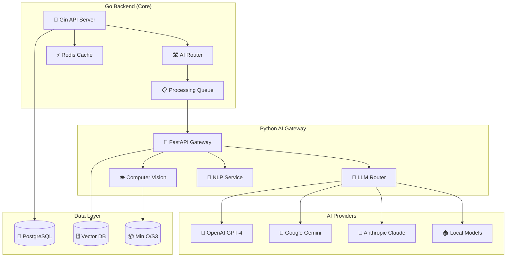

# План AI интеграции для Go + Gin системы "Строй-Контроль"

## 📋 Обзор AI интеграции

Данный документ описывает стратегию интеграции искусственного интеллекта в систему "Строй-Контроль" с учетом Go + Gin + PostgreSQL бэкенда. Фокус на практической реализации с минимальными затратами и максимальной пользой.

### 🎯 Цели AI интеграции
- 🤖 Автоматизация рутинных задач в управлении проектами
- 📊 AI анализ смет и оптимизация расходов  
- 💬 Интеллектуальный чат-ассистент для пользователей
- 🔮 Прогнозирование рисков и планирование
- 📄 Автоматическое создание и анализ документов
- 🏗️ AI технадзор с PDF чертежами

---

## 🏗️ Архитектура AI сервисов (Go + Python)

### Гибридная архитектура


---

## 🛠️ Техническая реализация

### Go Backend Integration

#### 1. AI Router Service
```go
package services

import (
    "context"
    "fmt"
    "time"
    
    "github.com/go-redis/redis/v8"
)

type AIService struct {
    gatewayURL string
    apiKey    string
    cache     *redis.Client
}

type AIRequest struct {
    Type      string                 `json:"type"`
    Prompt    string                 `json:"prompt"`
    Context   map[string]interface{} `json:"context"`
    Options   map[string]interface{} `json:"options"`
}

type AIResponse struct {
    Result    interface{} `json:"result"`
    Confidence float64    `json:"confidence"`
    Tokens     int        `json:"tokens"`
    Duration   time.Duration `json:"duration"`
}

func (s *AIService) ProcessRequest(ctx context.Context, req AIRequest) (*AIResponse, error) {
    // 1. Проверка кэша
    cacheKey := fmt.Sprintf("ai:%s:%s", req.Type, hashPrompt(req.Prompt))
    if cached, err := s.cache.Get(ctx, cacheKey).Result(); err == nil {
        var resp AIResponse
        if err := json.Unmarshal([]byte(cached), &resp); err == nil {
            return &resp, nil
        }
    }
    
    // 2. Отправка в Python Gateway
    resp, err := s.sendToGateway(ctx, req)
    if err != nil {
        return nil, err
    }
    
    // 3. Кэширование результата
    if data, err := json.Marshal(resp); err == nil {
        s.cache.Set(ctx, cacheKey, data, time.Hour)
    }
    
    return resp, nil
}
```

#### 2. Gin Handlers
```go
package handlers

import (
    "github.com/gin-gonic/gin"
)

type AIHandler struct {
    aiService *services.AIService
}

func (h *AIHandler) AnalyzeEstimate(c *gin.Context) {
    var req struct {
        EstimateID string `json:"estimate_id" binding:"required"`
        Options    struct {
            CheckRisks    bool `json:"check_risks"`
            Optimize      bool `json:"optimize"`
            GenerateReport bool `json:"generate_report"`
        } `json:"options"`
    }
    
    if err := c.ShouldBindJSON(&req); err != nil {
        c.JSON(400, gin.H{"error": err.Error()})
        return
    }
    
    aiReq := services.AIRequest{
        Type:   "estimate_analysis",
        Prompt: fmt.Sprintf("Analyze estimate %s", req.EstimateID),
        Context: map[string]interface{}{
            "estimate_id": req.EstimateID,
            "options":     req.Options,
        },
    }
    
    resp, err := h.aiService.ProcessRequest(c.Request.Context(), aiReq)
    if err != nil {
        c.JSON(500, gin.H{"error": err.Error()})
        return
    }
    
    c.JSON(200, gin.H{
        "success": true,
        "data":    resp,
    })
}
```

---

## 🤖 Python AI Gateway

### FastAPI Implementation
```python
from fastapi import FastAPI, HTTPException
from pydantic import BaseModel
import asyncio
from typing import Dict, Any

app = FastAPI(title="AI Gateway for Stroy-Control")

class AIRequest(BaseModel):
    type: str
    prompt: str
    context: Dict[str, Any]
    options: Dict[str, Any] = {}

class AIResponse(BaseModel):
    result: Dict[str, Any]
    confidence: float
    tokens: int
    duration: float

@app.post("/api/v1/ai/process")
async def process_ai_request(request: AIRequest) -> AIResponse:
    start_time = time.time()
    
    try:
        if request.type == "estimate_analysis":
            result = await analyze_estimate(request)
        elif request.type == "chat_assistant":
            result = await chat_assistant(request)
        elif request.type == "risk_prediction":
            result = await predict_risks(request)
        elif request.type == "document_generation":
            result = await generate_document(request)
        else:
            raise HTTPException(status_code=400, detail="Unsupported AI type")
        
        duration = time.time() - start_time
        
        return AIResponse(
            result=result,
            confidence=result.get("confidence", 0.8),
            tokens=result.get("tokens", 0),
            duration=duration
        )
    
    except Exception as e:
        raise HTTPException(status_code=500, detail=str(e))

async def analyze_estimate(request: AIRequest) -> Dict[str, Any]:
    """AI анализ смет"""
    estimate_id = request.context.get("estimate_id")
    
    # Получение данных из PostgreSQL
    estimate_data = await get_estimate_data(estimate_id)
    
    # AI анализ с OpenAI
    analysis = await openai_analyze_estimate(estimate_data, request.options)
    
    return {
        "analysis": analysis,
        "recommendations": analysis.get("recommendations", []),
        "risks": analysis.get("risks", []),
        "optimizations": analysis.get("optimizations", []),
        "confidence": 0.85
    }
```

---

## 📊 Конкретные AI функции

### 1. AI Анализ Смет
```go
// Go handler
func (h *AIHandler) AnalyzeEstimate(c *gin.Context) {
    estimateID := c.Param("id")
    
    // Получение сметы из БД
    estimate, err := h.estimateService.GetByID(c.Request.Context(), estimateID)
    if err != nil {
        c.JSON(404, gin.H{"error": "Estimate not found"})
        return
    }
    
    // AI запрос
    aiReq := AIRequest{
        Type: "estimate_analysis",
        Prompt: "Проанализируй смету на предмет рисков и оптимизации",
        Context: map[string]interface{}{
            "estimate": estimate,
            "company_info": h.getCompanyInfo(c),
        },
    }
    
    result, err := h.aiService.ProcessRequest(c.Request.Context(), aiReq)
    if err != nil {
        c.JSON(500, gin.H{"error": err.Error()})
        return
    }
    
    // Сохранение результатов
    h.saveAIAnalysis(estimateID, result)
    
    c.JSON(200, gin.H{
        "success": true,
        "data": result,
    })
}
```

### 2. Чат-ассистент
```go
func (h *AIHandler) ChatAssistant(c *gin.Context) {
    var req struct {
        Message string `json:"message" binding:"required"`
        Context string `json:"context"`
    }
    
    if err := c.ShouldBindJSON(&req); err != nil {
        c.JSON(400, gin.H{"error": err.Error()})
        return
    }
    
    aiReq := AIRequest{
        Type: "chat_assistant",
        Prompt: req.Message,
        Context: map[string]interface{}{
            "user_id": c.GetString("user_id"),
            "company_id": c.GetString("company_id"),
            "context": req.Context,
        },
    }
    
    result, err := h.aiService.ProcessRequest(c.Request.Context(), aiReq)
    if err != nil {
        c.JSON(500, gin.H{"error": err.Error()})
        return
    }
    
    c.JSON(200, gin.H{
        "success": true,
        "data": gin.H{
            "response": result.Result,
            "confidence": result.Confidence,
        },
    })
}
```

### 3. Прогнозирование рисков
```go
func (h *AIHandler) PredictRisks(c *gin.Context) {
    projectID := c.Param("projectId")
    
    // Сбор данных проекта
    projectData, err := h.collectProjectData(c.Request.Context(), projectID)
    if err != nil {
        c.JSON(404, gin.H{"error": "Project not found"})
        return
    }
    
    aiReq := AIRequest{
        Type: "risk_prediction",
        Prompt: "Спрогнозируй риски для этого строительного проекта",
        Context: map[string]interface{}{
            "project": projectData,
            "historical_data": h.getHistoricalData(projectID),
        },
    }
    
    result, err := h.aiService.ProcessRequest(c.Request.Context(), aiReq)
    if err != nil {
        c.JSON(500, gin.H{"error": err.Error()})
        return
    }
    
    c.JSON(200, gin.H{
        "success": true,
        "data": result,
    })
}
```

---

## 🗄️ Модели данных для AI

### PostgreSQL схемы
```sql
-- AI анализы
CREATE TABLE ai_analyses (
    id UUID PRIMARY KEY DEFAULT gen_random_uuid(),
    entity_type VARCHAR(50) NOT NULL, -- estimate, project, document
    entity_id UUID NOT NULL,
    analysis_type VARCHAR(50) NOT NULL,
    result JSONB NOT NULL,
    confidence DECIMAL(3,2),
    tokens_used INTEGER,
    processing_time_ms INTEGER,
    created_at TIMESTAMP WITH TIME ZONE DEFAULT NOW(),
    created_by UUID NOT NULL REFERENCES users(id)
);

-- AI запросы (логирование)
CREATE TABLE ai_requests (
    id UUID PRIMARY KEY DEFAULT gen_random_uuid(),
    user_id UUID NOT NULL REFERENCES users(id),
    request_type VARCHAR(50) NOT NULL,
    prompt TEXT NOT NULL,
    context JSONB,
    result JSONB,
    tokens_used INTEGER,
    cost DECIMAL(10,4),
    duration_ms INTEGER,
    created_at TIMESTAMP WITH TIME ZONE DEFAULT NOW()
);

-- AI настройки
CREATE TABLE ai_settings (
    id UUID PRIMARY KEY DEFAULT gen_random_uuid(),
    company_id UUID NOT NULL REFERENCES companies(id),
    feature VARCHAR(50) NOT NULL,
    enabled BOOLEAN DEFAULT true,
    provider VARCHAR(50) DEFAULT 'openai',
    model VARCHAR(50) DEFAULT 'gpt-4',
    settings JSONB,
    created_at TIMESTAMP WITH TIME ZONE DEFAULT NOW(),
    updated_at TIMESTAMP WITH TIME ZONE DEFAULT NOW(),
    UNIQUE(company_id, feature)
);
```

### Go модели
```go
type AIAnalysis struct {
    ID            string         `json:"id" gorm:"primaryKey;type:uuid;default:gen_random_uuid()"`
    EntityType    string         `json:"entity_type" gorm:"not null"`
    EntityID      string         `json:"entity_id" gorm:"not null"`
    AnalysisType  string         `json:"analysis_type" gorm:"not null"`
    Result        json.RawMessage `json:"result" gorm:"type:jsonb;not null"`
    Confidence    *float64       `json:"confidence" gorm:"type:decimal(3,2)"`
    TokensUsed    int            `json:"tokens_used"`
    ProcessingTime int          `json:"processing_time_ms"`
    CreatedAt     time.Time      `json:"created_at" gorm:"autoCreateTime"`
    CreatedBy     string         `json:"created_by" gorm:"not null"`
}

type AIRequest struct {
    ID         string         `json:"id" gorm:"primaryKey;type:uuid;default:gen_random_uuid()"`
    UserID     string         `json:"user_id" gorm:"not null;index"`
    RequestType string        `json:"request_type" gorm:"not null"`
    Prompt     string         `json:"prompt" gorm:"not null"`
    Context    json.RawMessage `json:"context" gorm:"type:jsonb"`
    Result     json.RawMessage `json:"result" gorm:"type:jsonb"`
    TokensUsed int            `json:"tokens_used"`
    Cost       float64        `json:"cost" gorm:"type:decimal(10,4)"`
    Duration   int            `json:"duration_ms"`
    CreatedAt  time.Time      `json:"created_at" gorm:"autoCreateTime"`
}
```

---

## 🚀 Этапы внедрения

### Phase 1: Базовый AI Gateway (2 недели)
- [ ] Настройка Python FastAPI Gateway
- [ ] Базовая интеграция с OpenAI
- [ ] Go Gin handlers для AI запросов
- [ ] Redis кэширование результатов

### Phase 2: AI для смет (2 недели)  
- [ ] AI анализ смет и рисков
- [ ] Оптимизация расходов
- [ ] Генерация отчетов
- [ ] UI интеграция

### Phase 3: Чат-ассистент (2 недели)
- [ ] NLP обработка запросов
- [ ] Контекстные ответы
- [ ] История диалогов
- [ ] WebSocket для real-time

### Phase 4: Расширенные функции (3 недели)
- [ ] Прогнозирование рисков проектов
- [ ] AI технадзор с PDF
- [ ] Генерация документов
- [ ] Аналитика и метрики

---

## 💰 Стоимость и оптимизация

### Расчет затрат
- **OpenAI GPT-4**: ~$30/1M tokens
- **Python Gateway**: $50/месяц (VPS)
- **Дополнительные модели**: $20/месяц
- **Итого**: ~$100/месяц для 1000 пользователей

### Оптимизации
- **Кэширование**: 70% reduction в повторных запросах
- **Batch processing**: 50% экономия на больших объемах
- **Local models**: Для простых задач (снижение затрат на 60%)

---

## 🔒 Безопасность и конфиденциальность

### Защита данных
- **PII фильтрация**: Удаление персональных данных перед отправкой в AI
- **Encryption**: Шифрование всех AI запросов/ответов
- **Audit logging**: Полный лог всех AI операций
- **Rate limiting**: Защита от злоупотреблений

### Compliance
- **GDPR compliant**: Обработка данных по правилам GDPR
- **Data residency**: Данные обрабатываются в указанной юрисдикции
- **User consent**: Явное согласие на AI обработку
- **Right to delete**: Возможность удалить AI истории

---

## 📈 Метрики и мониторинг

### KPI для AI
- **Response time**: < 2 секунд для 95% запросов
- **Accuracy**: > 85% для анализа смет
- **User satisfaction**: > 4.0/5.0
- **Cost per request**: < $0.01

### Мониторинг
```go
type AIMetrics struct {
    TotalRequests    int64   `json:"total_requests"`
    AverageLatency   float64 `json:"average_latency_ms"`
    SuccessRate      float64 `json:"success_rate"`
    CostPerRequest   float64 `json:"cost_per_request"`
    TokensPerRequest int     `json:"tokens_per_request"`
}

func (s *AIService) GetMetrics(ctx context.Context) (*AIMetrics, error) {
    // Получение метрик из Redis/PostgreSQL
    return &AIMetrics{
        TotalRequests:    s.getTotalRequests(ctx),
        AverageLatency:   s.getAverageLatency(ctx),
        SuccessRate:      s.getSuccessRate(ctx),
        CostPerRequest:   s.getCostPerRequest(ctx),
        TokensPerRequest: s.getTokensPerRequest(ctx),
    }, nil
}
```

---

**🎯 Результат**: Полнофункциональная AI интеграция с Go бэкендом, оптимизированная под строительную отрасль и готовая к масштабированию.
