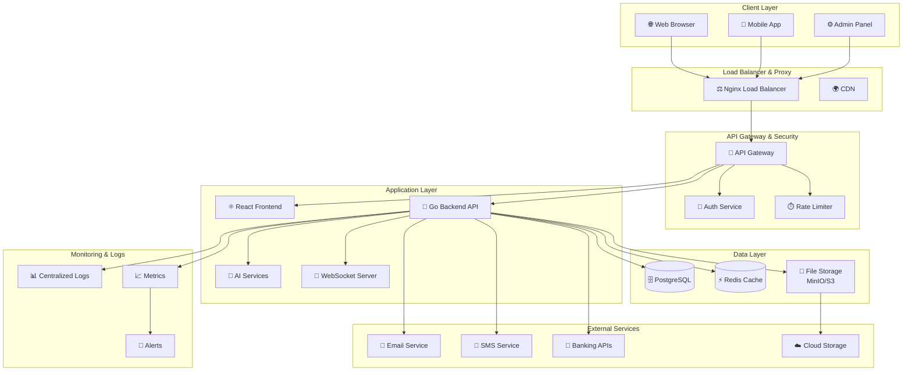
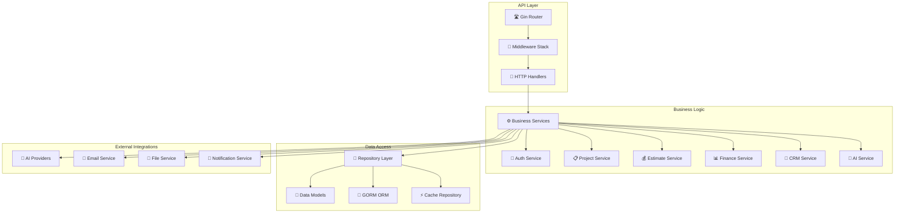
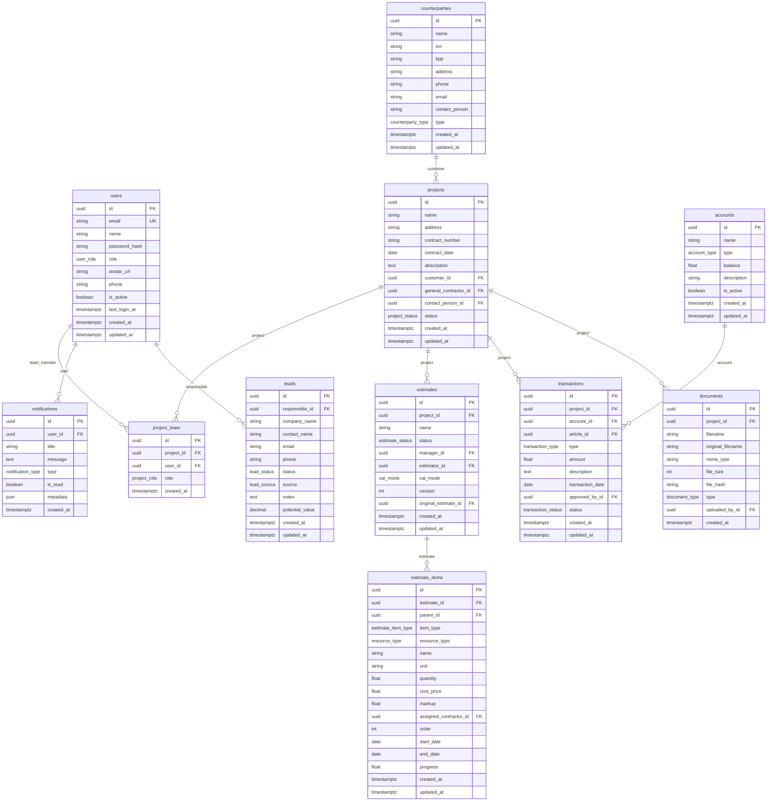
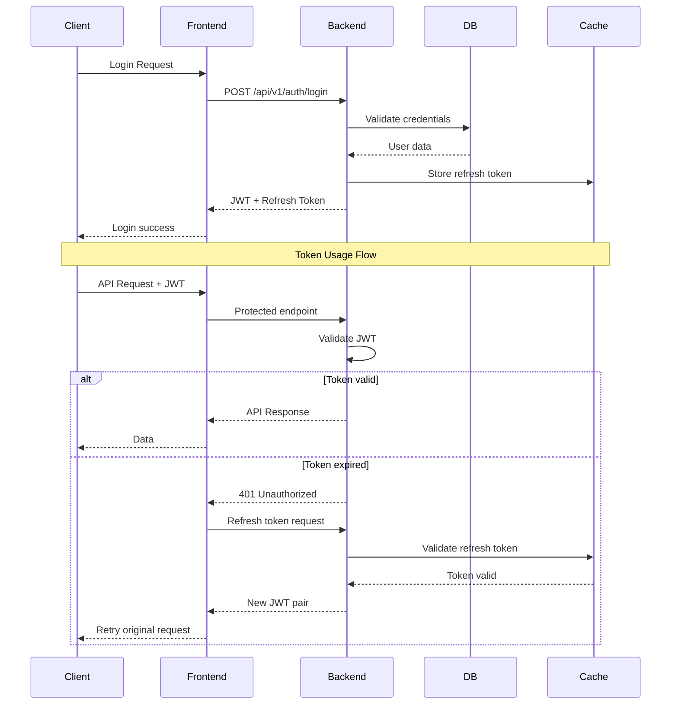
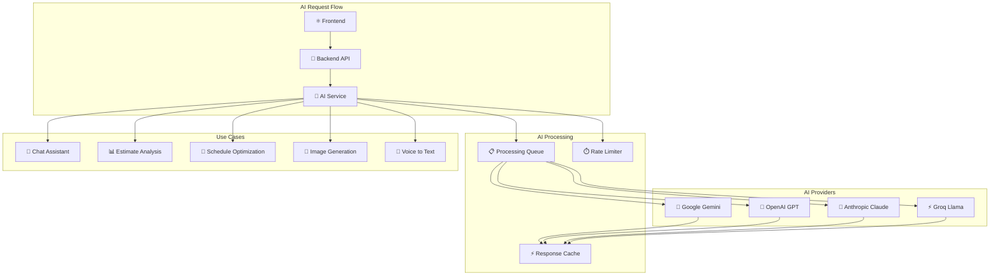
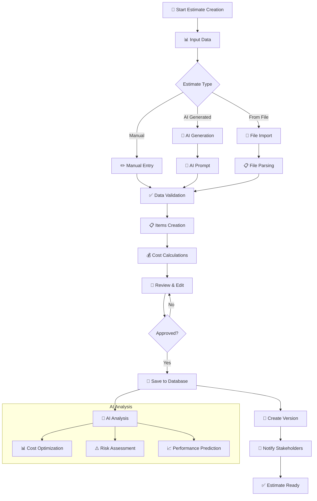
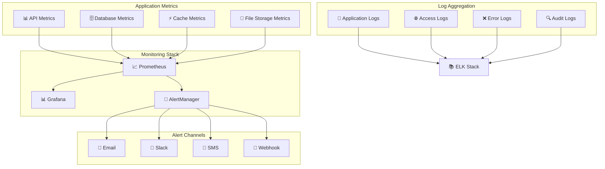

# Архитектурные диаграммы системы "Строй-Контроль"

## Общая системная архитектура

## Архитектура бэкенда

## Схема базы данных

## Поток аутентификации и авторизации

## Архитектура AI интеграции

## Поток обработки смет

## Мониторинг и алертинг

---

*Диаграммы созданы: 24.11.2024*
*Инструмент: Mermaid.js*
*Версия: 1.0*