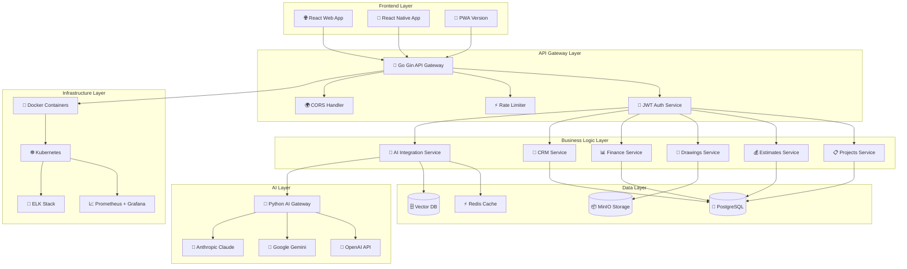

# Комплексная архитектура Go + Gin + PostgreSQL системы

## 📋 Обзор

Данный документ объединяет все архитектурные решения для системы "Строй-Контроль" с Go бэкендом, включая модульность, AI интеграцию, PDF обработку и мобильную поддержку.

---

## 🏗️ Общая архитектура системы



---

## 🚀 Go Backend Architecture

### Структура проекта
```
stroy-control-backend/
├── cmd/
│   └── server/
│       └── main.go
├── internal/
│   ├── config/
│   │   ├── config.go
│   │   └── database.go
│   ├── handlers/
│   │   ├── auth_handler.go
│   │   ├── projects_handler.go
│   │   ├── estimates_handler.go
│   │   ├── drawings_handler.go
│   │   ├── finance_handler.go
│   │   ├── crm_handler.go
│   │   └── ai_handler.go
│   ├── services/
│   │   ├── auth_service.go
│   │   ├── projects_service.go
│   │   ├── estimates_service.go
│   │   ├── drawings_service.go
│   │   ├── finance_service.go
│   │   ├── crm_service.go
│   │   ├── ai_service.go
│   │   └── file_service.go
│   ├── repository/
│   │   ├── base_repository.go
│   │   ├── projects_repository.go
│   │   ├── estimates_repository.go
│   │   ├── drawings_repository.go
│   │   ├── finance_repository.go
│   │   ├── crm_repository.go
│   │   └── users_repository.go
│   ├── models/
│   │   ├── user.go
│   │   ├── project.go
│   │   ├── estimate.go
│   │   ├── drawing.go
│   │   ├── finance.go
│   │   ├── crm.go
│   │   └── ai.go
│   ├── middleware/
│   │   ├── auth_middleware.go
│   │   ├── cors_middleware.go
│   │   ├── rate_limit_middleware.go
│   │   ├── permission_middleware.go
│   │   └── logging_middleware.go
│   ├── modules/
│   │   ├── auth/
│   │   ├── projects/
│   │   ├── estimates/
│   │   ├── drawings/
│   │   ├── finance/
│   │   ├── crm/
│   │   └── ai/
│   └── utils/
│       ├── response.go
│       ├── validation.go
│       ├── pagination.go
│       └── encryption.go
├── pkg/
│   ├── pdf/
│   │   ├── processor.go
│   │   └── renderer.go
│   ├── ai/
│   │   ├── client.go
│   │   └── types.go
│   └── storage/
│       ├── minio_client.go
│       └── file_storage.go
├── migrations/
│   ├── 001_create_users.sql
│   ├── 002_create_companies.sql
│   ├── 003_create_projects.sql
│   ├── 004_create_estimates.sql
│   ├── 005_create_drawings.sql
│   ├── 006_create_finance.sql
│   ├── 007_create_crm.sql
│   └── 008_create_ai_tables.sql
├── docker/
│   ├── Dockerfile
│   ├── docker-compose.yml
│   └── nginx.conf
├── scripts/
│   ├── build.sh
│   ├── deploy.sh
│   └── migrate.sh
├── docs/
│   ├── api.md
│   └── deployment.md
├── go.mod
├── go.sum
└── README.md
```

### Core конфигурация
```go
// internal/config/config.go
package config

import (
    "fmt"
    "os"
    "time"
    
    "github.com/spf13/viper"
)

type Config struct {
    Server   ServerConfig   `mapstructure:"server"`
    Database DatabaseConfig `mapstructure:"database"`
    Redis    RedisConfig    `mapstructure:"redis"`
    MinIO    MinIOConfig    `mapstructure:"minio"`
    AI       AIConfig       `mapstructure:"ai"`
    JWT      JWTConfig      `mapstructure:"jwt"`
}

type ServerConfig struct {
    Host         string        `mapstructure:"host"`
    Port         int           `mapstructure:"port"`
    ReadTimeout  time.Duration `mapstructure:"read_timeout"`
    WriteTimeout time.Duration `mapstructure:"write_timeout"`
    IdleTimeout  time.Duration `mapstructure:"idle_timeout"`
}

type DatabaseConfig struct {
    Host         string `mapstructure:"host"`
    Port         int    `mapstructure:"port"`
    User         string `mapstructure:"user"`
    Password     string `mapstructure:"password"`
    DBName       string `mapstructure:"dbname"`
    SSLMode      string `mapstructure:"ssl_mode"`
    MaxOpenConns int    `mapstructure:"max_open_conns"`
    MaxIdleConns int    `mapstructure:"max_idle_conns"`
}

type RedisConfig struct {
    Host     string `mapstructure:"host"`
    Port     int    `mapstructure:"port"`
    Password string `mapstructure:"password"`
    DB       int    `mapstructure:"db"`
}

type MinIOConfig struct {
    Endpoint  string `mapstructure:"endpoint"`
    AccessKey string `mapstructure:"access_key"`
    SecretKey string `mapstructure:"secret_key"`
    UseSSL    bool   `mapstructure:"use_ssl"`
    Bucket    string `mapstructure:"bucket"`
}

type AIConfig struct {
    GatewayURL string `mapstructure:"gateway_url"`
    APIKey     string `mapstructure:"api_key"`
    Timeout    time.Duration `mapstructure:"timeout"`
}

type JWTConfig struct {
    SecretKey     string        `mapstructure:"secret_key"`
    RefreshKey    string        `mapstructure:"refresh_key"`
    ExpiryTime    time.Duration `mapstructure:"expiry_time"`
    RefreshExpiry time.Duration `mapstructure:"refresh_expiry"`
}

func Load() (*Config, error) {
    viper.SetConfigName("config")
    viper.SetConfigType("yaml")
    viper.AddConfigPath(".")
    viper.AddConfigPath("./config")
    
    // Environment variables
    viper.AutomaticEnv()
    
    if err := viper.ReadInConfig(); err != nil {
        return nil, fmt.Errorf("failed to read config: %w", err)
    }
    
    var config Config
    if err := viper.Unmarshal(&config); err != nil {
        return nil, fmt.Errorf("failed to unmarshal config: %w", err)
    }
    
    return &config, nil
}
```

### Main application
```go
// cmd/server/main.go
package main

import (
    "context"
    "fmt"
    "log"
    "net/http"
    "os"
    "os/signal"
    "syscall"
    "time"
    
    "github.com/gin-gonic/gin"
    "gorm.io/gorm"
    
    "stroy-control/internal/config"
    "stroy-control/internal/database"
    "stroy-control/internal/handlers"
    "stroy-control/internal/middleware"
    "stroy-control/internal/modules"
    "stroy-control/internal/repository"
    "stroy-control/internal/services"
    "stroy-control/pkg/ai"
    "stroy-control/pkg/storage"
)

func main() {
    // Load configuration
    cfg, err := config.Load()
    if err != nil {
        log.Fatalf("Failed to load config: %v", err)
    }
    
    // Initialize database
    db, err := database.New(cfg.Database)
    if err != nil {
        log.Fatalf("Failed to connect to database: %v", err)
    }
    
    // Initialize Redis
    redisClient := database.NewRedis(cfg.Redis)
    
    // Initialize storage
    fileStorage, err := storage.NewMinIOClient(cfg.MinIO)
    if err != nil {
        log.Fatalf("Failed to initialize storage: %v", err)
    }
    
    // Initialize AI client
    aiClient := ai.NewClient(cfg.AI.GatewayURL, cfg.AI.APIKey)
    
    // Initialize repositories
    userRepo := repository.NewUserRepository(db)
    projectRepo := repository.NewProjectRepository(db)
    estimateRepo := repository.NewEstimateRepository(db)
    drawingRepo := repository.NewDrawingRepository(db)
    financeRepo := repository.NewFinanceRepository(db)
    crmRepo := repository.NewCRMRepository(db)
    
    // Initialize services
    authService := services.NewAuthService(userRepo, cfg.JWT)
    projectService := services.NewProjectService(projectRepo, userRepo)
    estimateService := services.NewEstimateService(estimateRepo, aiClient, redisClient)
    drawingService := services.NewDrawingService(drawingRepo, fileStorage, aiClient)
    financeService := services.NewFinanceService(financeRepo)
    crmService := services.NewCRMService(crmRepo)
    aiService := services.NewAIService(aiClient, redisClient)
    
    // Initialize handlers
    authHandler := handlers.NewAuthHandler(authService)
    projectHandler := handlers.NewProjectHandler(projectService)
    estimateHandler := handlers.NewEstimateHandler(estimateService)
    drawingHandler := handlers.NewDrawingHandler(drawingService)
    financeHandler := handlers.NewFinanceHandler(financeService)
    crmHandler := handlers.NewCRMHandler(crmService)
    aiHandler := handlers.NewAIHandler(aiService)
    
    // Setup Gin
    if cfg.Server.Host == "production" {
        gin.SetMode(gin.ReleaseMode)
    }
    
    router := gin.New()
    
    // Middleware
    router.Use(middleware.Logger())
    router.Use(middleware.Recovery())
    router.Use(middleware.CORS())
    router.Use(middleware.RateLimit(redisClient))
    
    // Health check
    router.GET("/health", func(c *gin.Context) {
        c.JSON(200, gin.H{
            "status": "ok",
            "timestamp": time.Now(),
            "version": "1.0.0",
        })
    })
    
    // Initialize module registry
    moduleRegistry := modules.NewRegistry(router, db, cfg)
    
    // Register modules
    moduleRegistry.RegisterModule(&modules.AuthModule{
        Handler: authHandler,
        Service: authService,
    })
    moduleRegistry.RegisterModule(&modules.ProjectsModule{
        Handler: projectHandler,
        Service: projectService,
    })
    moduleRegistry.RegisterModule(&modules.EstimatesModule{
        Handler: estimateHandler,
        Service: estimateService,
    })
    moduleRegistry.RegisterModule(&modules.DrawingsModule{
        Handler: drawingHandler,
        Service: drawingService,
    })
    moduleRegistry.RegisterModule(&modules.FinanceModule{
        Handler: financeHandler,
        Service: financeService,
    })
    moduleRegistry.RegisterModule(&modules.CRMModule{
        Handler: crmHandler,
        Service: crmService,
    })
    moduleRegistry.RegisterModule(&modules.AIModule{
        Handler: aiHandler,
        Service: aiService,
    })
    
    // Initialize modules with middleware
    router.Use(func(c *gin.Context) {
        // Get company subscription and initialize modules
        companyID := c.GetString("company_id")
        if companyID != "" {
            subscription, _ := projectService.GetCompanySubscription(companyID)
            moduleRegistry.InitializeModules(subscription)
        }
        c.Next()
    })
    
    // HTTP Server
    server := &http.Server{
        Addr:         fmt.Sprintf("%s:%d", cfg.Server.Host, cfg.Server.Port),
        Handler:      router,
        ReadTimeout:  cfg.Server.ReadTimeout,
        WriteTimeout: cfg.Server.WriteTimeout,
        IdleTimeout:  cfg.Server.IdleTimeout,
    }
    
    // Graceful shutdown
    go func() {
        if err := server.ListenAndServe(); err != nil && err != http.ErrServerClosed {
            log.Fatalf("Failed to start server: %v", err)
        }
    }()
    
    quit := make(chan os.Signal, 1)
    signal.Notify(quit, syscall.SIGINT, syscall.SIGTERM)
    <-quit
    
    log.Println("Shutting down server...")
    
    ctx, cancel := context.WithTimeout(context.Background(), 30*time.Second)
    defer cancel()
    
    if err := server.Shutdown(ctx); err != nil {
        log.Fatalf("Server forced to shutdown: %v", err)
    }
    
    log.Println("Server exited")
}
```

---

## 🤖 AI Integration Architecture

### Python AI Gateway
```python
# ai_gateway/main.py
from fastapi import FastAPI, HTTPException
from pydantic import BaseModel
import asyncio
from typing import Dict, Any, List
import openai
import google.generativeai as genai
from anthropic import Anthropic

app = FastAPI(title="AI Gateway for Stroy-Control")

class AIRequest(BaseModel):
    type: str
    prompt: str
    context: Dict[str, Any]
    options: Dict[str, Any] = {}

class AIResponse(BaseModel):
    result: Dict[str, Any]
    confidence: float
    tokens: int
    duration: float
    provider: str

class LLMRouter:
    def __init__(self):
        self.openai_client = openai.OpenAI()
        self.genai.configure(api_key=os.getenv("GEMINI_API_KEY"))
        self.anthropic = Anthropic()
    
    async def route_request(self, request: AIRequest) -> AIResponse:
        start_time = time.time()
        
        # Choose provider based on request type and options
        provider = self.choose_provider(request)
        
        try:
            if provider == "openai":
                result = await self.openai_request(request)
            elif provider == "gemini":
                result = await self.gemini_request(request)
            elif provider == "claude":
                result = await self.claude_request(request)
            else:
                raise ValueError(f"Unknown provider: {provider}")
            
            duration = time.time() - start_time
            
            return AIResponse(
                result=result,
                confidence=result.get("confidence", 0.8),
                tokens=result.get("tokens", 0),
                duration=duration,
                provider=provider
            )
        
        except Exception as e:
            raise HTTPException(status_code=500, detail=str(e))
    
    def choose_provider(self, request: AIRequest) -> str:
        # Provider selection logic
        if request.options.get("provider"):
            return request.options["provider"]
        
        # Default routing based on request type
        if request.type == "estimate_analysis":
            return "openai"  # Best for structured analysis
        elif request.type == "chat_assistant":
            return "claude"  # Best for conversational AI
        elif request.type == "document_generation":
            return "gemini"  # Good for document generation
        else:
            return "openai"  # Default

llm_router = LLMRouter()

@app.post("/api/v1/ai/process")
async def process_ai_request(request: AIRequest) -> AIResponse:
    return await llm_router.route_request(request)

@app.post("/api/v1/ai/analyze/estimate/{estimate_id}")
async def analyze_estimate(estimate_id: str, request: AIRequest):
    request.type = "estimate_analysis"
    request.context["estimate_id"] = estimate_id
    return await llm_router.route_request(request)

@app.post("/api/v1/ai/chat")
async def chat_with_ai(request: AIRequest):
    request.type = "chat_assistant"
    return await llm_router.route_request(request)

@app.post("/api/v1/ai/analyze/drawing/{drawing_id}")
async def analyze_drawing(drawing_id: str, request: AIRequest):
    request.type = "drawing_analysis"
    request.context["drawing_id"] = drawing_id
    return await llm_router.route_request(request)
```

### Go AI Service
```go
// internal/services/ai_service.go
package services

import (
    "context"
    "fmt"
    "time"
    
    "github.com/go-redis/redis/v8"
    "github.com/google/uuid"
)

type AIService struct {
    gatewayURL string
    apiKey    string
    cache     *redis.Client
    httpClient *http.Client
}

type AIRequest struct {
    Type      string                 `json:"type"`
    Prompt    string                 `json:"prompt"`
    Context   map[string]interface{} `json:"context"`
    Options   map[string]interface{} `json:"options"`
}

type AIResponse struct {
    Result    interface{} `json:"result"`
    Confidence float64    `json:"confidence"`
    Tokens     int        `json:"tokens"`
    Duration   time.Duration `json:"duration"`
    Provider   string     `json:"provider"`
}

func NewAIService(gatewayURL, apiKey string, cache *redis.Client) *AIService {
    return &AIService{
        gatewayURL: gatewayURL,
        apiKey:     apiKey,
        cache:      cache,
        httpClient: &http.Client{
            Timeout: 30 * time.Second,
        },
    }
}

func (s *AIService) ProcessRequest(ctx context.Context, req AIRequest) (*AIResponse, error) {
    // Check cache first
    cacheKey := fmt.Sprintf("ai:%s:%s", req.Type, hashPrompt(req.Prompt))
    if cached, err := s.cache.Get(ctx, cacheKey).Result(); err == nil {
        var resp AIResponse
        if err := json.Unmarshal([]byte(cached), &resp); err == nil {
            return &resp, nil
        }
    }
    
    // Send to Python Gateway
    resp, err := s.sendToGateway(ctx, req)
    if err != nil {
        return nil, err
    }
    
    // Cache result
    if data, err := json.Marshal(resp); err == nil {
        s.cache.Set(ctx, cacheKey, data, time.Hour)
    }
    
    return resp, nil
}

func (s *AIService) AnalyzeEstimate(ctx context.Context, estimateID string, options AnalyzeOptions) (*EstimateAnalysis, error) {
    req := AIRequest{
        Type:   "estimate_analysis",
        Prompt: "Analyze this construction estimate for risks and optimizations",
        Context: map[string]interface{}{
            "estimate_id": estimateID,
            "options":     options,
        },
    }
    
    resp, err := s.ProcessRequest(ctx, req)
    if err != nil {
        return nil, err
    }
    
    var analysis EstimateAnalysis
    if err := json.Unmarshal(resp.Result.(map[string]interface{})["analysis"].(json.RawMessage), &analysis); err != nil {
        return nil, err
    }
    
    return &analysis, nil
}

func (s *AIService) ChatWithAI(ctx context.Context, message string, userContext map[string]interface{}) (*ChatResponse, error) {
    req := AIRequest{
        Type:   "chat_assistant",
        Prompt: message,
        Context: userContext,
    }
    
    resp, err := s.ProcessRequest(ctx, req)
    if err != nil {
        return nil, err
    }
    
    var chatResp ChatResponse
    if err := json.Unmarshal(resp.Result.(map[string]interface{}), &chatResp); err != nil {
        return nil, err
    }
    
    return &chatResp, nil
}

func (s *AIService) AnalyzeDrawing(ctx context.Context, drawingID string, options DrawingAnalysisOptions) (*DrawingAnalysis, error) {
    req := AIRequest{
        Type:   "drawing_analysis",
        Prompt: "Analyze this construction drawing for compliance and issues",
        Context: map[string]interface{}{
            "drawing_id": drawingID,
            "options":    options,
        },
    }
    
    resp, err := s.ProcessRequest(ctx, req)
    if err != nil {
        return nil, err
    }
    
    var analysis DrawingAnalysis
    if err := json.Unmarshal(resp.Result.(map[string]interface{}), &analysis); err != nil {
        return nil, err
    }
    
    return &analysis, nil
}
```

---

## 📄 PDF Processing Architecture

### Go PDF Processor
```go
// pkg/pdf/processor.go
package pdf

import (
    "context"
    "fmt"
    "image"
    "image/png"
    "os"
    "path/filepath"
    "strings"
    
    "github.com/unidoc/unipdf/v3/common/license"
    "github.com/unidoc/unipdf/v3/model"
    "github.com/unidoc/unipdf/v3/render"
)

type Processor struct {
    tempDir string
    license bool
}

type DrawingPage struct {
    PageNumber    int                    `json:"page_number"`
    Width         float64                `json:"width"`
    Height        float64                `json:"height"`
    Scale         float64                `json:"scale"`
    Rotation      float64                `json:"rotation"`
    OriginalURL   *string                `json:"original_url"`
    ThumbnailURL  *string                `json:"thumbnail_url"`
    Text          string                 `json:"text"`
    Elements      []DrawingElement       `json:"elements"`
    AIElements    json.RawMessage        `json:"ai_elements" gorm:"type:jsonb"`
    AIText        json.RawMessage        `json:"ai_text" gorm:"type:jsonb"`
    AIAnalyzedAt *time.Time             `json:"ai_analyzed_at"`
}

type DrawingElement struct {
    Type        string                 `json:"type"`
    Coordinates []float64              `json:"coordinates"`
    Properties  map[string]interface{} `json:"properties"`
    Confidence  float64                `json:"confidence"`
}

func NewProcessor(tempDir string) *Processor {
    license.SetLicenseKey("your-license-key")
    return &Processor{
        tempDir: tempDir,
        license: true,
    }
}

func (p *Processor) ProcessPDF(ctx context.Context, filePath string) ([]DrawingPage, error) {
    f, err := os.Open(filePath)
    if err != nil {
        return nil, fmt.Errorf("failed to open PDF: %w", err)
    }
    defer f.Close()
    
    pdfReader, err := model.NewPdfReader(f)
    if err != nil {
        return nil, fmt.Errorf("failed to create PDF reader: %w", err)
    }
    
    numPages, err := pdfReader.GetNumPages()
    if err != nil {
        return nil, fmt.Errorf("failed to get number of pages: %w", err)
    }
    
    var pages []DrawingPage
    
    for i := 1; i <= numPages; i++ {
        page, err := pdfReader.GetPage(i)
        if err != nil {
            continue
        }
        
        bbox, err := page.GetMediaBox()
        if err != nil {
            continue
        }
        
        width := bbox.Urx - bbox.Llx
        height := bbox.Ury - bbox.Lly
        
        // Render page to image
        imagePath, thumbnailPath, err := p.renderPageToImage(ctx, pdfReader, i, width, height)
        if err != nil {
            return nil, fmt.Errorf("failed to render page %d: %w", i, err)
        }
        
        // Extract text
        text, err := p.extractTextFromPage(page)
        if err != nil {
            text = ""
        }
        
        // Extract elements
        elements, err := p.extractElementsFromPage(page)
        if err != nil {
            elements = []DrawingElement{}
        }
        
        drawingPage := DrawingPage{
            PageNumber:   i,
            Width:        width,
            Height:       height,
            Scale:        1.0,
            Rotation:     0,
            OriginalURL:  &imagePath,
            ThumbnailURL: &thumbnailPath,
            Text:         text,
            Elements:     elements,
        }
        
        pages = append(pages, drawingPage)
    }
    
    return pages, nil
}

func (p *Processor) renderPageToImage(ctx context.Context, pdfReader *model.PdfReader, pageNum int, width, height float64) (string, string, error) {
    device := render.NewImageDevice(width, height, &render.ImageDeviceProperties{
        TextMode:  render.TextModeGlyph,
        Scale:     2.0,
        AntiAlias: true,
    })
    
    page, err := pdfReader.GetPage(pageNum)
    if err != nil {
        return "", "", err
    }
    
    img, err := device.Render(page)
    if err != nil {
        return "", "", err
    }
    
    // Save full image
    imagePath := filepath.Join(p.tempDir, fmt.Sprintf("page_%d_full.png", pageNum))
    fullImg := p.scaleImage(img, 2048, 2048)
    if err := p.saveImage(fullImg, imagePath); err != nil {
        return "", "", err
    }
    
    // Create thumbnail
    thumbnailPath := filepath.Join(p.tempDir, fmt.Sprintf("page_%d_thumb.png", pageNum))
    thumbImg := p.scaleImage(img, 300, 300)
    if err := p.saveImage(thumbImg, thumbnailPath); err != nil {
        return "", "", err
    }
    
    return imagePath, thumbnailPath, nil
}
```

### Canvas Renderer
```go
// pkg/canvas/renderer.go
package canvas

import (
    "encoding/json"
    "fmt"
    "image"
    "image/color"
    "image/draw"
    
    "github.com/disintegration/imaging"
    "github.com/fogleman/gg"
)

type Renderer struct {
    width  int
    height int
    dc     *gg.Context
}

type Annotation struct {
    ID         string                 `json:"id"`
    Type       string                 `json:"type"`
    Geometry   map[string]interface{} `json:"geometry"`
    Properties map[string]interface{} `json:"properties"`
}

func NewRenderer(width, height int) *Renderer {
    dc := gg.NewContext(width, height)
    return &Renderer{
        width:  width,
        height: height,
        dc:     dc,
    }
}

func (r *Renderer) LoadBackground(imagePath string) error {
    img, err := gg.LoadImage(imagePath)
    if err != nil {
        return fmt.Errorf("failed to load background image: %w", err)
    }
    
    scaledImg := imaging.Fit(img, r.width, r.height, imaging.Lanczos)
    r.dc.DrawImage(scaledImg, 0, 0)
    
    return nil
}

func (r *Renderer) RenderAnnotations(annotations []Annotation) error {
    for _, annotation := range annotations {
        if err := r.renderAnnotation(annotation); err != nil {
            return fmt.Errorf("failed to render annotation %s: %w", annotation.ID, err)
        }
    }
    return nil
}

func (r *Renderer) renderAnnotation(annotation Annotation) error {
    props, err := r.parseProperties(annotation.Properties)
    if err != nil {
        return err
    }
    
    r.setupStyle(props)
    
    switch annotation.Type {
    case "point":
        return r.renderPoint(annotation.Geometry, props)
    case "line":
        return r.renderLine(annotation.Geometry, props)
    case "arrow":
        return r.renderArrow(annotation.Geometry, props)
    case "rectangle":
        return r.renderRectangle(annotation.Geometry, props)
    case "circle":
        return r.renderCircle(annotation.Geometry, props)
    case "text":
        return r.renderText(annotation.Geometry, props)
    case "freehand":
        return r.renderFreehand(annotation.Geometry, props)
    default:
        return fmt.Errorf("unsupported annotation type: %s", annotation.Type)
    }
}

func (r *Renderer) SaveImage(path string) error {
    return r.dc.SavePNG(path)
}
```

---

## 📱 Frontend Architecture

### React + TypeScript Structure
```
stroy-control-frontend/
├── public/
│   ├── manifest.json
│   ├── service-worker.js
│   └── icons/
├── src/
│   ├── components/
│   │   ├── common/
│   │   │   ├── Layout/
│   │   │   ├── Navigation/
│   │   │   ├── Notifications/
│   │   │   └── Loading/
│   │   ├── ai/
│   │   │   ├── AIChat/
│   │   │   ├── AIAnalysis/
│   │   │   └── AIInsights/
│   │   ├── drawings/
│   │   │   ├── PDFViewer/
│   │   │   ├── DrawingCanvas/
│   │   │   ├── AnnotationTools/
│   │   │   └── VersionComparison/
│   │   ├── projects/
│   │   │   ├── ProjectList/
│   │   │   ├── ProjectCard/
│   │   │   └── ProjectForm/
│   │   ├── estimates/
│   │   │   ├── EstimateEditor/
│   │   │   ├── EstimatePreview/
│   │   │   └── EstimateTemplates/
│   │   ├── finance/
│   │   │   ├── Dashboard/
│   │   │   ├── Transactions/
│   │   │   └── Reports/
│   │   └── crm/
│   │       ├── ContactList/
│   │       ├── LeadPipeline/
│   │       └── CustomerProfile/
│   ├── modules/
│   │   ├── core/
│   │   ├── projects/
│   │   ├── estimates/
│   │   ├── drawings/
│   │   ├── finance/
│   │   ├── crm/
│   │   └── ai/
│   ├── stores/
│   │   ├── auth-store.ts
│   │   ├── projects-store.ts
│   │   ├── estimates-store.ts
│   │   ├── drawings-store.ts
│   │   ├── finance-store.ts
│   │   ├── crm-store.ts
│   │   └── ai-store.ts
│   ├── hooks/
│   │   ├── useAuth.ts
│   │   ├── usePermissions.ts
│   │   ├── useWebSocket.ts
│   │   ├── useOfflineSync.ts
│   │   └── usePerformance.ts
│   ├── lib/
│   │   ├── api-client.ts
│   │   ├── react-query.ts
│   │   ├── websocket.ts
│   │   ├── module-registry.ts
│   │   └── performance.ts
│   ├── types/
│   │   ├── api.ts
│   │   ├── user.ts
│   │   ├── project.ts
│   │   ├── estimate.ts
│   │   ├── drawing.ts
│   │   ├── finance.ts
│   │   ├── crm.ts
│   │   └── ai.ts
│   ├── utils/
│   │   ├── validation.ts
│   │   ├── formatting.ts
│   │   ├── calculations.ts
│   │   └── file-utils.ts
│   ├── pages/
│   │   ├── Dashboard/
│   │   ├── Projects/
│   │   ├── Estimates/
│   │   ├── Drawings/
│   │   ├── Finance/
│   │   ├── CRM/
│   │   ├── AI/
│   │   ├── Settings/
│   │   └── Auth/
│   ├── App.tsx
│   ├── main.tsx
│   └── vite-env.d.ts
├── package.json
├── vite.config.ts
├── tailwind.config.js
├── tsconfig.json
└── README.md
```

### API Client
```typescript
// lib/api-client.ts
export class GoAPIClient {
  private config: APIConfig;
  private authToken: string | null = null;

  constructor(config: APIConfig) {
    this.config = config;
  }

  private getHeaders(): Record<string, string> {
    const headers: Record<string, string> = {
      'Content-Type': 'application/json',
      'Accept': 'application/json',
    };

    if (this.authToken) {
      headers['Authorization'] = `Bearer ${this.authToken}`;
    }

    return headers;
  }

  async request<T>(
    endpoint: string,
    options: RequestInit = {}
  ): Promise<APIResponse<T>> {
    const url = `${this.config.baseURL}${endpoint}`;
    
    try {
      const response = await fetch(url, {
        ...options,
        headers: {
          ...this.getHeaders(),
          ...options.headers,
        },
        signal: AbortSignal.timeout(this.config.timeout),
      });

      if (!response.ok) {
        this.handleError(response);
      }

      return await response.json();
    } catch (error) {
      console.error(`API Error [${endpoint}]:`, error);
      throw error;
    }
  }

  // Projects
  async getProjects(params?: ProjectFilters): Promise<APIResponse<Project[]>> {
    const query = new URLSearchParams(params as any).toString();
    return this.request<APIResponse<Project[]>>(`/api/v1/projects?${query}`);
  }

  async createProject(data: CreateProjectRequest): Promise<APIResponse<Project>> {
    return this.request<APIResponse<Project>>('/api/v1/projects', {
      method: 'POST',
      body: JSON.stringify(data),
    });
  }

  // Drawings
  async uploadDrawing(projectId: string, file: File, data: UploadDrawingRequest): Promise<APIResponse<Drawing>> {
    const formData = new FormData();
    formData.append('file', file);
    formData.append('name', data.name);
    formData.append('description', data.description || '');

    return this.request<APIResponse<Drawing>>(`/api/v1/projects/${projectId}/drawings`, {
      method: 'POST',
      body: formData,
      headers: {},
    });
  }

  // AI
  async analyzeEstimate(estimateId: string, options: AnalyzeOptions): Promise<APIResponse<AIAnalysis>> {
    return this.request<APIResponse<AIAnalysis>>(`/api/v1/ai/analyze/estimate/${estimateId}`, {
      method: 'POST',
      body: JSON.stringify({ options }),
    });
  }

  async chatWithAI(message: string, context?: string): Promise<APIResponse<AIChatResponse>> {
    return this.request<APIResponse<AIChatResponse>>('/api/v1/ai/chat', {
      method: 'POST',
      body: JSON.stringify({ message, context }),
    });
  }

  // WebSocket
  connectWebSocket(projectId: string): WebSocket {
    const wsURL = `${this.config.baseURL.replace('http', 'ws')}/api/v1/ws/projects/${projectId}`;
    const ws = new WebSocket(wsURL);

    ws.addEventListener('open', () => {
      ws.send(JSON.stringify({
        type: 'auth',
        token: this.authToken,
      }));
    });

    return ws;
  }
}
```

---

## 🗄️ Database Architecture

### PostgreSQL Schema
```sql
-- Core tables
CREATE TABLE users (
    id UUID PRIMARY KEY DEFAULT gen_random_uuid(),
    email VARCHAR(255) UNIQUE NOT NULL,
    password_hash VARCHAR(255) NOT NULL,
    first_name VARCHAR(100),
    last_name VARCHAR(100),
    phone VARCHAR(20),
    avatar_url VARCHAR(500),
    is_active BOOLEAN DEFAULT true,
    last_login TIMESTAMP WITH TIME ZONE,
    created_at TIMESTAMP WITH TIME ZONE DEFAULT NOW(),
    updated_at TIMESTAMP WITH TIME ZONE DEFAULT NOW()
);

CREATE TABLE companies (
    id UUID PRIMARY KEY DEFAULT gen_random_uuid(),
    name VARCHAR(255) NOT NULL,
    description TEXT,
    logo_url VARCHAR(500),
    website VARCHAR(500),
    phone VARCHAR(20),
    email VARCHAR(255),
    address TEXT,
    is_active BOOLEAN DEFAULT true,
    created_at TIMESTAMP WITH TIME ZONE DEFAULT NOW(),
    updated_at TIMESTAMP WITH TIME ZONE DEFAULT NOW()
);

CREATE TABLE user_companies (
    user_id UUID NOT NULL REFERENCES users(id) ON DELETE CASCADE,
    company_id UUID NOT NULL REFERENCES companies(id) ON DELETE CASCADE,
    role VARCHAR(50) NOT NULL,
    joined_at TIMESTAMP WITH TIME ZONE DEFAULT NOW(),
    PRIMARY KEY (user_id, company_id)
);

-- Projects
CREATE TABLE projects (
    id UUID PRIMARY KEY DEFAULT gen_random_uuid(),
    company_id UUID NOT NULL REFERENCES companies(id) ON DELETE CASCADE,
    name VARCHAR(255) NOT NULL,
    description TEXT,
    status VARCHAR(50) DEFAULT 'planning',
    start_date DATE,
    end_date DATE,
    budget DECIMAL(15,2),
    currency VARCHAR(3) DEFAULT 'RUB',
    address TEXT,
    coordinates POINT,
    manager_id UUID REFERENCES users(id),
    created_by UUID NOT NULL REFERENCES users(id),
    created_at TIMESTAMP WITH TIME ZONE DEFAULT NOW(),
    updated_at TIMESTAMP WITH TIME ZONE DEFAULT NOW()
);

-- Estimates
CREATE TABLE estimates (
    id UUID PRIMARY KEY DEFAULT gen_random_uuid(),
    project_id UUID NOT NULL REFERENCES projects(id) ON DELETE CASCADE,
    name VARCHAR(255) NOT NULL,
    description TEXT,
    version INTEGER DEFAULT 1,
    status VARCHAR(50) DEFAULT 'draft',
    total_amount DECIMAL(15,2),
    currency VARCHAR(3) DEFAULT 'RUB',
    created_by UUID NOT NULL REFERENCES users(id),
    approved_by UUID REFERENCES users(id),
    approved_at TIMESTAMP WITH TIME ZONE,
    created_at TIMESTAMP WITH TIME ZONE DEFAULT NOW(),
    updated_at TIMESTAMP WITH TIME ZONE DEFAULT NOW(),
    ai_analysis JSONB,
    ai_analyzed_at TIMESTAMP WITH TIME ZONE
);

CREATE TABLE estimate_items (
    id UUID PRIMARY KEY DEFAULT gen_random_uuid(),
    estimate_id UUID NOT NULL REFERENCES estimates(id) ON DELETE CASCADE,
    parent_id UUID REFERENCES estimate_items(id),
    name VARCHAR(255) NOT NULL,
    description TEXT,
    quantity DECIMAL(10,2) NOT NULL,
    unit VARCHAR(20) NOT NULL,
    unit_price DECIMAL(10,2) NOT NULL,
    total_price DECIMAL(15,2) GENERATED ALWAYS AS (quantity * unit_price) STORED,
    margin_percent DECIMAL(5,2),
    vat_rate DECIMAL(5,2),
    sort_order INTEGER DEFAULT 0,
    created_at TIMESTAMP WITH TIME ZONE DEFAULT NOW(),
    updated_at TIMESTAMP WITH TIME ZONE DEFAULT NOW()
);

-- Drawings
CREATE TABLE drawings (
    id UUID PRIMARY KEY DEFAULT gen_random_uuid(),
    project_id UUID NOT NULL REFERENCES projects(id) ON DELETE CASCADE,
    name VARCHAR(255) NOT NULL,
    description TEXT,
    file_path VARCHAR(500) NOT NULL,
    file_size BIGINT NOT NULL,
    file_hash VARCHAR(64) NOT NULL,
    mime_type VARCHAR(100) NOT NULL,
    version INTEGER DEFAULT 1,
    status VARCHAR(50) DEFAULT 'draft',
    uploaded_by UUID NOT NULL REFERENCES users(id),
    uploaded_at TIMESTAMP WITH TIME ZONE DEFAULT NOW(),
    updated_at TIMESTAMP WITH TIME ZONE DEFAULT NOW(),
    approved_at TIMESTAMP WITH TIME ZONE,
    approved_by UUID REFERENCES users(id),
    metadata JSONB DEFAULT '{}',
    scale JSONB,
    ai_analysis JSONB,
    ai_processed_at TIMESTAMP WITH TIME ZONE,
    ai_confidence DECIMAL(3,2)
);

CREATE TABLE drawing_pages (
    id UUID PRIMARY KEY DEFAULT gen_random_uuid(),
    drawing_id UUID NOT NULL REFERENCES drawings(id) ON DELETE CASCADE,
    page_number INTEGER NOT NULL,
    width DECIMAL(10,2) NOT NULL,
    height DECIMAL(10,2) NOT NULL,
    scale DECIMAL(10,2) DEFAULT 1.0,
    rotation DECIMAL(5,2) DEFAULT 0.0,
    original_url VARCHAR(500),
    thumbnail_url VARCHAR(500),
    text TEXT,
    elements JSONB,
    ai_elements JSONB,
    ai_text JSONB,
    ai_analyzed_at TIMESTAMP WITH TIME ZONE,
    created_at TIMESTAMP WITH TIME ZONE DEFAULT NOW(),
    UNIQUE(drawing_id, page_number)
);

CREATE TABLE annotations (
    id UUID PRIMARY KEY DEFAULT gen_random_uuid(),
    drawing_id UUID NOT NULL REFERENCES drawings(id) ON DELETE CASCADE,
    page_number INTEGER NOT NULL,
    type VARCHAR(50) NOT NULL,
    geometry JSONB NOT NULL,
    properties JSONB DEFAULT '{}',
    status VARCHAR(50) DEFAULT 'active',
    created_by UUID NOT NULL REFERENCES users(id),
    updated_by UUID REFERENCES users(id),
    created_at TIMESTAMP WITH TIME ZONE DEFAULT NOW(),
    updated_at TIMESTAMP WITH TIME ZONE DEFAULT NOW(),
    approved_at TIMESTAMP WITH TIME ZONE,
    approved_by UUID REFERENCES users(id)
);

CREATE TABLE annotation_history (
    id UUID PRIMARY KEY DEFAULT gen_random_uuid(),
    annotation_id UUID NOT NULL REFERENCES annotations(id) ON DELETE CASCADE,
    change_type VARCHAR(50) NOT NULL,
    old_data JSONB,
    new_data JSONB,
    changed_by UUID NOT NULL REFERENCES users(id),
    changed_at TIMESTAMP WITH TIME ZONE DEFAULT NOW()
);

-- Defects
CREATE TABLE defects (
    id UUID PRIMARY KEY DEFAULT gen_random_uuid(),
    project_id UUID NOT NULL REFERENCES projects(id) ON DELETE CASCADE,
    drawing_id UUID REFERENCES drawings(id) ON DELETE SET NULL,
    annotation_id UUID REFERENCES annotations(id) ON DELETE SET NULL,
    title VARCHAR(255) NOT NULL,
    description TEXT,
    severity VARCHAR(50) NOT NULL,
    status VARCHAR(50) DEFAULT 'open',
    assigned_to UUID REFERENCES users(id),
    reported_by UUID NOT NULL REFERENCES users(id),
    resolved_at TIMESTAMP WITH TIME ZONE,
    resolved_by UUID REFERENCES users(id),
    created_at TIMESTAMP WITH TIME ZONE DEFAULT NOW(),
    updated_at TIMESTAMP WITH TIME ZONE DEFAULT NOW(),
    coordinates POINT,
    ai_detected BOOLEAN DEFAULT false,
    ai_confidence DECIMAL(3,2)
);

CREATE TABLE defect_photos (
    id UUID PRIMARY KEY DEFAULT gen_random_uuid(),
    defect_id UUID NOT NULL REFERENCES defects(id) ON DELETE CASCADE,
    file_path VARCHAR(500) NOT NULL,
    file_size BIGINT NOT NULL,
    mime_type VARCHAR(100) NOT NULL,
    thumbnail_url VARCHAR(500),
    description TEXT,
    uploaded_by UUID NOT NULL REFERENCES users(id),
    uploaded_at TIMESTAMP WITH TIME ZONE DEFAULT NOW()
);

-- Finance
CREATE TABLE accounts (
    id UUID PRIMARY KEY DEFAULT gen_random_uuid(),
    company_id UUID NOT NULL REFERENCES companies(id) ON DELETE CASCADE,
    name VARCHAR(255) NOT NULL,
    type VARCHAR(50) NOT NULL,
    currency VARCHAR(3) DEFAULT 'RUB',
    balance DECIMAL(15,2) DEFAULT 0,
    is_active BOOLEAN DEFAULT true,
    created_at TIMESTAMP WITH TIME ZONE DEFAULT NOW(),
    updated_at TIMESTAMP WITH TIME ZONE DEFAULT NOW()
);

CREATE TABLE transactions (
    id UUID PRIMARY KEY DEFAULT gen_random_uuid(),
    account_id UUID NOT NULL REFERENCES accounts(id) ON DELETE CASCADE,
    project_id UUID REFERENCES projects(id) ON DELETE SET NULL,
    type VARCHAR(50) NOT NULL,
    amount DECIMAL(15,2) NOT NULL,
    currency VARCHAR(3) DEFAULT 'RUB',
    description TEXT,
    category VARCHAR(100),
    date DATE NOT NULL,
    created_by UUID NOT NULL REFERENCES users(id),
    created_at TIMESTAMP WITH TIME ZONE DEFAULT NOW(),
    updated_at TIMESTAMP WITH TIME ZONE DEFAULT NOW()
);

-- CRM
CREATE TABLE contacts (
    id UUID PRIMARY KEY DEFAULT gen_random_uuid(),
    company_id UUID NOT NULL REFERENCES companies(id) ON DELETE CASCADE,
    type VARCHAR(50) NOT NULL,
    first_name VARCHAR(100),
    last_name VARCHAR(100),
    company_name VARCHAR(255),
    email VARCHAR(255),
    phone VARCHAR(20),
    address TEXT,
    notes TEXT,
    status VARCHAR(50) DEFAULT 'active',
    created_by UUID NOT NULL REFERENCES users(id),
    created_at TIMESTAMP WITH TIME ZONE DEFAULT NOW(),
    updated_at TIMESTAMP WITH TIME ZONE DEFAULT NOW()
);

CREATE TABLE leads (
    id UUID PRIMARY KEY DEFAULT gen_random_uuid(),
    company_id UUID NOT NULL REFERENCES companies(id) ON DELETE CASCADE,
    contact_id UUID REFERENCES contacts(id) ON DELETE SET NULL,
    title VARCHAR(255) NOT NULL,
    description TEXT,
    status VARCHAR(50) DEFAULT 'new',
    priority VARCHAR(50) DEFAULT 'medium',
    value DECIMAL(15,2),
    currency VARCHAR(3) DEFAULT 'RUB',
    expected_close_date DATE,
    assigned_to UUID REFERENCES users(id),
    created_by UUID NOT NULL REFERENCES users(id),
    created_at TIMESTAMP WITH TIME ZONE DEFAULT NOW(),
    updated_at TIMESTAMP WITH TIME ZONE DEFAULT NOW()
);

-- AI and Analytics
CREATE TABLE ai_analyses (
    id UUID PRIMARY KEY DEFAULT gen_random_uuid(),
    entity_type VARCHAR(50) NOT NULL,
    entity_id UUID NOT NULL,
    analysis_type VARCHAR(50) NOT NULL,
    result JSONB NOT NULL,
    confidence DECIMAL(3,2),
    tokens_used INTEGER,
    processing_time_ms INTEGER,
    model VARCHAR(50),
    provider VARCHAR(50),
    created_at TIMESTAMP WITH TIME ZONE DEFAULT NOW(),
    created_by UUID NOT NULL REFERENCES users(id)
);

CREATE TABLE ai_requests (
    id UUID PRIMARY KEY DEFAULT gen_random_uuid(),
    user_id UUID NOT NULL REFERENCES users(id),
    request_type VARCHAR(50) NOT NULL,
    prompt TEXT NOT NULL,
    context JSONB,
    result JSONB,
    tokens_used INTEGER,
    cost DECIMAL(10,4),
    duration_ms INTEGER,
    model VARCHAR(50),
    provider VARCHAR(50),
    created_at TIMESTAMP WITH TIME ZONE DEFAULT NOW()
);

-- Permissions and Roles
CREATE TABLE roles (
    id UUID PRIMARY KEY DEFAULT gen_random_uuid(),
    name VARCHAR(50) NOT NULL UNIQUE,
    description TEXT,
    is_system BOOLEAN DEFAULT false,
    created_at TIMESTAMP WITH TIME ZONE DEFAULT NOW()
);

CREATE TABLE permissions (
    id UUID PRIMARY KEY DEFAULT gen_random_uuid(),
    resource VARCHAR(50) NOT NULL,
    action VARCHAR(50) NOT NULL,
    description TEXT,
    created_at TIMESTAMP WITH TIME ZONE DEFAULT NOW(),
    UNIQUE(resource, action)
);

CREATE TABLE role_permissions (
    role_id UUID NOT NULL REFERENCES roles(id) ON DELETE CASCADE,
    permission_id UUID NOT NULL REFERENCES permissions(id) ON DELETE CASCADE,
    PRIMARY KEY (role_id, permission_id)
);

CREATE TABLE user_roles (
    user_id UUID NOT NULL REFERENCES users(id) ON DELETE CASCADE,
    role_id UUID NOT NULL REFERENCES roles(id) ON DELETE CASCADE,
    company_id UUID NOT NULL REFERENCES companies(id) ON DELETE CASCADE,
    assigned_at TIMESTAMP WITH TIME ZONE DEFAULT NOW(),
    assigned_by UUID REFERENCES users(id),
    PRIMARY KEY (user_id, role_id, company_id)
);

-- Subscriptions
CREATE TABLE company_subscriptions (
    id UUID PRIMARY KEY DEFAULT gen_random_uuid(),
    company_id UUID NOT NULL REFERENCES companies(id) ON DELETE CASCADE,
    plan VARCHAR(50) NOT NULL,
    modules JSONB NOT NULL DEFAULT '[]',
    limits JSONB,
    expires_at TIMESTAMP WITH TIME ZONE,
    is_active BOOLEAN DEFAULT true,
    created_at TIMESTAMP WITH TIME ZONE DEFAULT NOW(),
    updated_at TIMESTAMP WITH TIME ZONE DEFAULT NOW()
);

-- Indexes
CREATE INDEX idx_users_email ON users(email);
CREATE INDEX idx_projects_company_id ON projects(company_id);
CREATE INDEX idx_projects_status ON projects(status);
CREATE INDEX idx_estimates_project_id ON estimates(project_id);
CREATE INDEX idx_drawings_project_id ON drawings(project_id);
CREATE INDEX idx_annotations_drawing_id ON annotations(drawing_id);
CREATE INDEX idx_defects_project_id ON defects(project_id);
CREATE INDEX idx_transactions_account_id ON transactions(account_id);
CREATE INDEX idx_transactions_date ON transactions(date);
CREATE INDEX idx_ai_analyses_entity ON ai_analyses(entity_type, entity_id);
CREATE INDEX idx_user_roles_user_company ON user_roles(user_id, company_id);

-- Triggers
CREATE OR REPLACE FUNCTION update_updated_at_column()
RETURNS TRIGGER AS $$
BEGIN
    NEW.updated_at = NOW();
    RETURN NEW;
END;
$$ language 'plpgsql';

-- Apply to all tables with updated_at column
CREATE TRIGGER update_users_updated_at BEFORE UPDATE ON users
    FOR EACH ROW EXECUTE FUNCTION update_updated_at_column();

CREATE TRIGGER update_projects_updated_at BEFORE UPDATE ON projects
    FOR EACH ROW EXECUTE FUNCTION update_updated_at_column();

CREATE TRIGGER update_estimates_updated_at BEFORE UPDATE ON estimates
    FOR EACH ROW EXECUTE FUNCTION update_updated_at_column();

-- ... and so on for other tables
```

---

## 🚀 Deployment Architecture

### Docker Compose
```yaml
# docker-compose.yml
version: '3.8'

services:
  postgres:
    image: postgres:15
    environment:
      POSTGRES_DB: stroy_control
      POSTGRES_USER: postgres
      POSTGRES_PASSWORD: password
    volumes:
      - postgres_data:/var/lib/postgresql/data
      - ./migrations:/docker-entrypoint-initdb.d
    ports:
      - "5432:5432"
    healthcheck:
      test: ["CMD-SHELL", "pg_isready -U postgres"]
      interval: 30s
      timeout: 10s
      retries: 3

  redis:
    image: redis:7-alpine
    ports:
      - "6379:6379"
    volumes:
      - redis_data:/data
    healthcheck:
      test: ["CMD", "redis-cli", "ping"]
      interval: 30s
      timeout: 10s
      retries: 3

  minio:
    image: minio/minio:latest
    command: server /data --console-address ":9001"
    environment:
      MINIO_ROOT_USER: minioadmin
      MINIO_ROOT_PASSWORD: minioadmin123
    volumes:
      - minio_data:/data
    ports:
      - "9000:9000"
      - "9001:9001"
    healthcheck:
      test: ["CMD", "curl", "-f", "http://localhost:9000/minio/health/live"]
      interval: 30s
      timeout: 10s
      retries: 3

  go-backend:
    build:
      context: .
      dockerfile: docker/Dockerfile
    ports:
      - "8080:8080"
    environment:
      - DATABASE_HOST=postgres
      - DATABASE_PORT=5432
      - DATABASE_USER=postgres
      - DATABASE_PASSWORD=password
      - DATABASE_NAME=stroy_control
      - REDIS_HOST=redis
      - REDIS_PORT=6379
      - MINIO_ENDPOINT=minio:9000
      - AI_GATEWAY_URL=http://ai-gateway:8000
    depends_on:
      postgres:
        condition: service_healthy
      redis:
        condition: service_healthy
      minio:
        condition: service_healthy
    volumes:
      - ./uploads:/app/uploads
    healthcheck:
      test: ["CMD", "curl", "-f", "http://localhost:8080/health"]
      interval: 30s
      timeout: 10s
      retries: 3

  ai-gateway:
    build:
      context: ./ai-gateway
      dockerfile: Dockerfile
    ports:
      - "8000:8000"
    environment:
      - OPENAI_API_KEY=${OPENAI_API_KEY}
      - GEMINI_API_KEY=${GEMINI_API_KEY}
      - ANTHROPIC_API_KEY=${ANTHROPIC_API_KEY}
    depends_on:
      - redis
    healthcheck:
      test: ["CMD", "curl", "-f", "http://localhost:8000/health"]
      interval: 30s
      timeout: 10s
      retries: 3

  frontend:
    build:
      context: ../stroy-control-frontend
      dockerfile: docker/Dockerfile
    ports:
      - "3000:3000"
    environment:
      - REACT_APP_API_URL=http://localhost:8080
      - REACT_APP_WS_URL=ws://localhost:8080
    depends_on:
      - go-backend
    volumes:
      - ../stroy-control-frontend:/app
      - /app/node_modules

  nginx:
    image: nginx:alpine
    ports:
      - "80:80"
      - "443:443"
    volumes:
      - ./docker/nginx.conf:/etc/nginx/nginx.conf
      - ./docker/ssl:/etc/nginx/ssl
    depends_on:
      - frontend
      - go-backend

volumes:
  postgres_data:
  redis_data:
  minio_data:
```

### Kubernetes Deployment
```yaml
# k8s/deployment.yaml
apiVersion: apps/v1
kind: Deployment
metadata:
  name: stroy-control-backend
spec:
  replicas: 3
  selector:
    matchLabels:
      app: stroy-control-backend
  template:
    metadata:
      labels:
        app: stroy-control-backend
    spec:
      containers:
      - name: backend
        image: stroy-control/backend:latest
        ports:
        - containerPort: 8080
        env:
        - name: DATABASE_HOST
          value: "postgres-service"
        - name: REDIS_HOST
          value: "redis-service"
        - name: MINIO_ENDPOINT
          value: "minio-service"
        resources:
          requests:
            memory: "256Mi"
            cpu: "250m"
          limits:
            memory: "512Mi"
            cpu: "500m"
        livenessProbe:
          httpGet:
            path: /health
            port: 8080
          initialDelaySeconds: 30
          periodSeconds: 10
        readinessProbe:
          httpGet:
            path: /health
            port: 8080
          initialDelaySeconds: 5
          periodSeconds: 5

---
apiVersion: v1
kind: Service
metadata:
  name: stroy-control-backend-service
spec:
  selector:
    app: stroy-control-backend
  ports:
  - protocol: TCP
    port: 80
    targetPort: 8080
  type: LoadBalancer
```

---

## 📊 Monitoring & Observability

### Prometheus Metrics
```go
// internal/middleware/metrics.go
package middleware

import (
    "github.com/gin-gonic/gin"
    "github.com/prometheus/client_golang/prometheus"
    "github.com/prometheus/client_golang/prometheus/promauto"
)

var (
    requestsTotal = promauto.NewCounterVec(
        prometheus.CounterOpts{
            Name: "http_requests_total",
            Help: "Total number of HTTP requests",
        },
        []string{"method", "path", "status"},
    )
    
    requestDuration = promauto.NewHistogramVec(
        prometheus.HistogramOpts{
            Name: "http_request_duration_seconds",
            Help: "HTTP request duration in seconds",
        },
        []string{"method", "path"},
    )
    
    activeConnections = promauto.NewGauge(
        prometheus.GaugeOpts{
            Name: "websocket_connections_active",
            Help: "Number of active WebSocket connections",
        },
    )
)

func PrometheusMiddleware() gin.HandlerFunc {
    return func(c *gin.Context) {
        start := time.Now()
        
        c.Next()
        
        duration := time.Since(start).Seconds()
        
        requestsTotal.WithLabelValues(
            c.Request.Method,
            c.FullPath(),
            fmt.Sprintf("%d", c.Writer.Status()),
        ).Inc()
        
        requestDuration.WithLabelValues(
            c.Request.Method,
            c.FullPath(),
        ).Observe(duration)
    }
}
```

### Grafana Dashboard
```json
{
  "dashboard": {
    "title": "Stroy-Control Metrics",
    "panels": [
      {
        "title": "Request Rate",
        "type": "graph",
        "targets": [
          {
            "expr": "rate(http_requests_total[5m])",
            "legendFormat": "{{method}} {{path}}"
          }
        ]
      },
      {
        "title": "Response Time",
        "type": "graph",
        "targets": [
          {
            "expr": "histogram_quantile(0.95, rate(http_request_duration_seconds_bucket[5m]))",
            "legendFormat": "95th percentile"
          }
        ]
      },
      {
        "title": "Database Connections",
        "type": "singlestat",
        "targets": [
          {
            "expr": "pg_stat_database_numbackends",
            "legendFormat": "Active connections"
          }
        ]
      }
    ]
  }
}
```

---

## 🔒 Security Architecture

### JWT Implementation
```go
// internal/services/jwt_service.go
package services

import (
    "time"
    "github.com/golang-jwt/jwt/v5"
)

type JWTService struct {
    secretKey     []byte
    refreshKey    []byte
    expiryTime    time.Duration
    refreshExpiry time.Duration
}

type Claims struct {
    UserID    string `json:"user_id"`
    CompanyID string `json:"company_id"`
    Email     string `json:"email"`
    Role      string `json:"role"`
    jwt.RegisteredClaims
}

func (s *JWTService) GenerateAccessToken(user *models.User) (string, error) {
    claims := &Claims{
        UserID:    user.ID,
        CompanyID: user.CompanyID,
        Email:     user.Email,
        Role:      user.Role,
        RegisteredClaims: jwt.RegisteredClaims{
            ExpiresAt: jwt.NewNumericDate(time.Now().Add(s.expiryTime)),
            IssuedAt:  jwt.NewNumericDate(time.Now()),
            NotBefore: jwt.NewNumericDate(time.Now()),
            Issuer:    "stroy-control",
            Subject:   user.ID,
        },
    }
    
    token := jwt.NewWithClaims(jwt.SigningMethodHS256, claims)
    return token.SignedString(s.secretKey)
}

func (s *JWTService) GenerateRefreshToken(user *models.User) (string, error) {
    claims := &Claims{
        UserID:    user.ID,
        CompanyID: user.CompanyID,
        Email:     user.Email,
        Role:      user.Role,
        RegisteredClaims: jwt.RegisteredClaims{
            ExpiresAt: jwt.NewNumericDate(time.Now().Add(s.refreshExpiry)),
            IssuedAt:  jwt.NewNumericDate(time.Now()),
            NotBefore: jwt.NewNumericDate(time.Now()),
            Issuer:    "stroy-control",
            Subject:   user.ID,
        },
    }
    
    token := jwt.NewWithClaims(jwt.SigningMethodHS256, claims)
    return token.SignedString(s.refreshKey)
}
```

### Rate Limiting
```go
// internal/middleware/rate_limit.go
package middleware

import (
    "context"
    "fmt"
    "time"
    
    "github.com/gin-gonic/gin"
    "github.com/go-redis/redis/v8"
)

func RateLimitMiddleware(redisClient *redis.Client) gin.HandlerFunc {
    return func(c *gin.Context) {
        key := fmt.Sprintf("rate_limit:%s", c.ClientIP())
        
        // Check current count
        count, err := redisClient.Get(context.Background(), key).Int()
        if err != nil && err != redis.Nil {
            c.Next()
            return
        }
        
        // Rate limit: 100 requests per minute
        limit := 100
        window := time.Minute
        
        if count >= limit {
            c.JSON(429, gin.H{
                "error": "Rate limit exceeded",
                "limit": limit,
                "window": window.String(),
            })
            c.Abort()
            return
        }
        
        // Increment counter
        pipe := redisClient.Pipeline()
        pipe.Incr(context.Background(), key)
        pipe.Expire(context.Background(), key, window)
        pipe.Exec(context.Background())
        
        c.Next()
    }
}
```

---

## 🎯 Summary

Эта комплексная архитектура обеспечивает:

### ✅ **Масштабируемость**
- Микросервисная архитектура с Go
- Горизонтальное масштабирование в Kubernetes
- Оптимизированная PostgreSQL с индексами

### ✅ **Производительность**
- Redis кэширование
- Асинхронная обработка PDF
- WebSocket для real-time обновлений

### ✅ **Безопасность**
- JWT аутентификация
- RBAC система прав
- Rate limiting и CORS

### ✅ **AI интеграция**
- Python AI Gateway
- Множественные LLM провайдеры
- Кэширование AI результатов

### ✅ **Модульность**
- Гибкая система подписок
- Динамическая загрузка модулей
- Изолированные компоненты

### ✅ **Мониторинг**
- Prometheus метрики
- Grafana дашборды
- Health checks

Эта архитектура готова к production и может масштабироваться под любые нагрузки.
