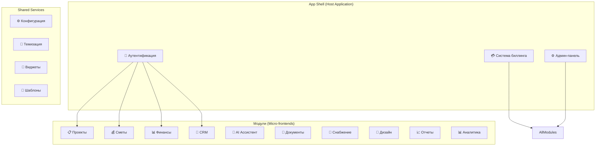

# План улучшений фронтенда "Строй-Контроль"

## Исполнительное резюме

Данный документ описывает стратегический план модернизации фронтенд архитектуры системы "Строй-Контроль" для создания модульной системы с гибким управлением доступом, разнообразными подписками и новыми функциями.

### Ключевые цели
1. **Модульная архитектура** - превращение существующих модулей в отдельные приложения
2. **Система подписок** - tier-based доступ к функциям для разных типов пользователей
3. **Гибкая система доступа** - настройка прав для сотрудников и клиентов
4. **Новые функции** - расширение возможностей AI, аналитики и автоматизации
5. **Масштабируемость** - подготовка к росту числа пользователей и модулей

---

## 1. Анализ текущего состояния

### ✅ Существующие сильные стороны
- **Полнофункциональный UI**: Все основные модули реализованы и работают
- **Современный стек**: React 19, TypeScript, Tailwind CSS
- **AI интеграция**: Поддержка множественных LLM провайдеров
- **Богатая функциональность**: Сметы, финансы, CRM, проекты, документооборот
- **Хорошая архитектура**: Контекстное управление состоянием, модульная структура

### ❌ Выявленные проблемы
- **Монолитность**: Все модули в одном приложении без изоляции
- **Отсутствие системы подписок**: Нет разграничения по планам доступа
- **Ограниченная персонализация**: Нет настройки интерфейса под пользователя
- **Отсутствие мобильной версии**: Нет PWA и мобильной адаптации
- **Ограниченная автоматизация**: Мало шаблонов и workflow
- **Отсутствие real-time функций**: Нет WebSocket и live обновлений

---

## 2. Архитектурная концепция

### Модульная архитектура


### Система подписок
- **Free Tier**: Базовые функции, ограниченные проекты
- **Professional Tier**: Полный доступ к основным модулям
- **Enterprise Tier**: Все модули + расширенные функции
- **Custom Tier**: Индивидуальная настройка модулей

---

## 3. Детальный план реализации

### 3.1 Phase 1: Система модулей и подписок

#### 3.1.1 Архитектура модулей
```typescript
// Новые типы для модульной системы
export interface Module {
  id: string;
  name: string;
  description: string;
  version: string;
  permissions: Permission[];
  components: ModuleComponent[];
  dependencies: string[];
  subscriptionTiers: SubscriptionTier[];
  pricing: ModulePricing;
}

export interface SubscriptionTier {
  id: string;
  name: string;
  features: string[];
  limits: ModuleLimits;
  price: number;
  billingPeriod: 'monthly' | 'yearly';
}

export interface Permission {
  action: 'read' | 'write' | 'delete' | 'admin';
  resource: string;
  conditions?: Record<string, any>;
}
```

#### 3.1.2 Система доступа
- **Role-Based Access Control (RBAC)**: Расширение существующих ролей
- **Attribute-Based Access Control (ABAC)**: Условный доступ на основе атрибутов
- **Permission System**: Детальные права на действия
- **Dynamic Access**: Реальная проверка прав в компонентах

#### 3.1.3 Компонентный магазин
- **Module Store**: Магазин дополнительных модулей
- **Custom Modules**: Возможность создания собственных модулей
- **Marketplace Integration**: Интеграция с внешними поставщиками
- **License Management**: Управление лицензиями

### 3.2 Phase 2: Новые функции и улучшения

#### 3.2.1 Расширенный AI Ассистент
- **🎤 Voice Input**: Голосовое управление и создание заметок
- **🔊 Text-to-Speech**: Озвучивание отчетов и уведомлений
- **📸 Image Recognition**: Анализ чертежей и фото
- **📄 Document Analysis**: Автоматический анализ документов
- **🎯 Smart Suggestions**: Умные предложения на основе контекста
- **📊 Predictive Analytics**: Прогнозирование рисков и сроков

#### 3.2.2 Система виджетов и кастомизации
- **📱 Drag & Drop Dashboard**: Настройка дашборда пользователем
- **🎨 Theme System**: Темы, цвета, шрифты
- **📊 Widget Library**: Библиотека виджетов
- **🔧 Custom Widgets**: Создание собственных виджетов
- **📱 Responsive Layouts**: Адаптивные макеты
- **⚡ Performance Widgets**: Виджеты производительности

#### 3.2.3 Система шаблонов и автоматизации
- **📋 Template Engine**: Движок шаблонов для документов
- **🔄 Workflow Automation**: Автоматизация рабочих процессов
- **⏰ Scheduled Actions**: Планируемые действия
- **🔗 Integration Connectors**: Коннекторы к внешним системам
- **📧 Automated Notifications**: Умные уведомления
- **🎯 Rule Engine**: Движок правил для автоматизации

### 3.3 Phase 3: Мобильная адаптация и PWA

#### 3.3.1 Progressive Web App (PWA)
- **📱 Offline Mode**: Работа без интернета
- **📲 Push Notifications**: Мобильные уведомления
- **⚡ Fast Loading**: Кэширование и оптимизация
- **🔄 Background Sync**: Синхронизация в фоне
- **📊 Performance Monitoring**: Мониторинг производительности

#### 3.3.2 Мобильная версия
- **📱 Mobile-First Design**: Дизайн сначала для мобильных
- **🖱️ Touch Gestures**: Сенсорные жесты
- **📏 Responsive Components**: Адаптивные компоненты
- **🔐 Mobile Auth**: Биометрическая аутентификация
- **📷 Mobile Features**: Камера, геолокация

### 3.4 Phase 4: Расширенная аналитика и отчетность

#### 3.4.1 BI Dashboard
- **📊 Custom Reports**: Создание отчетов пользователем
- **📈 Advanced Charts**: Расширенные типы графиков
- **🎯 KPI Dashboards**: КПЭ дашборды
- **📱 Mobile Analytics**: Аналитика для мобильных
- **🔄 Real-time Data**: Реальное время данные

#### 3.4.2 Data Visualization
- **🎨 Interactive Charts**: Интерактивные графики
- **🌐 Geographic Maps**: Географические карты
- **📅 Timeline Views**: Временные представления
- **🔗 Relationship Graphs**: Графы связей
- **📊 Drill-down Reports**: Детализированные отчеты

---

## 4. Техническая реализация

### 4.1 Новые зависимости
```json
{
  "additionalDependencies": {
    "@vitejs/plugin-pwa": "^0.17.0",
    "workbox-window": "^7.0.0",
    "react-grid-layout": "^1.4.0",
    "react-beautiful-dnd": "^13.1.1",
    "react-virtualized": "^9.22.5",
    "react-window": "^1.8.8",
    "socket.io-client": "^4.7.0",
    "framer-motion": "^10.16.0",
    "react-spring": "^9.7.0",
    "recharts": "^2.8.0",
    "three": "^0.157.0",
    "@react-three/fiber": "^8.15.0",
    "lucide-react": "^0.292.0",
    "date-fns": "^2.30.0",
    "lodash": "^4.17.21",
    "zustand": "^4.4.0",
    "react-query": "^3.39.0"
  }
}
```

### 4.2 Структура новых файлов
```
src/
├── modules/                    # Новые модули
│   ├── auth/                  # Расширенная аутентификация
│   ├── billing/              # Система биллинга
│   ├── widgets/              # Система виджетов
│   ├── templates/            # Система шаблонов
│   ├── analytics/            # Расширенная аналитика
│   ├── mobile/               # Мобильные функции
│   └── marketplace/          # Магазин модулей
├── shared/                   # Общие компоненты
│   ├── ui-components/        # Расширенная UI библиотека
│   ├── hooks/               # Пользовательские хуки
│   ├── utils/               # Утилиты
│   ├── stores/              # Состояние приложения
│   └── constants/           # Константы
├── config/                   # Конфигурация
│   ├── modules.config.ts    # Конфигурация модулей
│   ├── permissions.config.ts # Права доступа
│   ├── themes.config.ts     # Темы
│   └── features.config.ts   # Фичефлаги
└── assets/                  # Ресурсы
    ├── themes/              # Темы
    ├── icons/               # Иконки
    └── fonts/               # Шрифты
```

### 4.3 Новые компоненты

#### 4.3.1 Система модулей
```typescript
// ModuleContainer - контейнер для модулей
interface ModuleContainerProps {
  moduleId: string;
  userPermissions: Permission[];
  subscription: Subscription;
}

// ModuleLoader - лоадер модулей с проверкой доступа
const ModuleLoader: React.FC<ModuleContainerProps> = ({ moduleId, userPermissions, subscription }) => {
  const hasAccess = useModuleAccess(moduleId, userPermissions, subscription);
  
  if (!hasAccess) {
    return <UpgradePrompt moduleId={moduleId} />;
  }
  
  return <ModuleComponent moduleId={moduleId} />;
};
```

#### 4.3.2 Система виджетов
```typescript
// DashboardBuilder - конструктор дашбордов
const DashboardBuilder: React.FC = () => {
  const [widgets, setWidgets] = useState([]);
  const [layout, setLayout] = useState([]);
  
  return (
    <DragDropContext onDragEnd={handleDragEnd}>
      <Droppable droppableId="dashboard">
        {(provided) => (
          <div ref={provided.innerRef} {...provided.droppableProps}>
            {widgets.map((widget, index) => (
              <Draggable key={widget.id} draggableId={widget.id} index={index}>
                {(provided) => (
                  <div ref={provided.innerRef} {...provided.draggableProps}>
                    <WidgetRenderer widget={widget} />
                  </div>
                )}
              </Draggable>
            ))}
          </div>
        )}
      </Droppable>
    </DragDropContext>
  );
};
```

#### 4.3.3 Расширенный AI Ассистент
```typescript
// VoiceAssistant - голосовой ассистент
const VoiceAssistant: React.FC = () => {
  const [isListening, setIsListening] = useState(false);
  const [transcript, setTranscript] = useState('');
  
  const handleVoiceCommand = useCallback(async (command: string) => {
    const response = await aiService.processCommand(command);
    // Обработка команды AI
  }, []);
  
  return (
    <div className="voice-assistant">
      <VoiceButton 
        onClick={toggleListening}
        isActive={isListening}
      />
      <TranscriptDisplay transcript={transcript} />
      <ActionSuggestions suggestions={aiService.getSuggestions()} />
    </div>
  );
};
```

---

## 5. Пользовательский опыт (UX)

### 5.1 Настройка интерфейса
- **Персонализация**: Пользователь может настроить интерфейс
- **Темы**: Светлая/темная тема, корпоративные цвета
- **Layout**: Выбор расположения элементов
- **Widgets**: Добавление/удаление виджетов
- **Shortcuts**: Горячие клавиши для быстрого доступа

### 5.2 Адаптивность
- **Responsive Design**: Адаптация под все экраны
- **Progressive Enhancement**: Постепенное улучшение функций
- **Offline Support**: Работа без интернета
- **Performance**: Быстрая загрузка и отзывчивость

### 5.3 Доступность (Accessibility)
- **WCAG 2.1**: Соответствие стандартам доступности
- **Keyboard Navigation**: Навигация с клавиатуры
- **Screen Reader**: Поддержка скринридеров
- **High Contrast**: Поддержка высокого контраста

---

## 6. Система подписок и биллинг

### 6.1 Тарифные планы

#### 6.1.1 Free Tier (Бесплатный)
- До 3 проектов
- Базовая сметная работа
- Ограниченный AI (50 запросов/месяц)
- Стандартные отчеты
- Email поддержка

#### 6.1.2 Professional (Профессиональный) - 2990₽/месяц
- До 50 проектов
- Все основные модули
- Неограниченный AI
- Расширенная аналитика
- Приоритетная поддержка
- Интеграции с внешними системами

#### 6.1.3 Enterprise (Корпоративный) - 9990₽/месяц
- Неограниченные проекты
- Все модули и функции
- Пользовательские виджеты
- API доступ
- Персональный менеджер
- On-premise развертывание

#### 6.1.4 Custom (Индивидуальный)
- Выборочная модульная система
- Индивидуальные условия
- Специальная разработка
- Интеграция под процессы клиента

### 6.2 Управление подписками
- **Upgrade/Downgrade**: Изменение планов
- **Trial Periods**: Пробные периоды
- **Usage Tracking**: Отслеживание использования
- **Billing Integration**: Интеграция с платежными системами
- **Usage Alerts**: Уведомления об использовании

---

## 7. Производительность и масштабирование

### 7.1 Оптимизация производительности
- **Code Splitting**: Разделение кода по модулям
- **Lazy Loading**: Ленивая загрузка компонентов
- **Virtual Scrolling**: Виртуальная прокрутка для больших списков
- **Memoization**: Мемоизация дорогих вычислений
- **Service Workers**: Кэширование и offline режим

### 7.2 Мониторинг производительности
- **Performance Metrics**: Метрики производительности
- **Error Tracking**: Отслеживание ошибок
- **User Analytics**: Аналитика использования
- **Real User Monitoring**: Мониторинг реальных пользователей

### 7.3 Кэширование
- **React Query**: Кэширование API запросов
- **Local Storage**: Локальное кэширование данных
- **Session Storage**: Кэширование сессий
- **IndexedDB**: Офлайн хранение данных

---

## 8. Тестирование и качество

### 8.1 Стратегия тестирования
- **Unit Tests**: Тестирование компонентов и утилит
- **Integration Tests**: Тестирование интеграций
- **E2E Tests**: End-to-end тестирование
- **Visual Regression**: Визуальное регрессионное тестирование
- **Performance Tests**: Тестирование производительности

### 8.2 Качество кода
- **ESLint + Prettier**: Автоматическое форматирование
- **TypeScript**: Статическая типизация
- **Husky**: Git hooks для качества
- **Conventional Commits**: Стандартизация коммитов
- **Code Review**: Обязательные ревью кода

---

## 9. Развертывание и DevOps

### 9.1 CI/CD Pipeline
```yaml
# .github/workflows/frontend.yml
name: Frontend CI/CD

on:
  push:
    branches: [main, develop]
  pull_request:
    branches: [main]

jobs:
  test:
    runs-on: ubuntu-latest
    steps:
      - uses: actions/checkout@v3
      - name: Setup Node.js
        uses: actions/setup-node@v3
        with:
          node-version: '18'
      - name: Install dependencies
        run: npm ci
      - name: Run tests
        run: npm test
      - name: Build
        run: npm run build
      - name: Deploy
        run: npm run deploy
```

### 9.2 Конфигурация окружений
- **Development**: Локальная разработка
- **Staging**: Тестирование перед продакшеном
- **Production**: Продакшн развертывание
- **Feature Flags**: Флаговая система фич

---

## 10. Временные рамки и ресурсы

### 10.1 График разработки

#### Месяц 1-2: Foundation (Основа)
- Создание модульной архитектуры
- Система аутентификации и авторизации
- Базовая система подписок
- API для модулей

#### Месяц 3-4: Core Features (Основные функции)
- Новые UI компоненты
- Система виджетов
- Расширенный AI ассистент
- Мобильная адаптация

#### Месяц 5-6: Advanced Features (Продвинутые функции)
- Система шаблонов и автоматизации
- Расширенная аналитика
- PWA функциональность
- Marketplace модулей

### 10.2 Необходимые ресурсы
- **Frontend Developers**: 3-4 разработчика
- **UX/UI Designer**: 1 дизайнер
- **DevOps Engineer**: 0.5 ставки
- **QA Engineer**: 0.5 ставки
- **Project Manager**: 0.5 ставки

---

## 11. Риски и митигация

### 11.1 Технические риски
- **Сложность модульной архитектуры**: Постепенное внедрение
- **Производительность**: Оптимизация с самого начала
- **Совместимость браузеров**: Тестирование в CI/CD
- **Зависимости от внешних сервисов**: Резервные варианты

### 11.2 Бизнес риски
- **Сопротивление изменениям пользователей**: Обучение и коммуникация
- **Временные затраты**: Реалистичное планирование
- **Бюджетные ограничения**: Приоритизация функций
- **Конкуренция**: Быстрый выход MVP

---

## 12. Метрики успеха

### 12.1 Технические метрики
- **Время загрузки**: < 2 секунды
- **Производительность**: Lighthouse Score > 90
- **Покрытие тестами**: > 80%
- **Error Rate**: < 1%
- **Uptime**: 99.9%

### 12.2 Бизнес метрики
- **Конверсия Free → Paid**: > 15%
- **Retention Rate**: > 80%
- **Customer Satisfaction**: > 4.5/5
- **Feature Adoption**: > 60% для новых функций
- **Support Tickets**: Снижение на 40%

---

## 13. Заключение

Данный план модернизации фронтенда "Строй-Контроль" позволит:

1. **Создать масштабируемую модульную архитектуру** с независимыми модулями
2. **Реализовать гибкую систему подписок** для различных типов пользователей
3. **Добавить современные функции** для улучшения пользовательского опыта
4. **Подготовить систему к росту** и расширению функциональности
5. **Обеспечить конкурентоспособность** на рынке строительных SaaS решений

Реализация данного плана потребует значительных ресурсов, но создаст прочную основу для долгосрочного развития продукта и привлечения новых пользователей.

---

**Документ создан:** 24.11.2024  
**Версия:** 1.0  
**Автор:** Kilo Code  
**Статус:** Готов к обсуждению