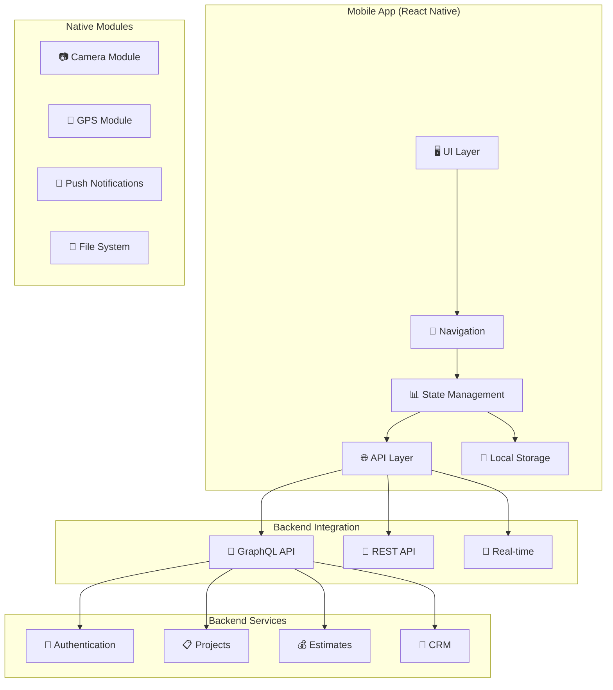

# План разработки мобильной версии системы "Строй-Контроль"

## Обзор мобильной стратегии

Данный документ описывает стратегию разработки мобильной версии системы "Строй-Контроль", включающую выбор технологического стека, архитектуру приложения, особенности UX/UI для мобильных устройств и план интеграции с существующим API.

### Цели мобильной разработки
- 📱 Обеспечение доступа к системе с мобильных устройств
- 🚀 Создание нативного пользовательского опыта
- 🔄 Синхронизация с веб-версией в реальном времени
- 📊 Ключевые функции для работы в полевых условиях
- 📸 Поддержка мобильных возможностей (камера, GPS, уведомления)

## Стратегия выбора платформы

### Сравнительный анализ подходов

| Критерий | React Native | Progressive Web App | Native (iOS/Android) |
|----------|--------------|---------------------|----------------------|
| **Разработка** | Единый код для iOS/Android | Веб-технологии | Отдельная разработка |
| **Производительность** | ⭐⭐⭐⭐ | ⭐⭐⭐ | ⭐⭐⭐⭐⭐ |
| **Доступ к API** | ⭐⭐⭐⭐⭐ | ⭐⭐⭐⭐⭐ | ⭐⭐⭐⭐⭐ |
| **App Store** | ✅ Доступно | ❌ Не требуется | ✅ Доступно |
| **Разработка** | 2-3 месяца | 1-2 месяца | 4-6 месяцев |
| **Стоимость** | $30,000-50,000 | $15,000-25,000 | $80,000-120,000 |

### Рекомендуемое решение: React Native

**Обоснование выбора:**
- ✅ Максимальное переиспользование существующего React кода
- ✅ Нативная производительность для критических операций
- ✅ Доступ к камере, GPS, push-уведомлениям
- ✅ Поддержка обеих платформ одним кодом
- ✅ Большое сообщество и экосистема

## Архитектура мобильного приложения

### Общая архитектура



### Структура проекта

```
stroy-control-mobile/
├── app/
│   ├── index.js                 # Entry point
│   ├── App.js                   # Main app component
│   └── providers/               # Context providers
├── src/
│   ├── components/              # Shared components
│   │   ├── common/
│   │   ├── forms/
│   │   └── charts/
│   ├── screens/                 # Screen components
│   │   ├── auth/
│   │   ├── projects/
│   │   ├── estimates/
│   │   ├── crm/
│   │   └── profile/
│   ├── navigation/              # Navigation config
│   │   ├── AppNavigator.js
│   │   └── AuthNavigator.js
│   ├── services/                # API services
│   │   ├── api/
│   │   ├── auth/
│   │   └── storage/
│   ├── hooks/                   # Custom hooks
│   ├── utils/                   # Utility functions
│   └── constants/               # App constants
├── assets/                      # Images, fonts, icons
├── android/                     # Android specific
├── ios/                         # iOS specific
└── __tests__/                   # Test files
```

## React Native Implementation

### Entry Point и настройка

```javascript
// app/index.js
import { AppRegistry } from 'react-native';
import App from './App';
import { name as appName } from './package.json';

AppRegistry.registerComponent(appName, () => App);
```

```javascript
// app/App.js
import React, { useEffect, useState } from 'react';
import { NavigationContainer } from '@react-navigation/native';
import { Provider as ReduxProvider } from 'react-redux';
import AsyncStorage from '@react-native-async-storage/async-storage';
import FlashMessage from 'react-native-flash-message';

import { AuthProvider } from './src/providers/AuthProvider';
import { APIProvider } from './src/providers/APIProvider';
import { NotificationProvider } from './src/providers/NotificationProvider';
import AppNavigator from './src/navigation/AppNavigator';
import { store } from './src/store/store';
import { setupNotifications } from './src/services/notifications';

const App = () => {
  const [isInitialized, setIsInitialized] = useState(false);

  useEffect(() => {
    const initializeApp = async () => {
      try {
        // Инициализация push-уведомлений
        await setupNotifications();
        
        // Инициализация других сервисов
        console.log('App initialized successfully');
        setIsInitialized(true);
      } catch (error) {
        console.error('App initialization failed:', error);
        setIsInitialized(true); // Продолжаем работу даже при ошибках
      }
    };

    initializeApp();
  }, []);

  if (!isInitialized) {
    return null; // Показываем splash screen
  }

  return (
    <ReduxProvider store={store}>
      <AuthProvider>
        <APIProvider>
          <NotificationProvider>
            <NavigationContainer>
              <AppNavigator />
            </NavigationContainer>
            <FlashMessage position="top" />
          </NotificationProvider>
        </APIProvider>
      </AuthProvider>
    </ReduxProvider>
  );
};

export default App;
```

### Authentication Provider

```javascript
// app/src/providers/AuthProvider.js
import React, { createContext, useContext, useReducer, useEffect } from 'react';
import AsyncStorage from '@react-native-async-storage/async-storage';
import authService from '../services/api/authService';

const AuthContext = createContext();

const initialState = {
  isAuthenticated: false,
  user: null,
  token: null,
  isLoading: true,
  error: null,
};

const authReducer = (state, action) => {
  switch (action.type) {
    case 'AUTH_START':
      return { ...state, isLoading: true, error: null };
    case 'AUTH_SUCCESS':
      return {
        ...state,
        isAuthenticated: true,
        user: action.payload.user,
        token: action.payload.token,
        isLoading: false,
        error: null,
      };
    case 'AUTH_FAILURE':
      return {
        ...state,
        isAuthenticated: false,
        user: null,
        token: null,
        isLoading: false,
        error: action.payload,
      };
    case 'AUTH_LOGOUT':
      return initialState;
    default:
      return state;
  }
};

export const AuthProvider = ({ children }) => {
  const [state, dispatch] = useReducer(authReducer, initialState);

  useEffect(() => {
    const checkAuthStatus = async () => {
      try {
        const token = await AsyncStorage.getItem('access_token');
        if (token) {
          // Проверка валидности токена
          const userProfile = await authService.getProfile();
          dispatch({
            type: 'AUTH_SUCCESS',
            payload: { user: userProfile, token },
          });
        } else {
          dispatch({ type: 'AUTH_FAILURE', payload: null });
        }
      } catch (error) {
        console.error('Auth check failed:', error);
        dispatch({ type: 'AUTH_FAILURE', payload: error.message });
      }
    };

    checkAuthStatus();
  }, []);

  const login = async (email, password) => {
    dispatch({ type: 'AUTH_START' });
    try {
      const response = await authService.login({ email, password });
      const { user, access_token, refresh_token } = response;

      // Сохранение токенов в AsyncStorage
      await AsyncStorage.setItem('access_token', access_token);
      await AsyncStorage.setItem('refresh_token', refresh_token);

      dispatch({
        type: 'AUTH_SUCCESS',
        payload: { user, token: access_token },
      });
    } catch (error) {
      dispatch({ type: 'AUTH_FAILURE', payload: error.message });
      throw error;
    }
  };

  const logout = async () => {
    try {
      await authService.logout();
    } catch (error) {
      console.error('Logout error:', error);
    } finally {
      // Очистка локального хранилища
      await AsyncStorage.multiRemove(['access_token', 'refresh_token']);
      dispatch({ type: 'AUTH_LOGOUT' });
    }
  };

  const refreshToken = async () => {
    try {
      const refreshToken = await AsyncStorage.getItem('refresh_token');
      if (!refreshToken) {
        throw new Error('No refresh token available');
      }

      const response = await authService.refreshToken(refreshToken);
      const { access_token } = response;

      await AsyncStorage.setItem('access_token', access_token);

      dispatch({
        type: 'AUTH_SUCCESS',
        payload: { user: state.user, token: access_token },
      });
    } catch (error) {
      // Если обновление токена не удалось, выходим из системы
      await logout();
    }
  };

  const value = {
    ...state,
    login,
    logout,
    refreshToken,
  };

  return (
    <AuthContext.Provider value={value}>
      {children}
    </AuthContext.Provider>
  );
};

export const useAuth = () => {
  const context = useContext(AuthContext);
  if (!context) {
    throw new Error('useAuth must be used within AuthProvider');
  }
  return context;
};
```

### API Service

```javascript
// app/src/services/api/baseAPI.js
import AsyncStorage from '@react-native-async-storage/async-storage';
import { API_BASE_URL } from '../../constants/config';

class BaseAPI {
  constructor() {
    this.baseURL = API_BASE_URL;
    this.token = null;
  }

  async initialize() {
    this.token = await AsyncStorage.getItem('access_token');
  }

  async request(endpoint, options = {}) {
    await this.initialize();

    const url = `${this.baseURL}${endpoint}`;
    const config = {
      headers: {
        'Content-Type': 'application/json',
        ...(this.token && { Authorization: `Bearer ${this.token}` }),
      },
      ...options,
    };

    try {
      const response = await fetch(url, config);
      
      if (response.status === 401) {
        // Попытка обновления токена
        await this.refreshToken();
        // Повторный запрос с новым токеном
        return this.request(endpoint, options);
      }

      if (!response.ok) {
        const errorData = await response.json();
        throw new Error(errorData.message || 'API request failed');
      }

      return await response.json();
    } catch (error) {
      console.error('API request error:', error);
      throw error;
    }
  }

  async refreshToken() {
    const refreshToken = await AsyncStorage.getItem('refresh_token');
    if (!refreshToken) {
      throw new Error('No refresh token available');
    }

    const response = await fetch(`${this.baseURL}/auth/refresh`, {
      method: 'POST',
      headers: {
        'Content-Type': 'application/json',
      },
      body: JSON.stringify({ refresh_token: refreshToken }),
    });

    if (!response.ok) {
      throw new Error('Token refresh failed');
    }

    const { access_token } = await response.json();
    await AsyncStorage.setItem('access_token', access_token);
    this.token = access_token;
  }

  get(endpoint) {
    return this.request(endpoint, { method: 'GET' });
  }

  post(endpoint, data) {
    return this.request(endpoint, {
      method: 'POST',
      body: JSON.stringify(data),
    });
  }

  put(endpoint, data) {
    return this.request(endpoint, {
      method: 'PUT',
      body: JSON.stringify(data),
    });
  }

  delete(endpoint) {
    return this.request(endpoint, { method: 'DELETE' });
  }
}

export default BaseAPI;
```

```javascript
// app/src/services/api/authService.js
import BaseAPI from './baseAPI';

class AuthService extends BaseAPI {
  async login(credentials) {
    const response = await this.post('/auth/login', credentials);
    return response.data;
  }

  async register(userData) {
    const response = await this.post('/auth/register', userData);
    return response.data;
  }

  async logout() {
    try {
      await this.post('/auth/logout');
    } catch (error) {
      console.error('Logout API call failed:', error);
    }
  }

  async getProfile() {
    const response = await this.get('/auth/profile');
    return response.data;
  }

  async updateProfile(data) {
    const response = await this.put('/auth/profile', data);
    return response.data;
  }

  async refreshToken(refreshToken) {
    const response = await this.post('/auth/refresh', { refresh_token: refreshToken });
    return response.data;
  }
}

export default new AuthService();
```

### Navigation Setup

```javascript
// app/src/navigation/AppNavigator.js
import React from 'react';
import { createNativeStackNavigator } from '@react-navigation/native-stack';
import { createBottomTabNavigator } from '@react-navigation/bottom-tabs';
import Icon from 'react-native-vector-icons/MaterialIcons';

import { useAuth } from '../providers/AuthProvider';

// Auth Screens
import LoginScreen from '../screens/auth/LoginScreen';
import RegisterScreen from '../screens/auth/RegisterScreen';

// Main App Screens
import ProjectsScreen from '../screens/projects/ProjectsScreen';
import ProjectDetailScreen from '../screens/projects/ProjectDetailScreen';
import EstimatesScreen from '../screens/estimates/EstimatesScreen';
import EstimateDetailScreen from '../screens/estimates/EstimateDetailScreen';
import CRMScreen from '../screens/crm/CRMScreen';
import ProfileScreen from '../screens/profile/ProfileScreen';

const Stack = createNativeStackNavigator();
const Tab = createBottomTabNavigator();

const MainTabs = () => {
  return (
    <Tab.Navigator
      screenOptions={({ route }) => ({
        tabBarIcon: ({ focused, color, size }) => {
          let iconName;

          switch (route.name) {
            case 'Projects':
              iconName = 'business';
              break;
            case 'Estimates':
              iconName = 'description';
              break;
            case 'CRM':
              iconName = 'people';
              break;
            case 'Profile':
              iconName = 'person';
              break;
            default:
              iconName = 'home';
          }

          return <Icon name={iconName} size={size} color={color} />;
        },
        tabBarActiveTintColor: '#2563eb',
        tabBarInactiveTintColor: 'gray',
        headerShown: false,
      })}
    >
      <Tab.Screen 
        name="Projects" 
        component={ProjectsScreen}
        options={{ title: 'Проекты' }}
      />
      <Tab.Screen 
        name="Estimates" 
        component={EstimatesScreen}
        options={{ title: 'Сметы' }}
      />
      <Tab.Screen 
        name="CRM" 
        component={CRMScreen}
        options={{ title: 'CRM' }}
      />
      <Tab.Screen 
        name="Profile" 
        component={ProfileScreen}
        options={{ title: 'Профиль' }}
      />
    </Tab.Navigator>
  );
};

const AppNavigator = () => {
  const { isAuthenticated, isLoading } = useAuth();

  if (isLoading) {
    // Показать splash screen или loading indicator
    return null;
  }

  return (
    <Stack.Navigator screenOptions={{ headerShown: false }}>
      {isAuthenticated ? (
        <>
          <Stack.Screen name="Main" component={MainTabs} />
          <Stack.Screen 
            name="ProjectDetail" 
            component={ProjectDetailScreen}
            options={{ title: 'Детали проекта' }}
          />
          <Stack.Screen 
            name="EstimateDetail" 
            component={EstimateDetailScreen}
            options={{ title: 'Детали сметы' }}
          />
        </>
      ) : (
        <>
          <Stack.Screen 
            name="Login" 
            component={LoginScreen}
            options={{ title: 'Вход в систему' }}
          />
          <Stack.Screen 
            name="Register" 
            component={RegisterScreen}
            options={{ title: 'Регистрация' }}
          />
        </>
      )}
    </Stack.Navigator>
  );
};

export default AppNavigator;
```

### Projects Screen

```javascript
// app/src/screens/projects/ProjectsScreen.js
import React, { useState, useEffect, useCallback } from 'react';
import {
  View,
  Text,
  FlatList,
  StyleSheet,
  RefreshControl,
  TouchableOpacity,
  Alert,
} from 'react-native';
import { useFocusEffect } from '@react-navigation/native';
import Icon from 'react-native-vector-icons/MaterialIcons';

import { useAuth } from '../../providers/AuthProvider';
import projectService from '../../services/api/projectService';
import ProjectCard from '../../components/projects/ProjectCard';
import LoadingSpinner from '../../components/common/LoadingSpinner';

const ProjectsScreen = ({ navigation }) => {
  const { user } = useAuth();
  const [projects, setProjects] = useState([]);
  const [isLoading, setIsLoading] = useState(true);
  const [refreshing, setRefreshing] = useState(false);
  const [error, setError] = useState(null);

  const loadProjects = async () => {
    try {
      setError(null);
      const response = await projectService.getProjects();
      setProjects(response.data);
    } catch (error) {
      console.error('Failed to load projects:', error);
      setError(error.message);
      Alert.alert('Ошибка', 'Не удалось загрузить проекты');
    } finally {
      setIsLoading(false);
      setRefreshing(false);
    }
  };

  useFocusEffect(
    useCallback(() => {
      loadProjects();
    }, [])
  );

  const onRefresh = () => {
    setRefreshing(true);
    loadProjects();
  };

  const handleProjectPress = (project) => {
    navigation.navigate('ProjectDetail', { project });
  };

  const renderProject = ({ item }) => (
    <ProjectCard
      project={item}
      onPress={() => handleProjectPress(item)}
      userRole={user.role}
    />
  );

  if (isLoading) {
    return <LoadingSpinner />;
  }

  if (error) {
    return (
      <View style={styles.errorContainer}>
        <Icon name="error" size={64} color="#ef4444" />
        <Text style={styles.errorText}>{error}</Text>
        <TouchableOpacity style={styles.retryButton} onPress={loadProjects}>
          <Text style={styles.retryButtonText}>Повторить</Text>
        </TouchableOpacity>
      </View>
    );
  }

  return (
    <View style={styles.container}>
      <FlatList
        data={projects}
        renderItem={renderProject}
        keyExtractor={(item) => item.id}
        contentContainerStyle={styles.listContainer}
        refreshControl={
          <RefreshControl refreshing={refreshing} onRefresh={onRefresh} />
        }
        ListEmptyComponent={
          <View style={styles.emptyContainer}>
            <Icon name="folder-open" size={64} color="#9ca3af" />
            <Text style={styles.emptyText}>Проекты не найдены</Text>
            <Text style={styles.emptySubtext}>
              Создайте первый проект для начала работы
            </Text>
          </View>
        }
      />
      
      {/* Floating Action Button для создания проекта */}
      {user.role !== 'client' && (
        <TouchableOpacity
          style={styles.fab}
          onPress={() => navigation.navigate('CreateProject')}
        >
          <Icon name="add" size={24} color="white" />
        </TouchableOpacity>
      )}
    </View>
  );
};

const styles = StyleSheet.create({
  container: {
    flex: 1,
    backgroundColor: '#f8fafc',
  },
  listContainer: {
    padding: 16,
  },
  errorContainer: {
    flex: 1,
    justifyContent: 'center',
    alignItems: 'center',
    padding: 32,
  },
  errorText: {
    fontSize: 16,
    color: '#ef4444',
    textAlign: 'center',
    marginTop: 16,
  },
  retryButton: {
    backgroundColor: '#2563eb',
    paddingHorizontal: 24,
    paddingVertical: 12,
    borderRadius: 8,
    marginTop: 16,
  },
  retryButtonText: {
    color: 'white',
    fontWeight: '600',
  },
  emptyContainer: {
    flex: 1,
    justifyContent: 'center',
    alignItems: 'center',
    padding: 32,
  },
  emptyText: {
    fontSize: 18,
    fontWeight: '600',
    color: '#374151',
    marginTop: 16,
    textAlign: 'center',
  },
  emptySubtext: {
    fontSize: 14,
    color: '#6b7280',
    textAlign: 'center',
    marginTop: 8,
  },
  fab: {
    position: 'absolute',
    bottom: 24,
    right: 24,
    width: 56,
    height: 56,
    borderRadius: 28,
    backgroundColor: '#2563eb',
    justifyContent: 'center',
    alignItems: 'center',
    elevation: 4,
    shadowColor: '#000',
    shadowOffset: {
      width: 0,
      height: 2,
    },
    shadowOpacity: 0.25,
    shadowRadius: 3.84,
  },
});

export default ProjectsScreen;
```

### Project Card Component

```javascript
// app/src/components/projects/ProjectCard.js
import React from 'react';
import {
  View,
  Text,
  TouchableOpacity,
  StyleSheet,
  Image,
} from 'react-native';
import Icon from 'react-native-vector-icons/MaterialIcons';

const ProjectCard = ({ project, onPress, userRole }) => {
  const getStatusColor = (status) => {
    switch (status) {
      case 'in_progress':
        return '#10b981';
      case 'planning':
        return '#f59e0b';
      case 'completed':
        return '#3b82f6';
      case 'on_hold':
        return '#ef4444';
      default:
        return '#6b7280';
    }
  };

  const getStatusText = (status) => {
    switch (status) {
      case 'in_progress':
        return 'В работе';
      case 'planning':
        return 'Планирование';
      case 'completed':
        return 'Завершен';
      case 'on_hold':
        return 'Приостановлен';
      default:
        return status;
    }
  };

  return (
    <TouchableOpacity style={styles.card} onPress={onPress}>
      <View style={styles.header}>
        <View style={styles.titleContainer}>
          <Text style={styles.title}>{project.name}</Text>
          <View style={[styles.statusBadge, { backgroundColor: getStatusColor(project.status) }]}>
            <Text style={styles.statusText}>{getStatusText(project.status)}</Text>
          </View>
        </View>
      </View>

      <View style={styles.content}>
        <View style={styles.infoRow}>
          <Icon name="location-on" size={16} color="#6b7280" />
          <Text style={styles.infoText}>{project.address}</Text>
        </View>

        <View style={styles.infoRow}>
          <Icon name="assignment" size={16} color="#6b7280" />
          <Text style={styles.infoText}>Договор: {project.contract_number}</Text>
        </View>

        <View style={styles.infoRow}>
          <Icon name="date-range" size={16} color="#6b7280" />
          <Text style={styles.infoText}>
            Дата: {new Date(project.contract_date).toLocaleDateString('ru-RU')}
          </Text>
        </View>

        {project.description && (
          <Text style={styles.description} numberOfLines={2}>
            {project.description}
          </Text>
        )}
      </View>

      <View style={styles.footer}>
        <View style={styles.progressContainer}>
          <Text style={styles.progressText}>
            Прогресс: {project.progress || 0}%
          </Text>
          <View style={styles.progressBar}>
            <View 
              style={[
                styles.progressFill, 
                { width: `${project.progress || 0}%` }
              ]} 
            />
          </View>
        </View>

        <View style={styles.actions}>
          <Icon name="chevron-right" size={24} color="#9ca3af" />
        </View>
      </View>
    </TouchableOpacity>
  );
};

const styles = StyleSheet.create({
  card: {
    backgroundColor: 'white',
    borderRadius: 12,
    marginBottom: 12,
    shadowColor: '#000',
    shadowOffset: {
      width: 0,
      height: 1,
    },
    shadowOpacity: 0.1,
    shadowRadius: 2,
    elevation: 2,
  },
  header: {
    padding: 16,
    borderBottomWidth: 1,
    borderBottomColor: '#f3f4f6',
  },
  titleContainer: {
    flexDirection: 'row',
    justifyContent: 'space-between',
    alignItems: 'flex-start',
  },
  title: {
    flex: 1,
    fontSize: 18,
    fontWeight: '600',
    color: '#111827',
    marginRight: 12,
  },
  statusBadge: {
    paddingHorizontal: 8,
    paddingVertical: 4,
    borderRadius: 12,
  },
  statusText: {
    fontSize: 12,
    fontWeight: '500',
    color: 'white',
  },
  content: {
    padding: 16,
  },
  infoRow: {
    flexDirection: 'row',
    alignItems: 'center',
    marginBottom: 8,
  },
  infoText: {
    fontSize: 14,
    color: '#6b7280',
    marginLeft: 8,
    flex: 1,
  },
  description: {
    fontSize: 14,
    color: '#374151',
    marginTop: 8,
    lineHeight: 20,
  },
  footer: {
    flexDirection: 'row',
    justifyContent: 'space-between',
    alignItems: 'center',
    padding: 16,
    borderTopWidth: 1,
    borderTopColor: '#f3f4f6',
  },
  progressContainer: {
    flex: 1,
    marginRight: 16,
  },
  progressText: {
    fontSize: 12,
    color: '#6b7280',
    marginBottom: 4,
  },
  progressBar: {
    height: 4,
    backgroundColor: '#e5e7eb',
    borderRadius: 2,
  },
  progressFill: {
    height: '100%',
    backgroundColor: '#10b981',
    borderRadius: 2,
  },
  actions: {
    paddingLeft: 16,
  },
});

export default ProjectCard;
```

## Специализированные мобильные функции

### Camera Integration

```javascript
// app/src/components/common/CameraCapture.js
import React, { useState, useRef } from 'react';
import {
  View,
  Text,
  TouchableOpacity,
  StyleSheet,
  CameraRoll,
  Alert,
} from 'react-native';
import { RNCamera } from 'react-native-camera';
import Icon from 'react-native-vector-icons/MaterialIcons';

const CameraCapture = ({ onImageCaptured, onClose }) => {
  const cameraRef = useRef(null);
  const [isRecording, setIsRecording] = useState(false);

  const takePicture = async () => {
    if (cameraRef.current) {
      try {
        const options = {
          quality: 0.8,
          base64: false,
          pauseAfterCapture: true,
        };
        
        const data = await cameraRef.current.takePictureAsync(options);
        
        // Сохранение в галерею
        await CameraRoll.save(data.uri, { type: 'photo' });
        
        onImageCaptured(data.uri);
        onClose();
      } catch (error) {
        Alert.alert('Ошибка', 'Не удалось сделать фото');
      }
    }
  };

  const recordVideo = async () => {
    if (cameraRef.current) {
      try {
        setIsRecording(true);
        const data = await cameraRef.current.recordAsync();
        
        // Сохранение видео
        await CameraRoll.save(data.uri, { type: 'video' });
        
        onImageCaptured(data.uri);
        onClose();
      } catch (error) {
        Alert.alert('Ошибка', 'Не удалось записать видео');
      } finally {
        setIsRecording(false);
      }
    }
  };

  return (
    <View style={styles.container}>
      <RNCamera
        ref={cameraRef}
        style={styles.camera}
        type={RNCamera.Constants.Type.back}
        flashMode={RNCamera.Constants.FlashMode.auto}
        captureAudio={true}
        androidCameraPermissionOptions={{
          title: 'Разрешение на использование камеры',
          message: 'Нам нужно использовать камеру для съемки документов',
          buttonPositive: 'OK',
          buttonNegative: 'Отмена',
        }}
      >
        <View style={styles.controls}>
          <TouchableOpacity style={styles.closeButton} onPress={onClose}>
            <Icon name="close" size={24} color="white" />
          </TouchableOpacity>

          <View style={styles.actionButtons}>
            <TouchableOpacity 
              style={styles.recordButton} 
              onPress={recordVideo}
              disabled={isRecording}
            >
              <Icon 
                name={isRecording ? "stop" : "videocam"} 
                size={32} 
                color="white" 
              />
            </TouchableOpacity>

            <TouchableOpacity style={styles.captureButton} onPress={takePicture}>
              <View style={styles.captureButtonInner} />
            </TouchableOpacity>
          </View>
        </View>
      </RNCamera>
    </View>
  );
};

const styles = StyleSheet.create({
  container: {
    flex: 1,
  },
  camera: {
    flex: 1,
  },
  controls: {
    flex: 1,
    backgroundColor: 'transparent',
    flexDirection: 'column',
    justifyContent: 'space-between',
  },
  closeButton: {
    alignSelf: 'flex-end',
    margin: 20,
    padding: 10,
    backgroundColor: 'rgba(0,0,0,0.5)',
    borderRadius: 20,
  },
  actionButtons: {
    flexDirection: 'row',
    justifyContent: 'space-around',
    alignItems: 'center',
    marginBottom: 50,
  },
  recordButton: {
    padding: 15,
    backgroundColor: 'rgba(0,0,0,0.5)',
    borderRadius: 25,
  },
  captureButton: {
    width: 60,
    height: 60,
    borderRadius: 30,
    backgroundColor: 'white',
    justifyContent: 'center',
    alignItems: 'center',
  },
  captureButtonInner: {
    width: 50,
    height: 50,
    borderRadius: 25,
    backgroundColor: 'white',
  },
});

export default CameraCapture;
```

### GPS и геолокация

```javascript
// app/src/services/locationService.js
import Geolocation from '@react-native-community/geolocation';

class LocationService {
  constructor() {
    this.currentPosition = null;
  }

  async getCurrentPosition() {
    return new Promise((resolve, reject) => {
      Geolocation.getCurrentPosition(
        (position) => {
          this.currentPosition = {
            latitude: position.coords.latitude,
            longitude: position.coords.longitude,
            accuracy: position.coords.accuracy,
            timestamp: position.timestamp,
          };
          resolve(this.currentPosition);
        },
        (error) => reject(error),
        {
          enableHighAccuracy: true,
          timeout: 15000,
          maximumAge: 10000,
        }
      );
    });
  }

  async watchPosition(callback, errorCallback) {
    return Geolocation.watchPosition(
      (position) => {
        this.currentPosition = {
          latitude: position.coords.latitude,
          longitude: position.coords.longitude,
          accuracy: position.coords.accuracy,
          timestamp: position.timestamp,
        };
        callback(this.currentPosition);
      },
      errorCallback,
      {
        enableHighAccuracy: true,
        timeout: 10000,
        maximumAge: 5000,
        distanceFilter: 10, // Обновлять каждые 10 метров
      }
    );
  }

  clearWatch(watchId) {
    Geolocation.clearWatch(watchId);
  }

  calculateDistance(pos1, pos2) {
    const R = 6371; // Радиус Земли в км
    const dLat = this.toRad(pos2.latitude - pos1.latitude);
    const dLon = this.toRad(pos2.longitude - pos1.longitude);
    
    const a = 
      Math.sin(dLat/2) * Math.sin(dLat/2) +
      Math.cos(this.toRad(pos1.latitude)) * Math.cos(this.toRad(pos2.latitude)) * 
      Math.sin(dLon/2) * Math.sin(dLon/2);
    
    const c = 2 * Math.atan2(Math.sqrt(a), Math.sqrt(1-a));
    const distance = R * c; // Расстояние в км
    
    return Math.round(distance * 1000); // В метрах
  }

  toRad(deg) {
    return deg * (Math.PI/180);
  }

  // Проверка нахождения в радиусе точки
  isWithinRadius(center, target, radiusMeters) {
    const distance = this.calculateDistance(center, target);
    return distance <= radiusMeters;
  }
}

export default new LocationService();
```

### Push Notifications

```javascript
// app/src/services/notifications.js
import messaging from '@react-native-firebase/messaging';
import AsyncStorage from '@react-native-async-storage/async-storage';

class NotificationService {
  constructor() {
    this.init();
  }

  async init() {
    // Запрос разрешений на уведомления
    await this.requestPermissions();
    
    // Настройка обработчиков
    this.setupMessageHandlers();
  }

  async requestPermissions() {
    const authStatus = await messaging().requestPermission();
    const enabled = 
      authStatus === messaging.AuthorizationStatus.AUTHORIZED ||
      authStatus === messaging.AuthorizationStatus.PROVISIONAL;

    if (enabled) {
      console.log('Push notifications authorized');
      return true;
    } else {
      console.log('Push notifications not authorized');
      return false;
    }
  }

  async getFCMToken() {
    try {
      const token = await messaging().getToken();
      console.log('FCM Token:', token);
      
      // Сохранение токена для отправки на сервер
      await AsyncStorage.setItem('fcm_token', token);
      
      // Отправка токена на сервер
      await this.sendTokenToServer(token);
      
      return token;
    } catch (error) {
      console.error('Error getting FCM token:', error);
      return null;
    }
  }

  async sendTokenToServer(token) {
    try {
      const authService = require('./api/authService').default;
      await authService.updateFCMToken(token);
    } catch (error) {
      console.error('Error sending FCM token to server:', error);
    }
  }

  setupMessageHandlers() {
    // Обработчик получения уведомления в foreground
    messaging().onMessage(async remoteMessage => {
      console.log('Foreground message:', remoteMessage);
      
      // Показ локального уведомления
      this.showLocalNotification(remoteMessage);
    });

    // Обработчик нажатия на уведомление
    messaging().onNotificationOpenedApp(remoteMessage => {
      console.log('Notification caused app to open:', remoteMessage);
      
      // Навигация к соответствующему экрану
      this.navigateToScreen(remoteMessage);
    });

    // Обработчик открытия приложения через уведомление (когда приложение закрыто)
    messaging()
      .getInitialNotification()
      .then(remoteMessage => {
        if (remoteMessage) {
          console.log('App opened from notification:', remoteMessage);
          this.navigateToScreen(remoteMessage);
        }
      });
  }

  showLocalNotification(remoteMessage) {
    // Используем react-native-push-notification или аналогичную библиотеку
    // Для демонстрации логируем сообщение
    console.log('Show local notification:', remoteMessage);
  }

  navigateToScreen(remoteMessage) {
    // Навигация на основе типа уведомления
    const { navigation } = remoteMessage.data;
    
    if (navigation) {
      // Здесь можно использовать навигационный сервис
      console.log('Navigate to:', navigation);
    }
  }

  async subscribeToTopic(topic) {
    try {
      await messaging().subscribeToTopic(topic);
      console.log(`Subscribed to topic: ${topic}`);
    } catch (error) {
      console.error(`Error subscribing to topic ${topic}:`, error);
    }
  }

  async unsubscribeFromTopic(topic) {
    try {
      await messaging().unsubscribeFromTopic(topic);
      console.log(`Unsubscribed from topic: ${topic}`);
    } catch (error) {
      console.error(`Error unsubscribing from topic ${topic}:`, error);
    }
  }

  // Отправка локального уведомления
  async showLocal(title, body, data = {}) {
    // Здесь можно добавить логику показа локального уведомления
    console.log('Local notification:', { title, body, data });
  }
}

export const setupNotifications = async () => {
  const notificationService = new NotificationService();
  return notificationService;
};

export default new NotificationService();
```

## Offline Support

### AsyncStorage для кэширования

```javascript
// app/src/services/offlineService.js
import AsyncStorage from '@react-native-async-storage/async-storage';

class OfflineService {
  constructor() {
    this.cacheKeys = {
      projects: 'cache_projects',
      estimates: 'cache_estimates',
      crm: 'cache_crm',
      user: 'cache_user',
    };
  }

  // Сохранение данных в кэш
  async cacheData(key, data, expiryMinutes = 60) {
    const cacheData = {
      data,
      timestamp: Date.now(),
      expiry: expiryMinutes * 60 * 1000, // в миллисекундах
    };

    try {
      await AsyncStorage.setItem(key, JSON.stringify(cacheData));
      console.log(`Cached data for key: ${key}`);
    } catch (error) {
      console.error(`Failed to cache data for key ${key}:`, error);
    }
  }

  // Получение данных из кэша
  async getCachedData(key) {
    try {
      const cached = await AsyncStorage.getItem(key);
      if (!cached) return null;

      const { data, timestamp, expiry } = JSON.parse(cached);
      
      // Проверка актуальности кэша
      if (Date.now() - timestamp > expiry) {
        await AsyncStorage.removeItem(key);
        console.log(`Expired cache removed for key: ${key}`);
        return null;
      }

      return data;
    } catch (error) {
      console.error(`Failed to get cached data for key ${key}:`, error);
      return null;
    }
  }

  // Кэширование проектов
  async cacheProjects(projects) {
    return this.cacheData(this.cacheKeys.projects, projects, 30); // 30 минут
  }

  async getCachedProjects() {
    return this.getCachedData(this.cacheKeys.projects);
  }

  // Кэширование смет
  async cacheEstimates(estimates) {
    return this.cacheData(this.cacheKeys.estimates, estimates, 30);
  }

  async getCachedEstimates() {
    return this.getCachedData(this.cacheKeys.estimates);
  }

  // Очистка устаревшего кэша
  async clearExpiredCache() {
    try {
      const keys = Object.values(this.cacheKeys);
      const allKeys = await AsyncStorage.multiGet(keys);
      
      const expiredKeys = [];
      const currentTime = Date.now();

      for (const [key, value] of allKeys) {
        if (value) {
          try {
            const { timestamp, expiry } = JSON.parse(value);
            if (currentTime - timestamp > expiry) {
              expiredKeys.push(key);
            }
          } catch (error) {
            // Невалидный JSON, удаляем ключ
            expiredKeys.push(key);
          }
        }
      }

      if (expiredKeys.length > 0) {
        await AsyncStorage.multiRemove(expiredKeys);
        console.log(`Cleared ${expiredKeys.length} expired cache entries`);
      }
    } catch (error) {
      console.error('Failed to clear expired cache:', error);
    }
  }

  // Очистка всего кэша
  async clearAllCache() {
    try {
      const keys = Object.values(this.cacheKeys);
      await AsyncStorage.multiRemove(keys);
      console.log('All cache cleared');
    } catch (error) {
      console.error('Failed to clear all cache:', error);
    }
  }
}

export default new OfflineService();
```

## План выполнения

### Этап 1 (Недели 1-3): Основа приложения
- [ ] Настройка React Native проекта
- [ ] Создание базовых компонентов и навигации
- [ ] Интеграция с API для аутентификации
- [ ] Основные экраны (Проекты, CRM, Профиль)

### Этап 2 (Недели 4-6): Функциональность
- [ ] Список проектов и детальная информация
- [ ] Система смет (просмотр и базовое редактирование)
- [ ] CRM функции (лиды и контакты)
- [ ] Push-уведомления

### Этап 3 (Недели 7-9): Мобильные возможности
- [ ] Интеграция камеры для документов
- [ ] GPS геолокация для строительных площадок
- [ ] Оффлайн режим и кэширование
- [ ] Оптимизация для различных размеров экранов

### Этап 4 (Недели 10-12): Финализация
- [ ] Тестирование на реальных устройствах
- [ ] Оптимизация производительности
- [ ] Подготовка к публикации в App Store и Google Play
- [ ] Документация и обучающие материалы

## Технический стек

### Основные зависимости
```json
{
  "dependencies": {
    "react": "^18.2.0",
    "react-native": "^0.72.0",
    "@react-navigation/native": "^6.1.7",
    "@react-navigation/bottom-tabs": "^6.5.8",
    "@react-navigation/stack": "^6.3.17",
    "react-native-vector-icons": "^9.2.0",
    "@react-native-async-storage/async-storage": "^1.19.0",
    "@react-native-community/geolocation": "^3.0.6",
    "react-native-camera": "^4.2.1",
    "@react-native-firebase/messaging": "^18.3.1",
    "react-native-flash-message": "^0.4.2",
    "react-native-device-info": "^9.0.0",
    "react-native-image-picker": "^5.6.0",
    "react-native-maps": "^1.7.1"
  },
  "devDependencies": {
    "@babel/core": "^7.20.0",
    "@babel/preset-env": "^7.20.0",
    "@babel/runtime": "^7.20.0",
    "@react-native/eslint-config": "^0.72.0",
    "@react-native/metro-config": "^0.72.0",
    "@tsconfig/react-native": "^3.0.0",
    "metro-react-native-babel-preset": "0.76.5"
  }
}
```

---

*План мобильной разработки создан: 24.11.2024*
*Версия: 1.0*
*Следующий обзор: 01.12.2024*