# Архитектурная схема новой системы "Строй-Контроль"

## 1. Модульная архитектура

### 1.1 Микросервисная структура фронтенда
```mermaid
graph TB
    subgraph "App Shell (Host)"
        Auth[🔐 Authentication Core]
        Routing[🛣️ Universal Router]
        Layout[📐 Layout System]
        Theme[🎨 Theme Manager]
        State[⚡ State Management]
    end
    
    subgraph "Module Federation System"
        Registry[📋 Module Registry]
        Loader[🔄 Module Loader]
        Manager[⚙️ Module Manager]
        Billing[💳 Billing System]
    end
    
    subgraph "Core Modules (Built-in)"
        Projects[📋 Projects]
        Estimates[💰 Estimates]
        Finance[📊 Finance]
        CRM[👥 CRM]
        Documents[📄 Documents]
    end
    
    subgraph "Extended Modules"
        AIAssistant[🤖 AI Assistant]
        Analytics[📈 Analytics]
        Automation[🔄 Automation]
        Mobile[📱 Mobile Features]
        Marketplace[🛒 Marketplace]
    end
    
    subgraph "Shared Services"
        UI[🎨 UI Components]
        Utils[🛠️ Utilities]
        Storage[💾 Storage Service]
        Cache[⚡ Cache Service]
        Notifications[🔔 Notifications]
    end
    
    Auth --> Registry
    Routing --> Manager
    Layout --> Theme
    State --> Storage
    
    Registry --> Loader
    Loader --> Projects
    Loader --> Estimates
    Loader --> Finance
    Loader --> CRM
    Loader --> Documents
    
    Manager --> AIAssistant
    Manager --> Analytics
    Manager --> Automation
    Manager --> Mobile
    Manager --> Marketplace
    
    Billing --> AllModules
    
    Projects --> UI
    Projects --> Utils
    Projects --> Cache
    Projects --> Notifications
    
    subgraph "Subscription Tiers"
        Free[🆓 Free Tier]
        Pro[💼 Professional]
        Enterprise[🏢 Enterprise]
        Custom[⚙️ Custom]
    end
    
    Billing --> Free
    Billing --> Pro
    Billing --> Enterprise
    Billing --> Custom
```

### 1.2 Module Federation Architecture
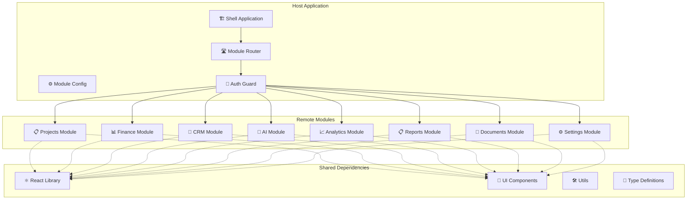

## 2. Система доступа и подписок

### 2.1 Access Control Flow
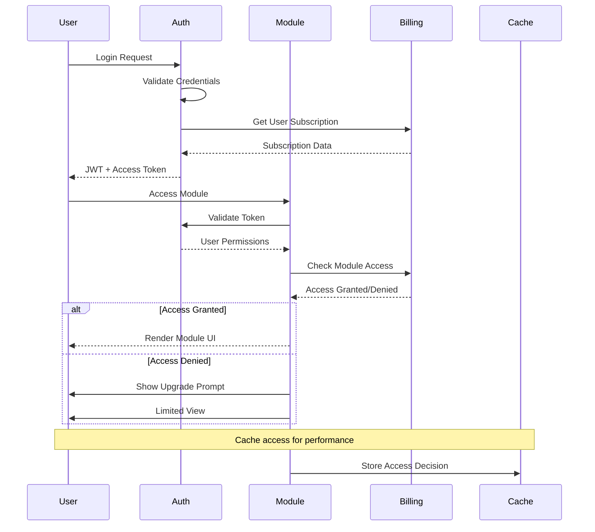

### 2.2 Subscription Tiers Visualization
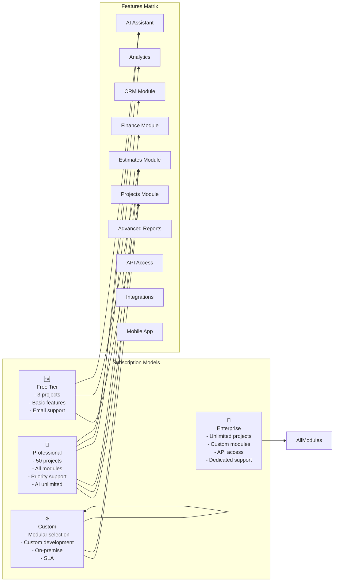

## 3. Система виджетов и дашбордов

### 3.1 Widget System Architecture
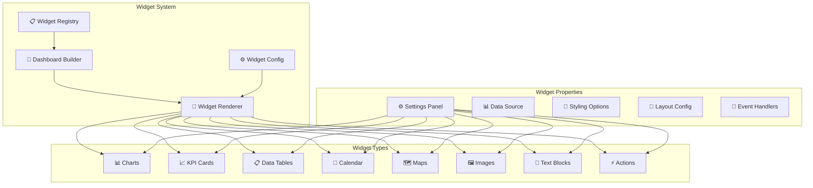

### 3.2 Dashboard Builder Flow
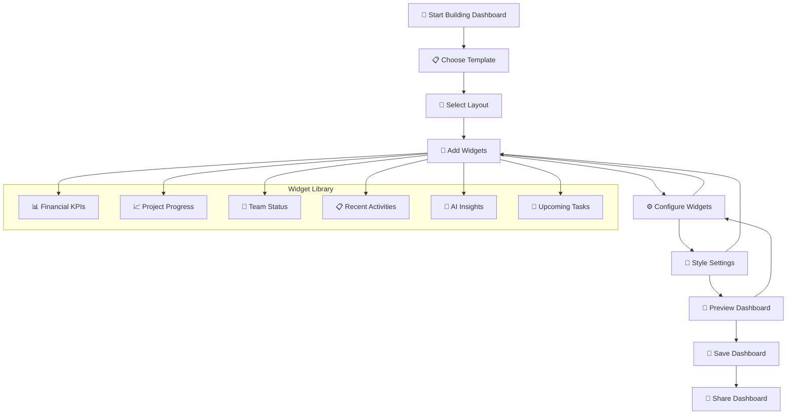

## 4. AI Assistant Extension

### 4.1 Enhanced AI Architecture
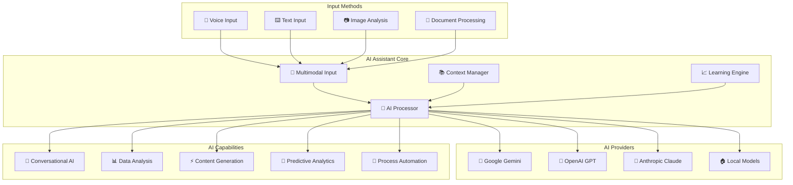

### 4.2 Voice Assistant Flow
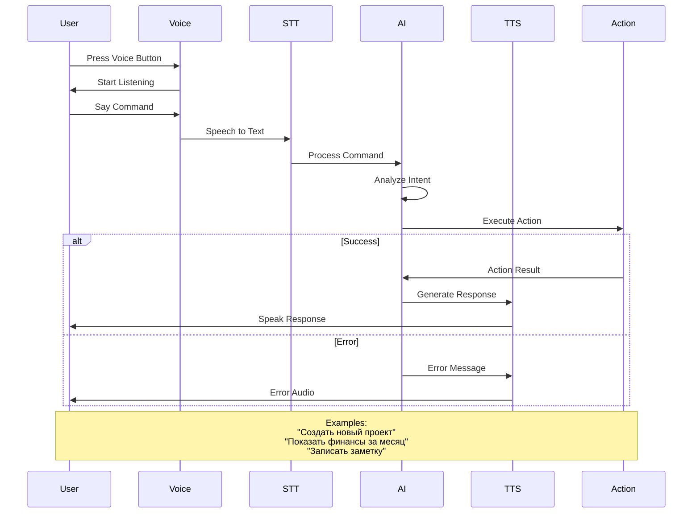

## 5. Мобильная адаптация и PWA

### 5.1 PWA Architecture
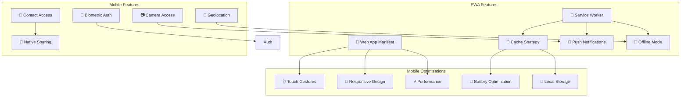

### 5.2 Mobile UI Adaptations
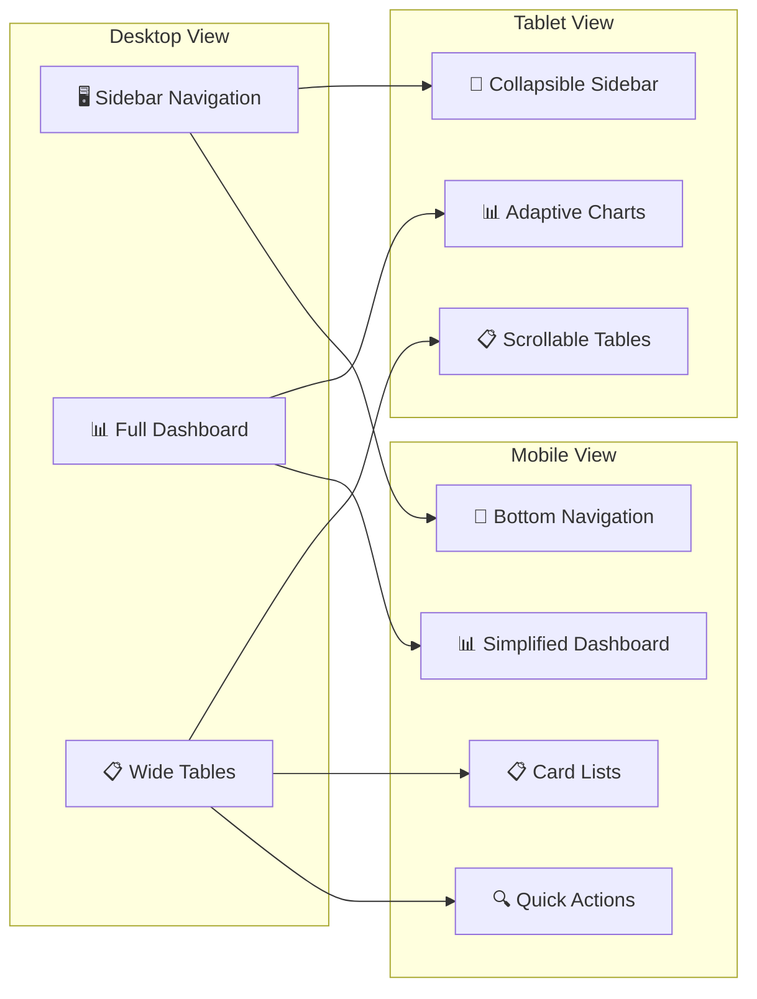

## 6. Система шаблонов и автоматизации

### 6.1 Template System
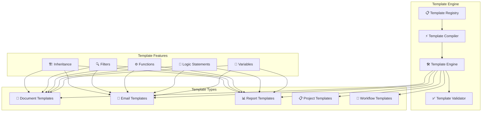

### 6.2 Automation Workflow
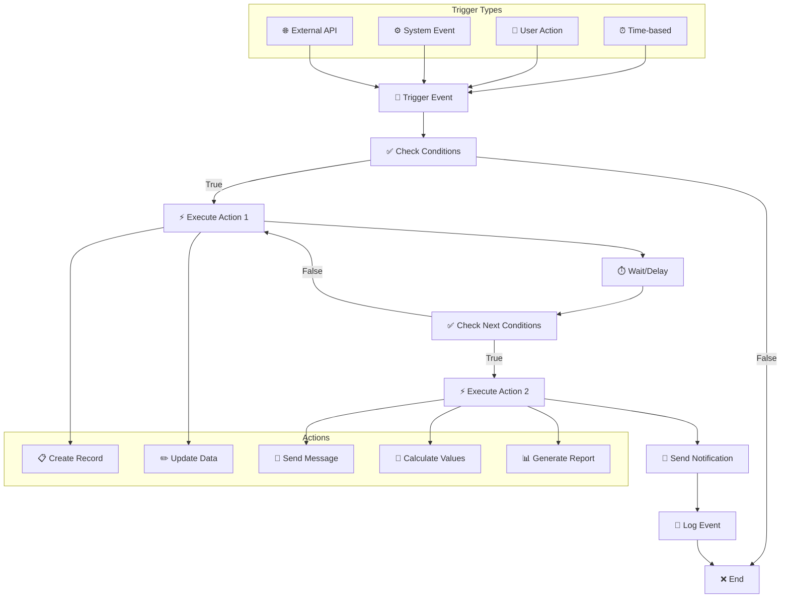

## 7. Аналитика и отчетность

### 7.1 BI Dashboard Architecture
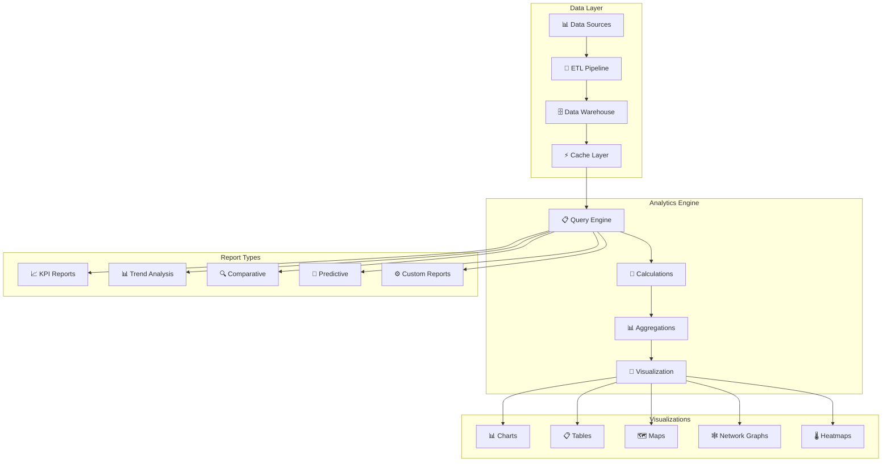

### 7.2 Real-time Analytics
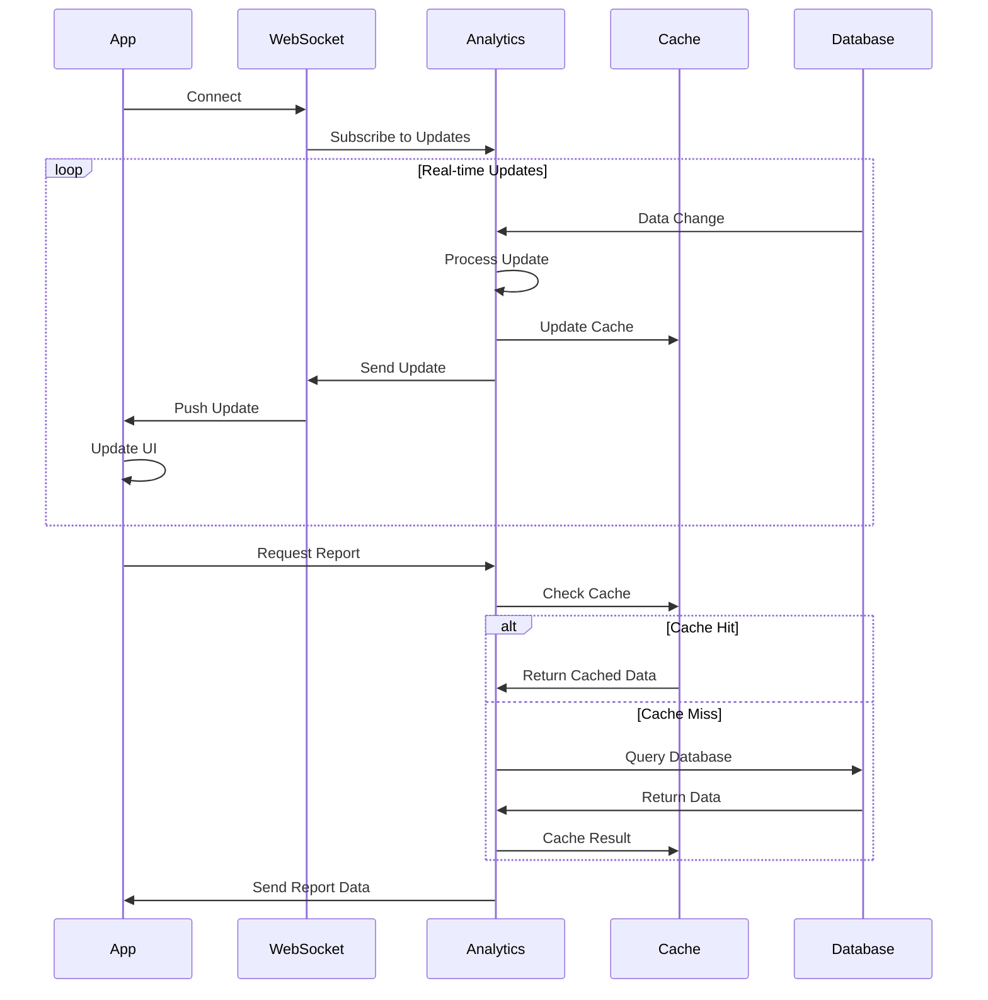

## 8. Marketplace и расширения

### 8.1 Module Marketplace
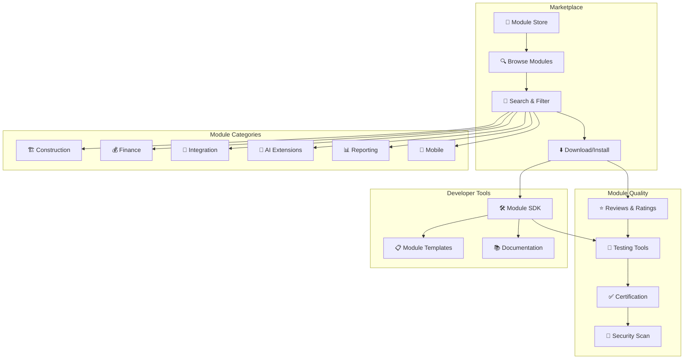

### 8.2 Extension Development
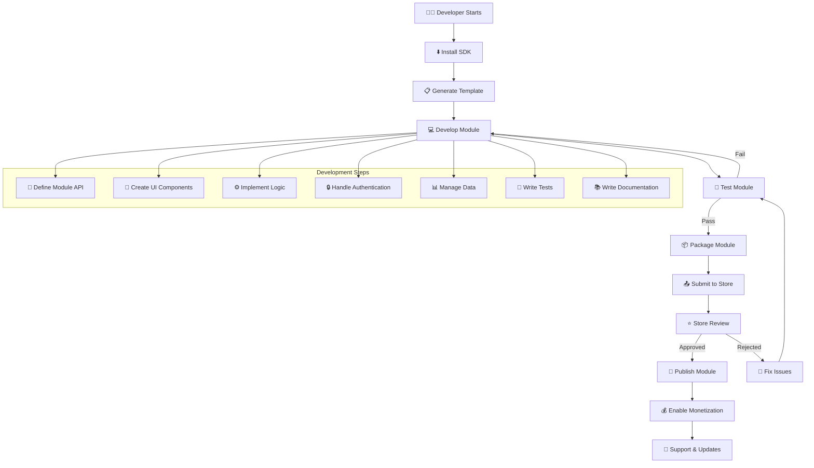

---

**Схема создана:** 24.11.2024  
**Версия:** 1.0  
**Назначение:** Визуализация архитектуры новой системы "Строй-Контроль"