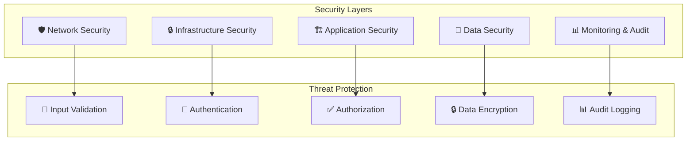

# План обеспечения безопасности системы "Строй-Контроль"

## Обзор безопасности

Данный документ описывает комплексную стратегию обеспечения безопасности для системы "Строй-Контроль", включающую все уровни защиты от инфраструктуры до прикладного уровня.

### Цели безопасности
- 🔒 Защита конфиденциальных данных клиентов
- 🛡️ Предотвращение несанкционированного доступа
- 🚨 Обеспечение целостности данных
- ⚡ Минимизация уязвимостей и рисков
- 📋 Соответствие требованиям безопасности

## Архитектура безопасности

### Принципы безопасности (Security by Design)



## Аутентификация и авторизация

### JWT Token Security

```go
// security/jwt_handler.go
package security

import (
    "crypto/rand"
    "crypto/rsa"
    "crypto/x509"
    "encoding/pem"
    "errors"
    "time"

    "github.com/golang-jwt/jwt/v5"
)

type JWTHandler struct {
    privateKey *rsa.PrivateKey
    publicKey  *rsa.PublicKey
}

type Claims struct {
    UserID       string   `json:"user_id"`
    Email        string   `json:"email"`
    Role         string   `json:"role"`
    Permissions  []string `json:"permissions"`
    jwt.RegisteredClaims
}

func NewJWTHandler() (*JWTHandler, error) {
    // Генерация ключей RSA
    privateKey, err := rsa.GenerateKey(rand.Reader, 2048)
    if err != nil {
        return nil, err
    }

    publicKey := &privateKey.PublicKey

    return &JWTHandler{
        privateKey: privateKey,
        publicKey:  publicKey,
    }, nil
}

func (j *JWTHandler) GenerateAccessToken(user *User, ttl time.Duration) (string, error) {
    claims := Claims{
        UserID:      user.ID,
        Email:       user.Email,
        Role:        user.Role,
        Permissions: user.Permissions,
        RegisteredClaims: jwt.RegisteredClaims{
            ExpiresAt: jwt.NewNumericDate(time.Now().Add(ttl)),
            IssuedAt:  jwt.NewNumericDate(time.Now()),
            NotBefore: jwt.NewNumericDate(time.Now()),
            Issuer:    "stroy-control",
            Subject:   user.ID,
        },
    }

    token := jwt.NewWithClaims(jwt.SigningMethodRS256, claims)
    
    return token.SignedString(j.privateKey)
}

func (j *JWTHandler) GenerateRefreshToken(userID string, ttl time.Duration) (string, error) {
    claims := jwt.RegisteredClaims{
        ExpiresAt: jwt.NewNumericDate(time.Now().Add(ttl)),
        IssuedAt:  jwt.NewNumericDate(time.Now()),
        Subject:   userID,
        Issuer:    "stroy-control-refresh",
    }

    token := jwt.NewWithClaims(jwt.SigningMethodRS256, claims)
    
    return token.SignedString(j.privateKey)
}

func (j *JWTHandler) ValidateToken(tokenString string) (*Claims, error) {
    token, err := jwt.ParseWithClaims(tokenString, &Claims{}, func(token *jwt.Token) (interface{}, error) {
        return j.publicKey, nil
    })
    
    if err != nil {
        return nil, err
    }
    
    claims, ok := token.Claims.(*Claims)
    if !ok {
        return nil, errors.New("invalid token claims")
    }
    
    return claims, nil
}
```

### Role-Based Access Control (RBAC)

```go
// security/rbac.go
package security

import (
    "context"
    "database/sql"
    "errors"
    "strings"
)

type Permission struct {
    ID          string   `json:"id"`
    Name        string   `json:"name"`
    Resource    string   `json:"resource"`
    Action      string   `json:"action"`
    Description string   `json:"description"`
}

type Role struct {
    ID          string       `json:"id"`
    Name        string       `json:"name"`
    Description string       `json:"description"`
    Permissions []Permission `json:"permissions"`
}

type RBACService struct {
    db *sql.DB
}

func NewRBACService(db *sql.DB) *RBACService {
    return &RBACService{db: db}
}

func (r *RBACService) HasPermission(ctx context.Context, userID string, resource string, action string) (bool, error) {
    query := `
        SELECT COUNT(*) 
        FROM user_roles ur
        JOIN role_permissions rp ON ur.role_id = rp.role_id
        JOIN permissions p ON rp.permission_id = p.id
        WHERE ur.user_id = ? AND p.resource = ? AND p.action = ?
    `
    
    var count int
    err := r.db.QueryRowContext(ctx, query, userID, resource, action).Scan(&count)
    if err != nil {
        return false, err
    }
    
    return count > 0, nil
}

func (r *RBACService) GetUserPermissions(ctx context.Context, userID string) ([]Permission, error) {
    query := `
        SELECT DISTINCT p.id, p.name, p.resource, p.action, p.description
        FROM user_roles ur
        JOIN role_permissions rp ON ur.role_id = rp.role_id
        JOIN permissions p ON rp.permission_id = p.id
        WHERE ur.user_id = ?
    `
    
    rows, err := r.db.QueryContext(ctx, query, userID)
    if err != nil {
        return nil, err
    }
    defer rows.Close()
    
    var permissions []Permission
    for rows.Next() {
        var perm Permission
        err := rows.Scan(&perm.ID, &perm.Name, &perm.Resource, &perm.Action, &perm.Description)
        if err != nil {
            return nil, err
        }
        permissions = append(permissions, perm)
    }
    
    return permissions, nil
}

// Middleware для проверки разрешений
func PermissionMiddleware(requiredResource string, requiredAction string) gin.HandlerFunc {
    return func(c *gin.Context) {
        user := c.MustGet("user").(*Claims)
        
        ctx := context.Background()
        rbac := NewRBACService(getDB())
        
        hasPermission, err := rbac.HasPermission(ctx, user.UserID, requiredResource, requiredAction)
        if err != nil || !hasPermission {
            c.JSON(403, gin.H{
                "error": "Insufficient permissions",
                "required": fmt.Sprintf("%s:%s", requiredResource, requiredAction),
            })
            c.Abort()
            return
        }
        
        c.Next()
    }
}
```

### Rate Limiting

```go
// security/rate_limiter.go
package security

import (
    "strconv"
    "time"

    "github.com/go-redis/redis/v8"
    "golang.org/x/time/rate"
)

type RateLimiter struct {
    redis  *redis.Client
    limiters map[string]*rate.Limiter
}

func NewRateLimiter(redis *redis.Client) *RateLimiter {
    return &RateLimiter{
        redis:     redis,
        limiters:  make(map[string]*rate.Limiter),
    }
}

func (rl *RateLimiter) Allow(key string, limit rate.Limit, burst int) (bool, error) {
    limiter := rl.getLimiter(key, limit, burst)
    return limiter.Allow()
}

func (rl *RateLimiter) AllowN(key string, limit rate.Limit, burst int, n int) (bool, error) {
    limiter := rl.getLimiter(key, limit, burst)
    return limiter.AllowN(time.Now(), n), nil
}

func (rl *RateLimiter) getLimiter(key string, limit rate.Limit, burst int) *rate.Limiter {
    rl.mu.Lock()
    defer rl.mu.Unlock()
    
    if limiter, exists := rl.limiters[key]; exists {
        return limiter
    }
    
    limiter := rate.NewLimiter(limit, burst)
    rl.limiters[key] = limiter
    return limiter
}

// Redis-based distributed rate limiting
func (rl *RateLimiter) AllowWithRedis(key string, limit int, window time.Duration) (bool, error) {
    ctx := context.Background()
    
    luaScript := `
        local key = KEYS[1]
        local limit = tonumber(ARGV[1])
        local window = tonumber(ARGV[2])
        local current = redis.call('GET', key)
        
        if current == false then
            redis.call('SET', key, 1, 'EX', window)
            return 1
        end
        
        current = tonumber(current)
        if current >= limit then
            return 0
        end
        
        redis.call('INCR', key)
        return current + 1
    `
    
    result, err := rl.redis.Eval(ctx, luaScript, []string{
        "rate_limit:" + key,
    }, limit, int(window.Seconds())).Int64()
    
    return result > 0, err
}
```

## Шифрование данных

### Шифрование в покое (Encryption at Rest)

```go
// security/encryption.go
package security

import (
    "crypto/aes"
    "crypto/cipher"
    "crypto/rand"
    "crypto/sha256"
    "encoding/base64"
    "errors"
    "io"
)

type DataEncryption struct {
    masterKey []byte
}

func NewDataEncryption(masterKey string) *DataEncryption {
    hash := sha256.Sum256([]byte(masterKey))
    return &DataEncryption{
        masterKey: hash[:],
    }
}

func (e *DataEncryption) Encrypt(plaintext []byte) (string, error) {
    block, err := aes.NewCipher(e.masterKey)
    if err != nil {
        return "", err
    }

    gcm, err := cipher.NewGCM(block)
    if err != nil {
        return "", err
    }

    nonce := make([]byte, gcm.NonceSize())
    if _, err = io.ReadFull(rand.Reader, nonce); err != nil {
        return "", err
    }

    ciphertext := gcm.Seal(nonce, nonce, plaintext, nil)
    return base64.StdEncoding.EncodeToString(ciphertext), nil
}

func (e *DataEncryption) Decrypt(encoded string) ([]byte, error) {
    ciphertext, err := base64.StdEncoding.DecodeString(encoded)
    if err != nil {
        return nil, err
    }

    block, err := aes.NewCipher(e.masterKey)
    if err != nil {
        return nil, err
    }

    gcm, err := cipher.NewGCM(block)
    if err != nil {
        return nil, err
    }

    nonceSize := gcm.NonceSize()
    if len(ciphertext) < nonceSize {
        return nil, errors.New("ciphertext too short")
    }

    nonce, ciphertext := ciphertext[:nonceSize], ciphertext[nonceSize:]
    plaintext, err := gcm.Open(nil, nonce, ciphertext, nil)
    if err != nil {
        return nil, err
    }

    return plaintext, nil
}

// Field-level encryption for sensitive data
type FieldEncryption struct {
    encryption *DataEncryption
}

func NewFieldEncryption(masterKey string) *FieldEncryption {
    return &FieldEncryption{
        encryption: NewDataEncryption(masterKey),
    }
}

func (fe *FieldEncryption) EncryptUserPII(user *User) error {
    // Шифрование PII данных пользователя
    if user.Phone != nil {
        encryptedPhone, err := fe.encryption.Encrypt([]byte(*user.Phone))
        if err != nil {
            return err
        }
        phone := encryptedPhone
        user.Phone = &phone
    }
    
    if user.AvatarURL != nil && strings.Contains(*user.AvatarURL, "pii:") {
        data, err := fe.encryption.Decrypt(strings.TrimPrefix(*user.AvatarURL, "pii:"))
        if err != nil {
            return err
        }
        avatar := base64.StdEncoding.EncodeToString(data)
        user.AvatarURL = &avatar
    }
    
    return nil
}

func (fe *FieldEncryption) DecryptUserPII(user *User) error {
    if user.Phone != nil {
        decryptedPhone, err := fe.encryption.Decrypt(*user.Phone)
        if err != nil {
            return err
        }
        phone := string(decryptedPhone)
        user.Phone = &phone
    }
    
    return nil
}
```

### Шифрование в транзите (Encryption in Transit)

```yaml
# nginx/ssl-config.conf
# TLS 1.3 конфигурация
ssl_protocols TLSv1.3;
ssl_ciphers ECDHE-ECDSA-AES128-GCM-SHA256:ECDHE-RSA-AES128-GCM-SHA256:ECDHE-ECDSA-AES256-GCM-SHA384:ECDHE-RSA-AES256-GCM-SHA384;
ssl_prefer_server_ciphers off;

# HSTS
add_header Strict-Transport-Security "max-age=63072000; includeSubDomains; preload" always;

# OCSP Stapling
ssl_stapling on;
ssl_stapling_verify on;
resolver 8.8.8.8 8.8.4.4 valid=300s;
resolver_timeout 5s;

# Certificate configuration
ssl_certificate /etc/ssl/certs/stroy-control.crt;
ssl_certificate_key /etc/ssl/private/stroy-control.key;

# Session settings
ssl_session_cache shared:SSL:10m;
ssl_session_timeout 10m;
ssl_session_tickets off;
```

## Input Validation и Sanitization

### Валидация запросов

```go
// security/validation.go
package security

import (
    "regexp"
    "strings"
    "unicode"

    "github.com/go-playground/validator/v10"
)

type ValidationService struct {
    validator *validator.Validate
}

func NewValidationService() *ValidationService {
    v := validator.New()
    
    // Пользовательские валидаторы
    v.RegisterValidation("email", validateEmail)
    v.RegisterValidation("phone", validatePhone)
    v.RegisterValidation("inn", validateINN)
    v.RegisterValidation("safe_string", validateSafeString)
    
    return &ValidationService{validator: v}
}

func (vs *ValidationService) ValidateCreateProject(data *CreateProjectRequest) error {
    return vs.validator.Struct(data)
}

func (vs *ValidationService) ValidateEstimateItem(data *EstimateItemRequest) error {
    return vs.validator.Struct(data)
}

// Email validation
func validateEmail(fl validator.FieldLevel) bool {
    email := fl.Field().String()
    
    // Проверка базового формата
    emailRegex := regexp.MustCompile(`^[a-zA-Z0-9._%+-]+@[a-zA-Z0-9.-]+\.[a-zA-Z]{2,}$`)
    if !emailRegex.MatchString(email) {
        return false
    }
    
    // Проверка длины
    if len(email) > 254 {
        return false
    }
    
    // Проверка на подозрительные символы
    if strings.Contains(email, "..") || strings.HasPrefix(email, ".") || strings.HasSuffix(email, ".") {
        return false
    }
    
    return true
}

// Phone validation
func validatePhone(fl validator.FieldLevel) bool {
    phone := fl.Field().String()
    
    // Удаление всех кроме цифр и +
    cleanPhone := regexp.MustCompile(`[^\d+]`).ReplaceAllString(phone, "")
    
    // Проверка формата российского номера
    if strings.HasPrefix(cleanPhone, "+7") && len(cleanPhone) == 12 {
        return true
    }
    if strings.HasPrefix(cleanPhone, "8") && len(cleanPhone) == 11 {
        return true
    }
    if len(cleanPhone) == 10 {
        return true
    }
    
    return false
}

// INN validation (Tax Identification Number)
func validateINN(fl validator.FieldLevel) bool {
    inn := fl.Field().String()
    
    if len(inn) != 10 && len(inn) != 12 {
        return false
    }
    
    if !regexp.MustCompile(`^\d+$`).MatchString(inn) {
        return false
    }
    
    // Алгоритм проверки контрольной суммы (упрощенный)
    if len(inn) == 10 {
        return validateINN10(inn)
    }
    
    return validateINN12(inn)
}

// Safe string validation
func validateSafeString(fl validator.FieldLevel) bool {
    str := fl.Field().String()
    
    // Проверка на запрещенные символы
    forbidden := []string{
        "<script", "</script", "javascript:", "data:",
        "vbscript:", "onload=", "onerror=", "<iframe",
    }
    
    lowerStr := strings.ToLower(str)
    for _, forbiddenStr := range forbidden {
        if strings.Contains(lowerStr, forbiddenStr) {
            return false
        }
    }
    
    return true
}

func validateINN10(inn string) bool {
    weights := []int{2, 4, 10, 3, 5, 9, 4, 6, 8, 0}
    
    sum := 0
    for i := 0; i < 9; i++ {
        digit := int(inn[i] - '0')
        sum += digit * weights[i]
    }
    
    checkDigit := sum % 11
    if checkDigit >= 10 {
        checkDigit = (sum + 2) % 11
        if checkDigit >= 10 {
            checkDigit = (sum + 4) % 11
        }
    }
    
    return checkDigit == int(inn[9]-'0')
}

func validateINN12(inn string) bool {
    weights10 := []int{7, 2, 4, 10, 3, 5, 9, 4, 6, 8, 0}
    weights11 := []int{3, 7, 2, 4, 10, 3, 5, 9, 4, 6, 8, 0}
    
    // Проверка 10-го разряда
    sum := 0
    for i := 0; i < 10; i++ {
        digit := int(inn[i] - '0')
        sum += digit * weights10[i]
    }
    
    checkDigit10 := sum % 11
    if checkDigit10 >= 10 {
        checkDigit10 = (sum + 2) % 11
        if checkDigit10 >= 10 {
            checkDigit10 = (sum + 4) % 11
        }
    }
    
    if checkDigit10 != int(inn[10]-'0') {
        return false
    }
    
    // Проверка 11-го разряда
    sum = 0
    for i := 0; i < 11; i++ {
        digit := int(inn[i] - '0')
        sum += digit * weights11[i]
    }
    
    checkDigit11 := sum % 11
    if checkDigit11 >= 10 {
        checkDigit11 = (sum + 2) % 11
        if checkDigit11 >= 10 {
            checkDigit11 = (sum + 4) % 11
        }
    }
    
    return checkDigit11 == int(inn[11]-'0')
}

// SQL Injection protection
type SQLSafeQuery struct {
    query  string
    params []interface{}
}

func (vs *ValidationService) BuildSafeQuery(baseQuery string, filters map[string]interface{}) (*SQLSafeQuery, error) {
    // Проверка разрешенных полей для фильтрации
    allowedFields := map[string]bool{
        "id":         true,
        "name":       true,
        "status":     true,
        "created_at": true,
        "updated_at": true,
        "customer_id": true,
    }
    
    var conditions []string
    var params []interface{}
    
    for field, value := range filters {
        if !allowedFields[field] {
            return nil, errors.New("unsafe field: " + field)
        }
        
        // Валидация значений полей
        if !vs.validateFieldValue(field, value) {
            return nil, errors.New("unsafe value for field: " + field)
        }
        
        conditions = append(conditions, field+" = ?")
        params = append(params, value)
    }
    
    query := baseQuery
    if len(conditions) > 0 {
        query += " WHERE " + strings.Join(conditions, " AND ")
    }
    
    return &SQLSafeQuery{
        query:  query,
        params: params,
    }, nil
}

func (vs *ValidationService) validateFieldValue(field string, value interface{}) bool {
    switch field {
    case "id":
        _, ok := value.(string)
        return ok && len(value.(string)) == 36 // UUID length
    case "name":
        str, ok := value.(string)
        return ok && len(str) > 0 && len(str) <= 255
    case "status":
        str, ok := value.(string)
        return ok && contains([]string{"draft", "in_progress", "completed", "cancelled"}, str)
    case "customer_id":
        _, ok := value.(string)
        return ok && len(value.(string)) == 36
    default:
        return true
    }
}

func contains(slice []string, item string) bool {
    for _, s := range slice {
        if s == item {
            return true
        }
    }
    return false
}
```

### CSP (Content Security Policy)

```javascript
// frontend/src/security/csp.ts
export const generateCSP = () => {
  const csp = {
    'default-src': ["'self'"],
    'script-src': [
      "'self'",
      "'unsafe-inline'", // Для inline скриптов React
      'https://cdn.jsdelivr.net',
      'https://fonts.googleapis.com',
    ],
    'style-src': [
      "'self'",
      "'unsafe-inline'", // Для Tailwind CSS
      'https://fonts.googleapis.com',
      'https://cdn.jsdelivr.net',
    ],
    'font-src': [
      "'self'",
      'https://fonts.gstatic.com',
      'https://cdn.jsdelivr.net',
    ],
    'img-src': [
      "'self'",
      'data:',
      'https:',
      'blob:',
    ],
    'connect-src': [
      "'self'",
      'https://api.stroy-control.ru',
      'wss://api.stroy-control.ru',
      'https://*.openai.com',
      'https://*.google.com',
    ],
    'frame-src': ["'none'"],
    'object-src': ["'none'"],
    'base-uri': ["'self'"],
    'form-action': ["'self'"],
    'upgrade-insecure-requests': [],
  };

  const cspString = Object.entries(csp)
    .map(([key, values]) => `${key} ${values.join(' ')}`)
    .join('; ');

  return cspString;
};

// Установка CSP заголовков
export const setCSPHeaders = () => {
  const csp = generateCSP();
  document.head.appendChild(
    Object.assign(document.createElement('meta'), {
      httpEquiv: 'Content-Security-Policy',
      content: csp,
    })
  );
};
```

## Аудит и мониторинг безопасности

### Audit Logging

```go
// security/audit.go
package security

import (
    "encoding/json"
    "time"

    "github.com/google/uuid"
)

type AuditEvent struct {
    ID          string    `json:"id"`
    Timestamp   time.Time `json:"timestamp"`
    UserID      string    `json:"user_id"`
    UserEmail   string    `json:"user_email"`
    Action      string    `json:"action"`
    Resource    string    `json:"resource"`
    ResourceID  string    `json:"resource_id"`
    IPAddress   string    `json:"ip_address"`
    UserAgent   string    `json:"user_agent"`
    Success     bool      `json:"success"`
    Error       string    `json:"error,omitempty"`
    Metadata    map[string]interface{} `json:"metadata,omitempty"`
}

type AuditService struct {
    logger *zap.Logger
    db     *sql.DB
}

func NewAuditService(logger *zap.Logger, db *sql.DB) *AuditService {
    return &AuditService{
        logger: logger,
        db:     db,
    }
}

func (a *AuditService) Log(event *AuditEvent) error {
    // Сохранение в базу данных
    query := `
        INSERT INTO audit_log 
        (id, timestamp, user_id, user_email, action, resource, resource_id, 
         ip_address, user_agent, success, error, metadata)
        VALUES (?, ?, ?, ?, ?, ?, ?, ?, ?, ?, ?, ?)
    `
    
    metadataJSON, _ := json.Marshal(event.Metadata)
    
    _, err := a.db.Exec(query,
        event.ID,
        event.Timestamp,
        event.UserID,
        event.UserEmail,
        event.Action,
        event.Resource,
        event.ResourceID,
        event.IPAddress,
        event.UserAgent,
        event.Success,
        event.Error,
        metadataJSON,
    )
    
    if err != nil {
        a.logger.Error("Failed to save audit event", zap.Error(err))
    }
    
    // Логирование
    a.logger.Info("Audit event",
        zap.String("id", event.ID),
        zap.String("user_id", event.UserID),
        zap.String("action", event.Action),
        zap.String("resource", event.Resource),
        zap.Bool("success", event.Success),
        zap.String("ip", event.IPAddress),
    )
    
    return err
}

func (a *AuditService) LogUserAction(userID, userEmail, action, resource, resourceID, ipAddress, userAgent string, success bool, err error, metadata map[string]interface{}) {
    event := &AuditEvent{
        ID:         uuid.New().String(),
        Timestamp:  time.Now(),
        UserID:     userID,
        UserEmail:  userEmail,
        Action:     action,
        Resource:   resource,
        ResourceID: resourceID,
        IPAddress:  ipAddress,
        UserAgent:  userAgent,
        Success:    success,
        Error:      "",
        Metadata:   metadata,
    }
    
    if err != nil {
        event.Error = err.Error()
    }
    
    a.Log(event)
}

// Middleware для аудита
func AuditMiddleware(auditService *AuditService, action, resource string) gin.HandlerFunc {
    return func(c *gin.Context) {
        start := time.Now()
        
        // Выполнение запроса
        c.Next()
        
        duration := time.Since(start)
        
        user := c.Value("user")
        var userID, userEmail string
        if user != nil {
            if claims, ok := user.(*Claims); ok {
                userID = claims.UserID
                userEmail = claims.Email
            }
        }
        
        resourceID := c.Param("id")
        if resourceID == "" {
            resourceID = c.Query("id")
        }
        
        success := c.Writer.Status() < 400
        var errorMsg string
        if !success {
            errorMsg = c.Errors.Last().Err.Error()
        }
        
        auditService.Log(&AuditEvent{
            ID:         uuid.New().String(),
            Timestamp:  time.Now(),
            UserID:     userID,
            UserEmail:  userEmail,
            Action:     action,
            Resource:   resource,
            ResourceID: resourceID,
            IPAddress:  c.ClientIP(),
            UserAgent:  c.Request.UserAgent(),
            Success:    success,
            Error:      errorMsg,
            Metadata: map[string]interface{}{
                "duration_ms": duration.Milliseconds(),
                "status_code": c.Writer.Status(),
                "method":      c.Request.Method,
                "path":        c.Request.URL.Path,
            },
        })
    }
}
```

### Security Monitoring

```yaml
# monitoring/security-rules.yml
groups:
  - name: security_alerts
    rules:
      - alert: MultipleFailedLogins
        expr: increase(auth_failed_login_total[5m]) > 10
        for: 1m
        labels:
          severity: warning
        annotations:
          summary: "Multiple failed login attempts detected"
          description: "More than 10 failed logins in 5 minutes from {{ $labels.source_ip }}"

      - alert: SuspiciousUserAgent
        expr: increase(auth_requests_total{user_agent=~".*sqlmap.*|.*nikto.*|.*nmap.*"}[5m]) > 0
        for: 0s
        labels:
          severity: critical
        annotations:
          summary: "Suspicious user agent detected"
          description: "Potentially malicious request from user agent: {{ $labels.user_agent }}"

      - alert: UnauthorizedAccess
        expr: increase(http_requests_total{status=~"4.."}[1m]) > 100
        for: 2m
        labels:
          severity: warning
        annotations:
          summary: "High rate of unauthorized requests"
          description: "More than 100 4xx responses in the last minute"

      - alert: DatabaseConnectionFailure
        expr: increase(database_connection_errors_total[5m]) > 5
        for: 1m
        labels:
          severity: critical
        annotations:
          summary: "Database connection failures"
          description: "Multiple database connection failures detected"

      - alert: EncryptionFailure
        expr: increase(encryption_failures_total[5m]) > 0
        for: 0s
        labels:
          severity: critical
        annotations:
          summary: "Data encryption/decryption failures"
          description: "Data encryption/decryption failures detected"

      - alert: RateLimitExceeded
        expr: increase(rate_limit_exceeded_total[5m]) > 50
        for: 2m
        labels:
          severity: warning
        annotations:
          summary: "High rate limit violations"
          description: "More than 50 rate limit violations in 5 minutes"
```

## Безопасность инфраструктуры

### Container Security

```dockerfile
# Backend Dockerfile - Multi-stage build for security
FROM golang:1.21-alpine AS builder

# Создание непривилегированного пользователя
RUN adduser -D -s /bin/sh appuser

WORKDIR /app
COPY go.mod go.sum ./
RUN go mod download

COPY . .

# Сборка приложения
RUN CGO_ENABLED=0 GOOS=linux go build \
    -a -installsuffix cgo \
    -o main \
    -ldflags '-w -s' \
    cmd/server/main.go

# Production образ
FROM alpine:latest

# Установка только необходимых пакетов
RUN apk --no-cache add ca-certificates tzdata && \
    rm -rf /var/cache/apk/*

# Создание пользователя для приложения
RUN addgroup -g 1001 appgroup && \
    adduser -u 1001 -G appgroup -s /bin/sh -D appuser

WORKDIR /root/

# Копирование бинарника
COPY --from=builder /app/main .
COPY --from=builder --chown=appuser:appgroup /app/configs ./configs

# Переключение на непривилегированного пользователя
USER appuser

EXPOSE 8080

HEALTHCHECK --interval=30s --timeout=10s --start-period=5s --retries=3 \
    CMD wget --no-verbose --tries=1 --spider http://localhost:8080/health || exit 1

CMD ["./main"]
```

### Secrets Management

```yaml
# docker-compose.prod.yml - Безопасная конфигурация секретов
version: '3.8'
services:
  backend:
    image: stroy-control-backend:latest
    environment:
      - DATABASE_URL_FILE=/run/secrets/database_url
      - JWT_SECRET_FILE=/run/secrets/jwt_secret
      - ENCRYPTION_KEY_FILE=/run/secrets/encryption_key
    secrets:
      - database_url
      - jwt_secret
      - encryption_key
    deploy:
      secrets:
        - database_url
        - jwt_secret
        - encryption_key

secrets:
  database_url:
    file: ./secrets/database_url.txt
  jwt_secret:
    file: ./secrets/jwt_secret.txt
  encryption_key:
    file: ./secrets/encryption_key.txt

# Kubernetes Secrets
apiVersion: v1
kind: Secret
metadata:
  name: stroy-control-secrets
type: Opaque
data:
  database-url: <base64-encoded-database-url>
  jwt-secret: <base64-encoded-jwt-secret>
  encryption-key: <base64-encoded-encryption-key>
  ai-api-keys: <base64-encoded-ai-api-keys>
```

### Network Security

```yaml
# nginx/security.conf
# Rate limiting
limit_req_zone $binary_remote_addr zone=login:10m rate=5r/m;
limit_req_zone $binary_remote_addr zone=api:10m rate=100r/m;

# Security headers
add_header X-Frame-Options "DENY" always;
add_header X-Content-Type-Options "nosniff" always;
add_header X-XSS-Protection "1; mode=block" always;
add_header Referrer-Policy "strict-origin-when-cross-origin" always;

# CORS configuration
add_header Access-Control-Allow-Origin "https://stroy-control.ru" always;
add_header Access-Control-Allow-Methods "GET, POST, PUT, DELETE, OPTIONS" always;
add_header Access-Control-Allow-Headers "DNT,User-Agent,X-Requested-With,If-Modified-Since,Cache-Control,Content-Type,Range,Authorization" always;

# Rate limiting for specific endpoints
location /api/v1/auth/login {
    limit_req zone=login burst=3 nodelay;
    # Security headers for login
    add_header X-Frame-Options "DENY" always;
    add_header X-Content-Type-Options "nosniff" always;
}

location /api/v1/ {
    limit_req zone=api burst=20 nodelay;
    proxy_pass http://backend:8080;
    
    # Security headers for API
    add_header X-Frame-Options "DENY" always;
    add_header X-Content-Type-Options "nosniff" always;
    
    # Request/Response logging
    access_log /var/log/nginx/api_access.log;
    error_log /var/log/nginx/api_error.log;
}
```

## Compliance и Audit Trail

### GDPR Compliance

```go
// security/gdpr.go
package security

import (
    "context"
    "database/sql"
    "time"
)

type GDPRService struct {
    db *sql.DB
}

func NewGDPRService(db *sql.DB) *GDPRService {
    return &GDPRService{db: db}
}

type DataSubjectRequest struct {
    ID         string    `json:"id"`
    UserID     string    `json:"user_id"`
    Email      string    `json:"email"`
    Type       string    `json:"type"` // access, rectification, erasure, portability
    Status     string    `json:"status"`
    CreatedAt  time.Time `json:"created_at"`
    CompletedAt *time.Time `json:"completed_at,omitempty"`
}

func (g *GDPRService) CreateDataAccessRequest(userID string, email string) (string, error) {
    requestID := uuid.New().String()
    
    query := `
        INSERT INTO gdpr_requests (id, user_id, email, type, status, created_at)
        VALUES (?, ?, ?, 'access', 'pending', ?)
    `
    
    _, err := g.db.Exec(query, requestID, userID, email, time.Now())
    if err != nil {
        return "", err
    }
    
    return requestID, nil
}

func (g *GDPRService) ProcessErasureRequest(userID string) error {
    ctx := context.Background()
    
    // Анонимизация пользовательских данных
    anonymizedData := map[string]interface{}{
        "email":      "deleted_" + uuid.New().String() + "@deleted.local",
        "name":       "Deleted User",
        "phone":      nil,
        "avatar_url": nil,
        "is_active":  false,
    }
    
    // Обновление пользователя
    query := `
        UPDATE users 
        SET email = ?, name = ?, phone = ?, avatar_url = ?, is_active = ?
        WHERE id = ?
    `
    
    _, err := g.db.Exec(query,
        anonymizedData["email"],
        anonymizedData["name"],
        anonymizedData["phone"],
        anonymizedData["avatar_url"],
        anonymizedData["is_active"],
        userID,
    )
    
    if err != nil {
        return err
    }
    
    // Логирование действий для аудита
    auditService := NewAuditService(nil, g.db)
    auditService.Log(&AuditEvent{
        ID:         uuid.New().String(),
        Timestamp:  time.Now(),
        UserID:     userID,
        UserEmail:  anonymizedData["email"].(string),
        Action:     "data_erasure",
        Resource:   "user_data",
        ResourceID: userID,
        Success:    true,
    })
    
    return nil
}

func (g *GDPRService) GetUserData(userID string) (map[string]interface{}, error) {
    // Получение всех данных пользователя
    data := make(map[string]interface{})
    
    // Основная информация пользователя
    var user User
    query := "SELECT * FROM users WHERE id = ?"
    err := g.db.QueryRow(query, userID).Scan(&user.ID, &user.Email, &user.Name, &user.Role)
    if err != nil {
        return nil, err
    }
    data["user"] = user
    
    // Проекты пользователя
    var projects []Project
    query = "SELECT * FROM projects WHERE customer_id = ? OR id IN (SELECT project_id FROM project_team WHERE user_id = ?)"
    rows, err := g.db.Query(query, userID, userID)
    if err != nil {
        return nil, err
    }
    defer rows.Close()
    
    for rows.Next() {
        var project Project
        rows.Scan(&project.ID, &project.Name, &project.Address, &project.Status)
        projects = append(projects, project)
    }
    data["projects"] = projects
    
    // Аудит запроса
    auditService := NewAuditService(nil, g.db)
    auditService.LogUserAction(userID, user.Email, "data_export", "user_data", userID, "", "", true, nil, map[string]interface{}{
        "request_type": "gdpr_access",
    })
    
    return data, nil
}
```

### Audit Report Generation

```go
// security/audit_report.go
package security

import (
    "encoding/csv"
    "fmt"
    "os"
    "time"
)

type AuditReport struct {
    StartDate time.Time
    EndDate   time.Time
    Events    []AuditEvent
}

func (a *AuditService) GenerateSecurityReport(startDate, endDate time.Time) (*AuditReport, error) {
    query := `
        SELECT id, timestamp, user_id, user_email, action, resource, 
               resource_id, ip_address, user_agent, success, error, metadata
        FROM audit_log 
        WHERE timestamp BETWEEN ? AND ?
        ORDER BY timestamp DESC
    `
    
    rows, err := a.db.Query(query, startDate, endDate)
    if err != nil {
        return nil, err
    }
    defer rows.Close()
    
    var events []AuditEvent
    
    for rows.Next() {
        var event AuditEvent
        var metadataJSON sql.NullString
        
        err := rows.Scan(
            &event.ID,
            &event.Timestamp,
            &event.UserID,
            &event.UserEmail,
            &event.Action,
            &event.Resource,
            &event.ResourceID,
            &event.IPAddress,
            &event.UserAgent,
            &event.Success,
            &event.Error,
            &metadataJSON,
        )
        
        if err != nil {
            continue
        }
        
        if metadataJSON.Valid {
            var metadata map[string]interface{}
            json.Unmarshal([]byte(metadataJSON.String), &metadata)
            event.Metadata = metadata
        }
        
        events = append(events, event)
    }
    
    return &AuditReport{
        StartDate: startDate,
        EndDate:   endDate,
        Events:    events,
    }, nil
}

func (a *AuditService) ExportToCSV(report *AuditReport, filename string) error {
    file, err := os.Create(filename)
    if err != nil {
        return err
    }
    defer file.Close()
    
    writer := csv.NewWriter(file)
    defer writer.Flush()
    
    // Заголовки
    headers := []string{
        "ID", "Timestamp", "User ID", "User Email", "Action", 
        "Resource", "Resource ID", "IP Address", "User Agent",
        "Success", "Error",
    }
    writer.Write(headers)
    
    // Данные
    for _, event := range report.Events {
        row := []string{
            event.ID,
            event.Timestamp.Format(time.RFC3339),
            event.UserID,
            event.UserEmail,
            event.Action,
            event.Resource,
            event.ResourceID,
            event.IPAddress,
            event.UserAgent,
            fmt.Sprintf("%t", event.Success),
            event.Error,
        }
        writer.Write(row)
    }
    
    return nil
}
```

## План выполнения

### Этап 1 (Недели 1-3): Базовая безопасность
- [ ] Настройка аутентификации и авторизации
- [ ] Реализация RBAC системы
- [ ] Базовое шифрование данных
- [ ] Валидация входных данных

### Этап 2 (Недели 4-6): Продвинутая защита
- [ ] Rate limiting и DDoS защита
- [ ] Аудит и мониторинг безопасности
- [ ] CSP и XSS защита
- [ ] Безопасность инфраструктуры

### Этап 3 (Недели 7-9): Compliance и аудит
- [ ] GDPR compliance
- [ ] Audit trail система
- [ ] Security testing
- [ ] Penetration testing

### Этап 4 (Недели 10-12): Production готовность
- [ ] Security hardening
- [ ] Incident response plan
- [ ] Security monitoring setup
- [ ] Documentation and training

---

*План безопасности создан: 24.11.2024*
*Версия: 1.0*
*Следующий обзор: 01.12.2024*