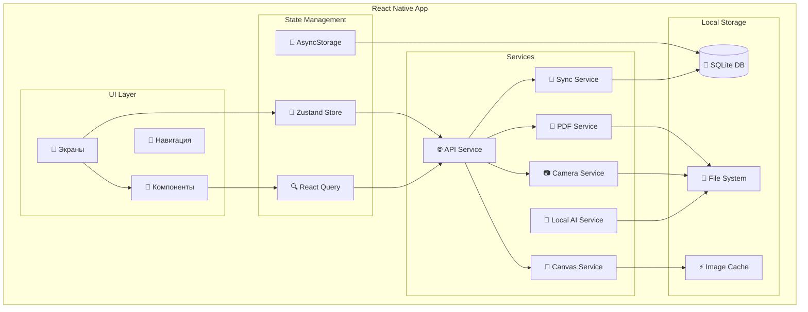
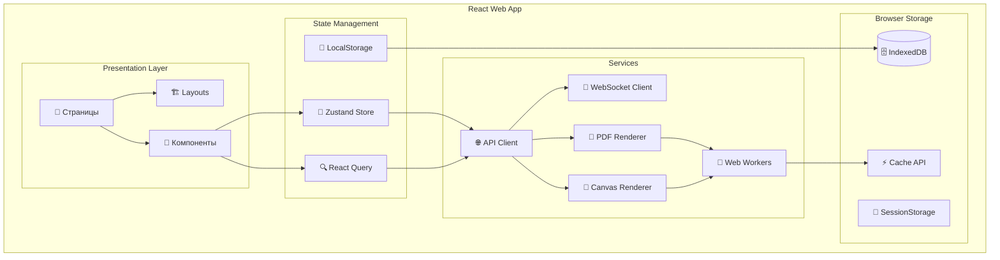
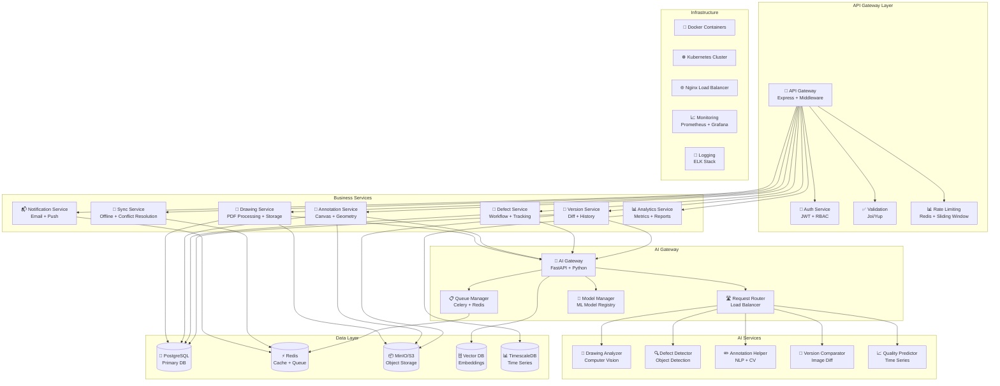
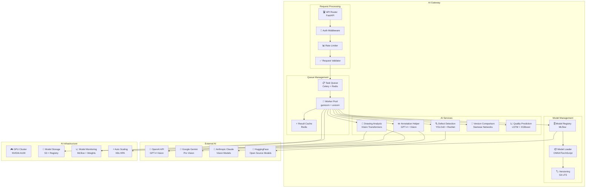
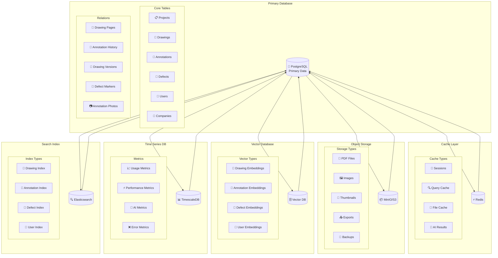
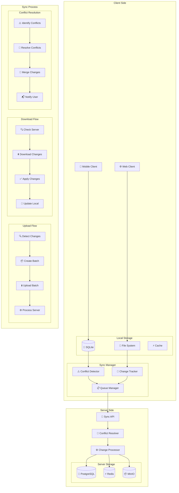
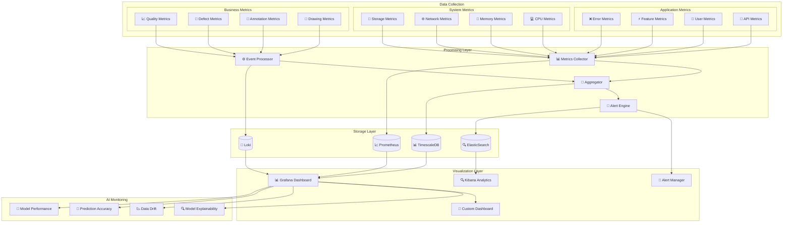
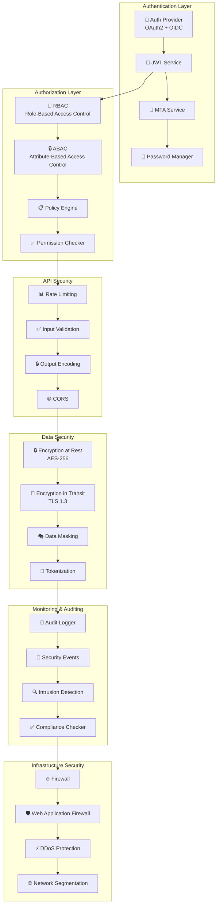

# Архитектурная диаграмма системы технического надзора

## 🏗️ Общая архитектура системы

```mermaid
graph TB
    subgraph "Клиентские приложения"
        WebApp[🌐 Веб-приложение<br/>React + TypeScript]
        MobileApp[📱 Мобильное приложение<br/>React Native]
        AdminPanel[⚙️ Админ панель<br/>React Dashboard]
    end
    
    subgraph "API Gateway"
        Gateway[🚪 API Gateway<br/>Express/Fastify]
        Auth[🔐 Аутентификация<br/>JWT + OAuth2]
        RateLimit[📊 Rate Limiting<br/>Redis]
    end
    
    subgraph "Микросервисы"
        DrawingService[📄 Drawing Service<br/>Node.js + PDF.js]
        AnnotationService[🎨 Annotation Service<br/>Node.js + Canvas]
        DefectService[🐛 Defect Service<br/>Node.js]
        VersionService[🔄 Version Service<br/>Node.js]
        NotificationService[📬 Notification Service<br/>Node.js]
        SyncService[🔄 Sync Service<br/>Node.js + SQLite]
    end
    
    subgraph "AI Gateway"
        AIGateway[🤖 AI Gateway<br/>Python + FastAPI]
        DrawingAI[📐 Drawing Analysis<br/>Computer Vision]
        DefectAI[🔍 Defect Detection<br/>ML Models]
        AnnotationAI[✏️ Annotation Helper<br/>NLP + CV]
        ComparisonAI[🔀 Version Comparison<br/>Diff Algorithms]
    end
    
    subgraph "База данных"
        PostgreSQL[(🐘 PostgreSQL<br/>Основные данные)]
        Redis[(⚡ Redis<br/>Кэш + Сессии)]
        MinIO[(📦 MinIO/S3<br/>Файлы + PDF)]
        VectorDB[(🗄️ Vector DB<br/>AI Embeddings)]
    end
    
    subgraph "Внешние сервисы"
        EmailService[📧 Email Service<br/>Resend/SendGrid]
        PushService[📱 Push Notifications<br/>FCM/APNS]
        StorageService[☁️ Cloud Storage<br/>AWS S3/Google Cloud]
        AIServices[🧠 AI Models<br/>OpenAI/Gemini/Anthropic]
    end
    
    %% Connections
    WebApp --> Gateway
    MobileApp --> Gateway
    AdminPanel --> Gateway
    
    Gateway --> Auth
    Gateway --> RateLimit
    
    Gateway --> DrawingService
    Gateway --> AnnotationService
    Gateway --> DefectService
    Gateway --> VersionService
    Gateway --> NotificationService
    Gateway --> SyncService
    
    DrawingService --> AIGateway
    AnnotationService --> AIGateway
    DefectService --> AIGateway
    VersionService --> AIGateway
    
    AIGateway --> DrawingAI
    AIGateway --> DefectAI
    AIGateway --> AnnotationAI
    AIGateway --> ComparisonAI
    
    DrawingService --> PostgreSQL
    AnnotationService --> PostgreSQL
    DefectService --> PostgreSQL
    VersionService --> PostgreSQL
    NotificationService --> Redis
    SyncService --> Redis
    
    DrawingService --> MinIO
    AnnotationService --> MinIO
    VersionService --> MinIO
    
    AIGateway --> VectorDB
    AIGateway --> AIServices
    
    NotificationService --> EmailService
    NotificationService --> PushService
    
    DrawingService --> StorageService
    AnnotationService --> StorageService
```

## 📱 Детальная архитектура мобильного приложения

## 🌐 Детальная архитектура веб-приложения

## 🔧 Backend микросервисная архитектура

## 🤖 AI Gateway архитектура

## 🗄️ Архитектура данных

## 🔄 Архитектура синхронизации

## 📊 Архитектура аналитики и мониторинга

## 🔐 Архитектура безопасности

---

Эти архитектурные диаграммы обеспечивают комплексное представление системы технического надзора с PDF чертежами, охватывая все уровни от пользовательских интерфейсов до инфраструктуры и безопасности.
